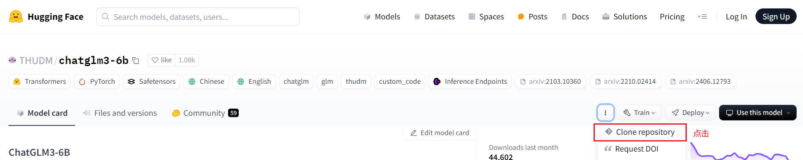
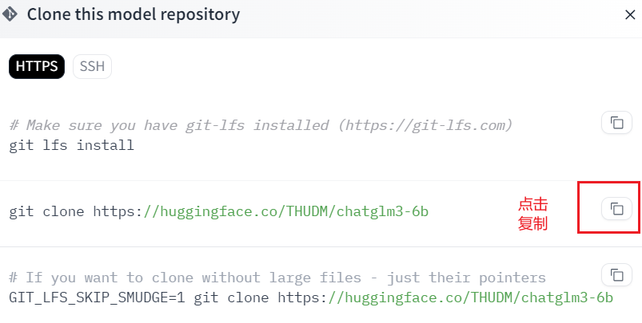
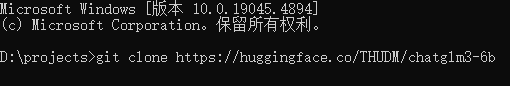
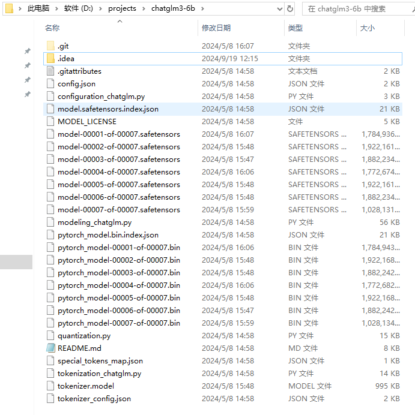
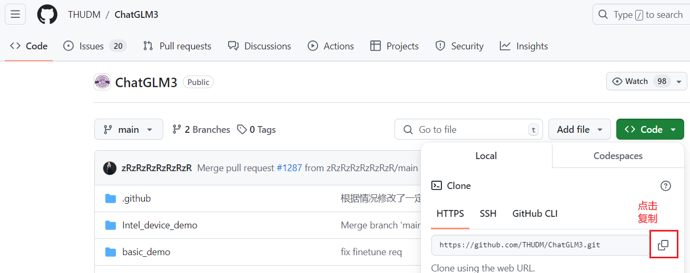
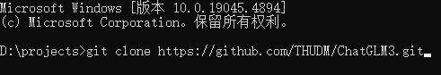
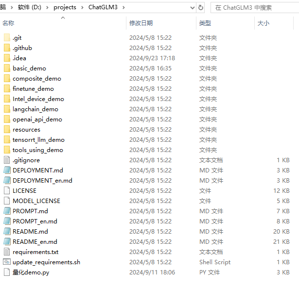
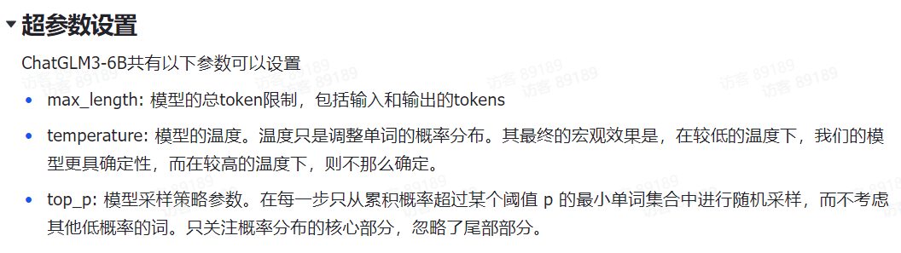
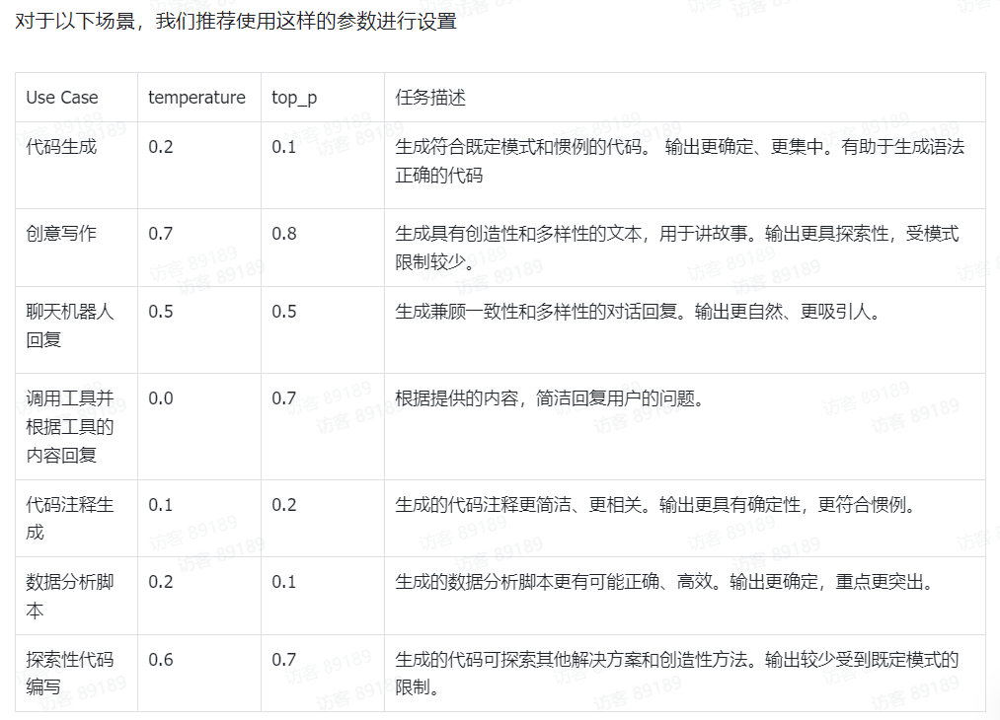

# 部署原生ChatGLM3

[github](https://github.com/THUDM/ChatGLM3?tab=readme-ov-file)

[文档](https://zhipu-ai.feishu.cn/wiki/WvQbwIJ9tiPAxGk8ywDck6yfnof)

模型 chatglm3-6b 下载:

[modelscope](https://modelscope.cn/models/ZhipuAI/chatglm3-6b) | [hugging face](https://huggingface.co/THUDM/chatglm3-6b)

## 部署步骤

## 1. 下载模型参数

在 modelscope 或 hugging face 上下载对应模型，这里以 hugging face 为例:





使用命令行和 git 克隆项目到本地，例如: 



得到模型文件如下:



模型有 47G 需要下载很久

## 2. 下载ChatGLM3项目

在 github 上复制克隆地址:



克隆项目到本地，如:



得到项目如下:



## 3. 创建并配置运行环境

创建 conda 环境，例如:

```shell
conda create --name chatglm3-6b python=3.10
```

使用 pycharm 打开 ChatGLM3 项目，并添加解释器如下:


安装依赖:

```shell
pip install -r requirements.txt
```

官方对一些基础环境的要求如下:

- `python`: `3.10 - 3.11`
- `transformers`: `4.36.2`
- `torch`: 推荐使用 2.0 及以上的版本

> ==**注意:**==
> 因为软件版本的问题，安装最新的 requirements.txt 中的软件，会有一些问题，此处可以尝试安装最低版本要求的软件，例如：
> torch\==2.3.0
> sentence_transformers\==2.4.0
> transformers\==4.39.3

## 4. 运行模型

运行项目中的如下脚本:

- `basic_demo/cli_demo.py`
- `basic_demo/web_demo_streamlit.py`

==**注意:** 设备内存需要 **18g** 左右==
==**注意:** 使用模型量化则必须使用 cuda==

## 5. 部分 API 讲解

```python
# 分词器
tokenizer = AutoTokenizer.from_pretrained(model_path, trust_remote_code=True)
# 模型
# .quantize(bits=4).cuda() 量化模型并迁移到 cuda 上
model = AutoModel.from_pretrained(model_path, trust_remote_code=True, device_map="cuda").quantize(bits=4, device='cuda').cuda().eval()
# 流式聊天
model.stream_chat(tokenizer, query, history=history, top_p=1,
                    temperature=0.01,
                    past_key_values=past_key_values,
                    return_past_key_values=True)
```

关于超参数设置，可以参考[官网](https://zhipu-ai.feishu.cn/wiki/ATFHwOlYdiF2HBkxlQPc9o7wnif)



