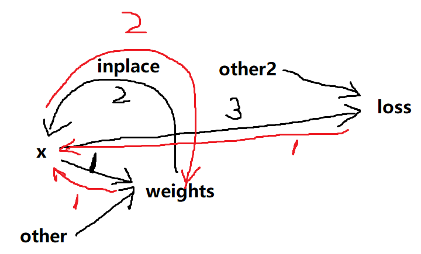

# 就地操作inplace常见错误

在计算图中，对不是叶节点的其余中间节点进行就地操作(inplace)，通常会引发一个无法反向传播的异常。

我们通过计算图来看为什么会这样

## 分析计算图

图中黑线部分是正向传播

红线部分是反向传播

当反向传播时，反向传播的第 2 阶段可以正常执行，因为 x 和 weights 值已知

但反向传播 1 阶段不能执行反向传播，因为执行 1 阶段反向传播所需的 x 的值已经被修改成了 2 阶段时的 x 值

**固总结: 通常来说，计算图的中间节点不能做就地修改，否则就会像上图一样，无法进行反向传播；==只有叶节点可以进行就地操作==**

## torch.Tensor.detach()

detach 用于将张量分离计算图，也就是保留张量中的数据的同时，让该张量变成一个**叶节点**

detach 返回的张量，required_grad 为 False，也就是不会追踪梯度

## pytorch 中部分模块(nn.Module)的就地操作也可以反向传播

例如: nn.ReLU()，relu 模块就地操作也能反向传播，因为 pytorch 在实现模块时，判断了导函数是否需要自变量，不需要自变量的情况，则可以进行反向传播。

例如: $x^2$ 导函数是 $2x$，则必须知道自变量 $x$ 是多少，才能求出导数；$2x$ 的导函数是 $2$，此处不需要知道自变量 $x$ 是多少，所以 $2x$ 中的 $x$ 被就地赋值也没有关系

nn.ReLU 函数是:

$$
\text{ReLU(x)}=
\begin{cases}
    \text{if } x > 0 & x \\
    \text{if } x \leq 0 & 0
\end{cases}
$$

导函数为

$$
\text{ReLU'(x)}=
\begin{cases}
    \text{if } x > 0 & 1 \\
    \text{if } x \leq 0 & 0
\end{cases}
$$

导函数不包含自变量，所以 nn.ReLU 可以进行反向传播

## 总结

**==非必要不要使用就地操作==**

