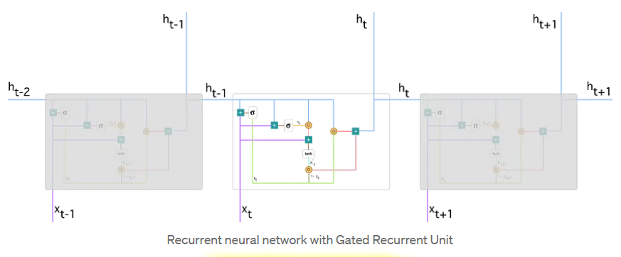
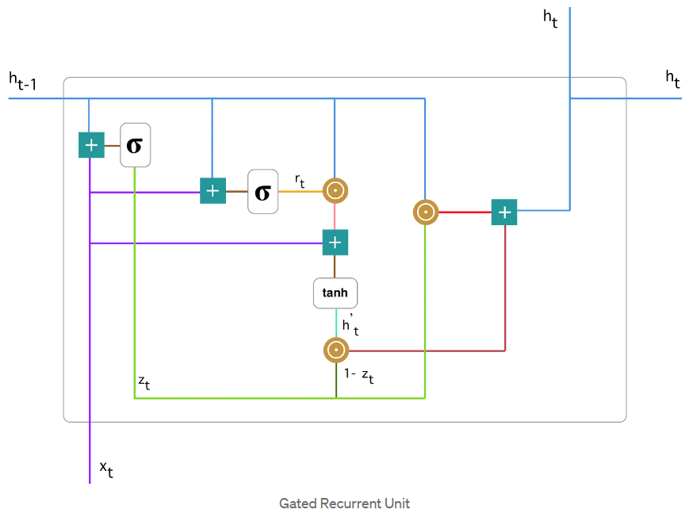
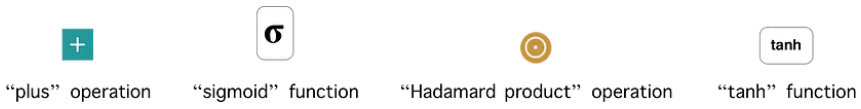
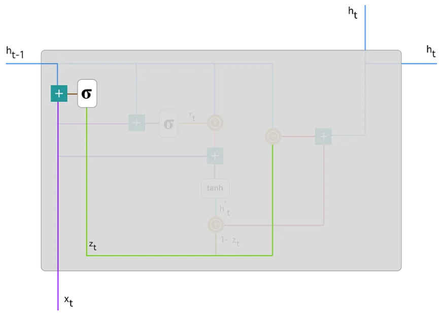
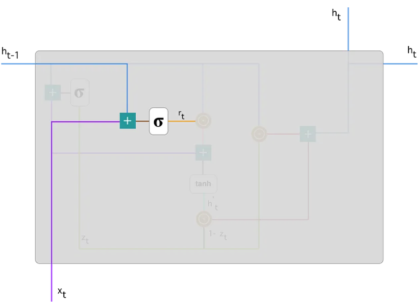
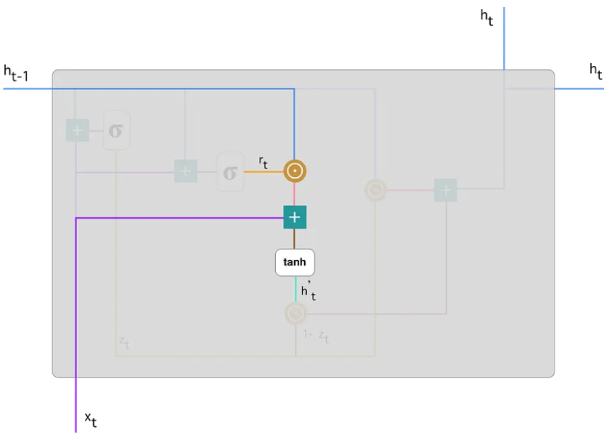
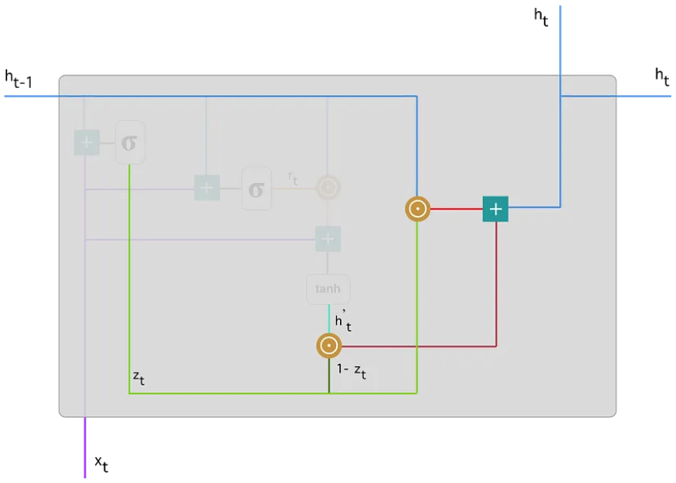

# GRU原理解析

## 什么是 GRU?

GRU (Gated Recurrent Unit) 门控循环单元，它是一种 RNN 的简单变体

和 RNN 相比 GRU 增加了 **更新门** (update gate) 和 **重置门** (reset gate)

通过两个门对网络数据进行控制，实现了以下优点:

- 解决了传统 RNN 梯度爆炸或消失的问题
- 网络能够学习保留序列中更重要的数据

## GRU 结构分析

### 总体结构图

类似 RNN，GRU 也是循环处理的，如图:

可以看到这幅图一共是循环 3 次的 GRU

和 RNN 类似，接收一个序列输入 $x_{t-1}$, $x_{t}$, $x_{t+1}$

通过 GRU 计算，输出隐藏状态，并将隐藏状态传入下一个 GRU 时间步

### 单个时间步解析

单个时间步的详细图，如下:

图例如下:

- 第一个符号: 加法
- 第二个符号: sigmoid 函数，将结果压缩到 0~1 之间
- 第三个符号: 逐位相乘，也就是两个形状相同的张量中，各个元素按照对应位置相乘
- 第四个符号: tanh 函数，将结果压缩到 -1~1 之间

接下来我们按步骤，一步步解释运行原理

#### 1. 更新门

我们通过上一个时间步的隐藏状态和这一次时间步的输入，求得更新门 $z_t$，如图:

公式如下:

$$
z_t = sigmoid(W_{z}x_t + U_{z}h_{t-1})
$$

- $W_{z}$: 关于输入的线性变换权重矩阵
- $U_{z}$: 关于上个时间步隐藏状态的线性变换权重矩阵

这个步骤我们求出更新门的值，结果是个 0~1 之间的数

##### 更新门作用

更新门计算出来是个比例系数，代表后面更新隐藏状态时的权重系数，是更新策略系数，更新策略[见下文](#更新策略)

#### 2. 重置门

和更新门的求法相同，如图:

公式为:

$$
r_t = sigmoid(W_{r}x_t + U_{r}h_{t-1})
$$

> ==**注意:** 虽然算法和更新门相同，但是两者使用的**权重是不同的**==

##### 重置门作用

用于决定上一个隐藏状态被保留的比例，描述了过去的信息有多重要，重置门趋近于 0，代表过去的信息完全不重要，趋近于 1，代表过去的信息非常重要

#### 3. 计算候选隐藏状态

候选隐藏状态是一个包含过去的信息和新的输入的数据，如图:

公式为:

$$
\tilde{h}_t = tanh(U (r_t \odot h_{t-1}) + Wx_t)
$$

> ==**注意:** 此处的**权重是不同于更新门和重置门的**==

##### 候选隐藏状态代表什么

代表了过去的信息和新输入信息的一个整体数据信息

#### 4. 更新隐藏状态

最后我们通过更新门和候选隐藏状态计算得到新的当前时间步的隐藏状态，如图:

公式为:

$$
h_t = z_t \odot h_{t-1} + (1-z_t) \odot \tilde{h}_t
$$

##### 更新策略

$z_t$ 代表更新系数，$z_t \odot h_{t-1}$ 决定了保留多少的过去的信息

$(1-z_t)$ 和 $z_t$ 组成了加权系数，其和为 $1$

$(1-z_t) \odot \tilde{h}_t$ 代表从候选隐藏状态中保留多少信息

$z_t$ 越趋近于 1，则表示本时间步中不关心新的数据 $x_t$

$z_t$ 越趋近于 0，则表示本时间步中更加考虑新的数据 $x_t$ 的影响

## GRU 如何解决 RNN 的梯度问题的?

GRU 通过更新门 $z_t$ 和 重置门 $r_t$ 控制了信息的流动和更新

两个门是一个 0~1 的系数值，用加权的方式来更新隐藏状态，那么隐藏状态的数据大小不会成指数膨胀，如下:

$$
h_t = z_t \odot h_{t-1} + (1-z_t) \odot \tilde{h}_t
$$

因为 $\tilde{h}_t$ 是结合了 $x_t$ 和 $h_{t-1}$，的数据，从极限角度看，当输入序列足够长时，则 $x_t$ 的影响将减少，那么==我们近似的认为 $\tilde{h}_t = h_{t-1}$==

然后把上述公式中的 $z_t$ 和 $(1-z_t)$ 抽象的看成权重 $W$，那么上述公式可以简化为如下公式:

$$
h_t = Wh_{t-1}
$$

那么我们可以认为==这个 $W$ 是趋近于 $1$ 的==，因为:

$$
h_t = z_t \odot h_{t-1} + (1-z_t) \odot h_{t-1} \\
= [z_t + (1 - z_t)] \odot h_{t-1}
$$

所以 $W = z_t + (1 - z_t) = 1$

==当 $W$ 趋近于 $1$ 时，无论 $W$ 循环相乘多少次，结果还是 $1$==

==**那么求导时，$\frac{\delta{h_t}}{\delta{h_{t-1}}} = 1$，导数为 $1$，梯度自然不会爆炸或消失**==

而传统 RNN 的隐藏状态如下:

$$
h_t = Wx_t + Uh_{t-1}
$$

传统 RNN 的 $h_t$ 会随着 $W$ 和 $U$ 的重复相乘，形成指数级递增或递减

权重指数递增时，其梯度切线就越接近垂直

权重指数递减时，其梯度切线就越接近水平

### 总结

==**GRU，LSTM 通过让 W 为 1，缓解梯度爆炸或消失的**==
