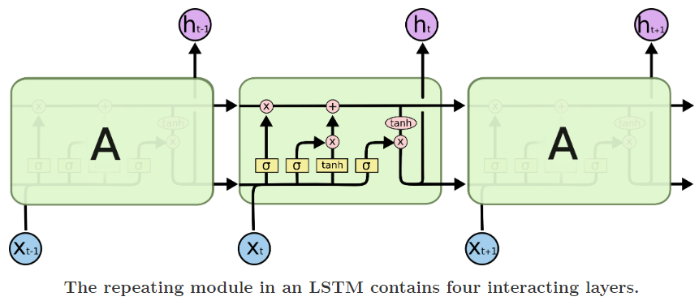
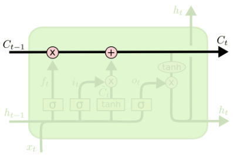
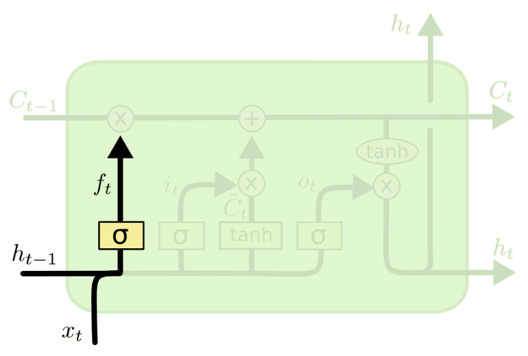
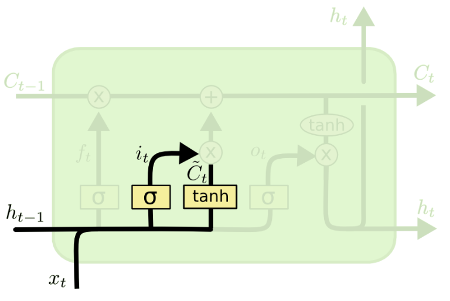
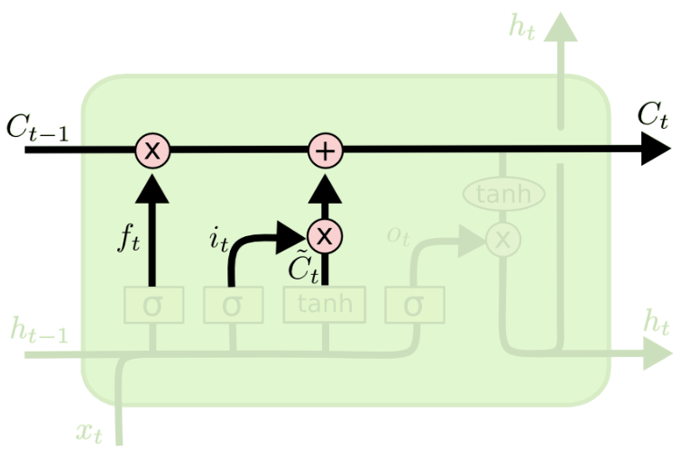
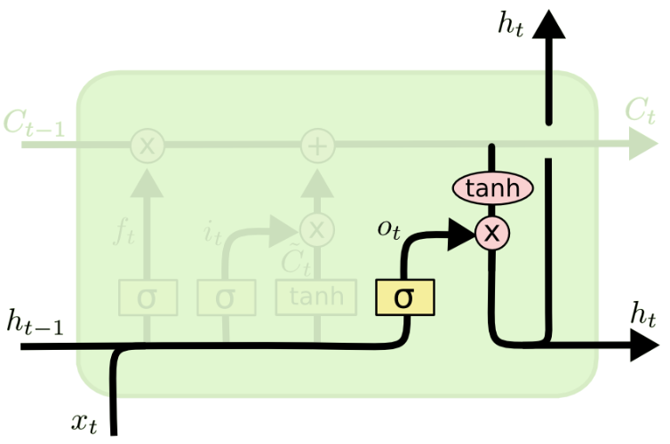
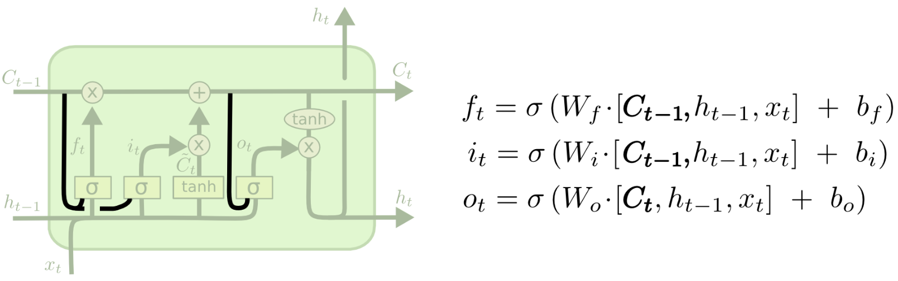
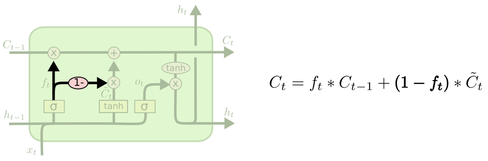
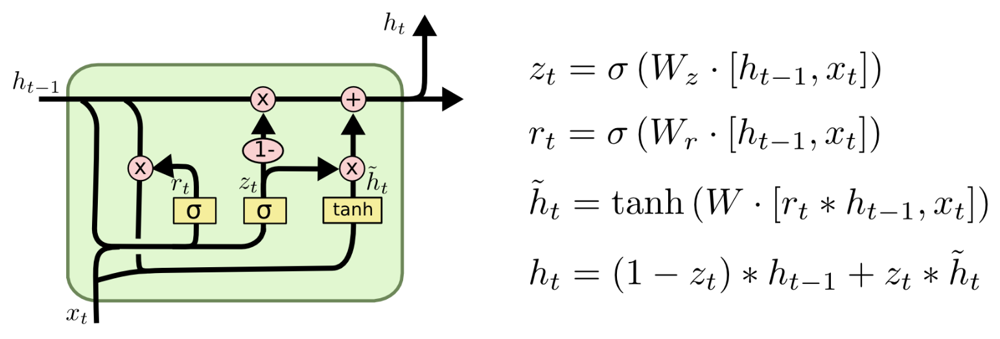

# LSTM 原理解析

## 什么是 LSTM?

LSTM (Long Short-Term Memory Network) 长短期记忆网络，是 RNN 的一种变体，用于解决长期依赖问题

和 GRU 相比，LSTM 参数更多，更适合处理长期依赖问题

## LSTM 结构分析

### 总体结构图

上图是循环 3 次的 LSTM 单元，展开一个单元，如下:

- 上面这条高亮的线就是**长期记忆**，其中存储的数据 $C$ 称为**单元状态**或**细胞状态**，英文是 **cell state**
- 与高亮线平行的下方有个以参数 $h$ 为主的线，这是**短期记忆**，$h$ 是**隐藏状态** **hidden state**

LSTM 主要围绕长期记忆和短期记忆的两条线，进行数据更新和输出

和 GRU 类似，这里用到了门的概念，包含三个门

- 遗忘门
- 输入门
- 输出门

接下来我们推演下具体的执行步骤

#### 1. 遗忘门

遗忘门将通过输入和短期记忆，计算一个记忆保留率，并将该比例剩到长期记忆中，如图:

其中记忆保留系数为 $f_t$，计算公式为:

$$
f_t=\sigma(W_f \cdot [h_{t-1}, x_t] + b_f)
$$

此处的 $[h_{t-1}, x_t]$ 代表张量拼接

求得 $f_t$ 后，为后续更新长期记忆做准备

##### 遗忘门的作用

可以看到通过 sigmoid 函数求得的 $f_t$ 是个 0~1 的比例值，该 $f_t$ 决定了单元状态 $C_{t-1}$ 保留多少，$f_t$ 为 0，代表长期记忆全部遗忘，为 1 代表全部保留

#### 2. 输入门

通过隐藏状态和输入值，计算出一个对长期记忆的偏移量，和该偏移量的缩放值，然后应用到长期记忆中进行偏移，结构如图:

输入门分为了两个部分 $i_t$ 和 $\tilde{C}_t$

$\tilde{C}_t$ 是我们通过隐藏状态和输入，计算出来的一个向量，代表长期记忆应该朝着哪个方向进行更新，更新多少信息，公式如下:

$$
\tilde{C}_t = tanh(W_c \cdot [h_{t-1}, x_t]+b_c)
$$

而 $i_t$ 是一个比例值，用于对 $\tilde{C}_t$ 进行缩放，决定了 $\tilde{C}_t$ 作为长期记忆的输入的重要性，为 0 代表完全不重要，为 1 代表输入全部保留。$i_t$ 的公式为:

$$
i_t = \sigma(W_i \cdot [h_{t-1}, x_t]+b_i)
$$

最后我们将 $i_t$ 和 $\tilde{C}_t$ 相乘，得到输入向量

$$
输入向量 = i_t \cdot \tilde{C}_t
$$

##### 输入门的作用

$\tilde{C}_t$ 决定更新向量

$i_t$ 决定 $\tilde{C}_t$ 向量的缩放

最后在 $i_t$ 和 $\tilde{C}_t$ 共同作用下，输入门起到了更新长期记忆的作用

#### 3. 更新长期记忆

我们结合遗忘门 $f_t$ 和输入门的输入向量，更新长期记忆，如图:

公式如下:

$$
C_t = f_t \cdot C_{t-1} + i_t \cdot \tilde{C}_t
$$

#### 4. 输出门

最后我们通过隐藏状态和输入求得一个比例值，再用该比例值和长期记忆求得更新后的短期记忆，如图:

首先我们求得一个短期记忆的更新比例 $o_t$，它决定了长期记忆有多啊少被保留下来，变成短期记忆，公式如下:

$$
o_t = \sigma(W_o \cdot [h_{t-1}, x_t]+b_o)
$$

然后用 $o_t$ 和 $C_t$ 更新短期记忆，如下:

$$
h_t = o_t \cdot tanh(C_t)
$$

最后结果 $h_t$ 既是当前 LSTM 单元的输出，也是下一个 LSTM 单元的隐藏状态，也就是短期记忆

##### 输出门的作用

求得当前 LSTM 单元的输出和短期记忆

## LSTM 变体

在很多实践和研究中，研究者们，会在原始 LSTM 结构上做一些微调，这里列举一些具有代表性的变体

### 添加窥视孔

可以看到，和传统 LSTM 相比，此处 $f_t$ $i_t$ $o_t$ 计算时，多连接了一个 $C_{t-1}$ 和 $C_{t}$

### 加权遗忘门和输入门

可以看到和常规的更新长期记忆不同，此处用 $1-f_t$ 代替了 $i_t$，这样的话让遗忘门和输入门形成一种加权关系

### GRU

GRU 是一种简化了 LSTM 的变体