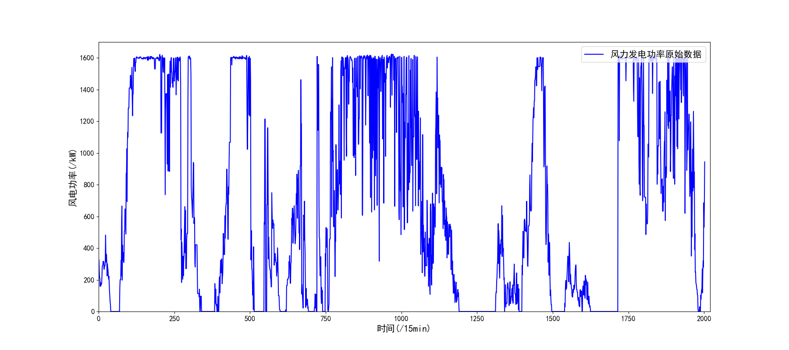
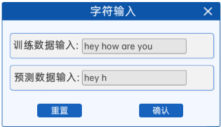
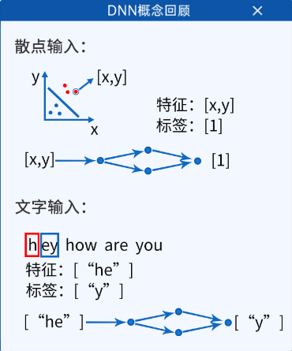
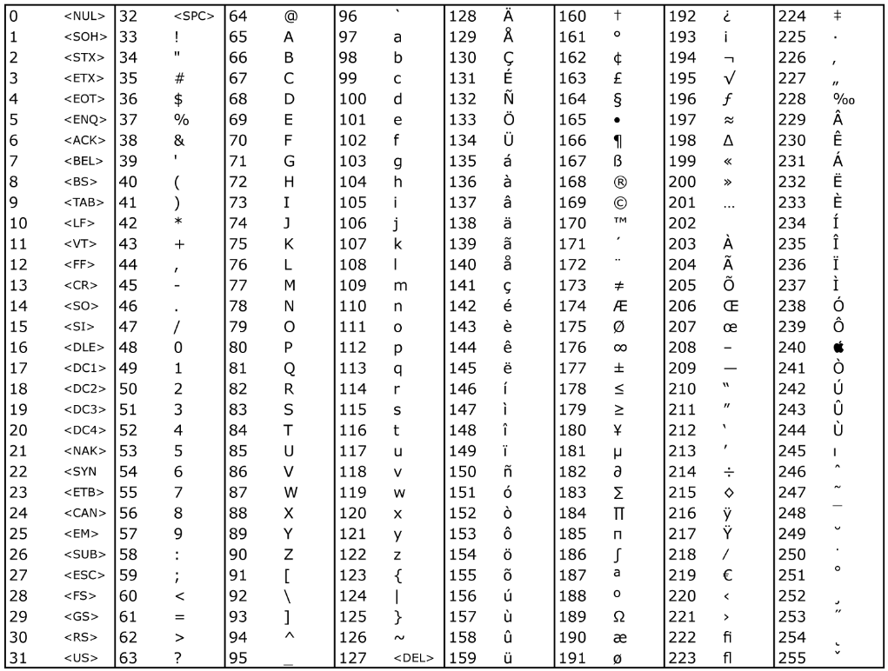

[TOC]

# DNN的时序预测与缺陷

## 1. 提出预测问题

在之前的学习过程中，我们学习了神经的基础和卷积神经网络，解决了一些回归问题，分类问题，包括图像分类等。

但是，之前的回归算法在解决拟合问题时貌似很有用，我们可以用一个多层的DNN神经网络去拟合一个二维内的一条曲线。

如下图是一个风电功率数据，横坐标是时间，纵坐标是发电功率，我们可以使用一个网络去拟合它：

但是如果涉及到想预测这个它，大家基于现有的学习内容有什么方案吗？

注意它的特点：这些数据点按照时间顺序排列，其中每个数据点都与其前后的数据点相关联。例如，时间序列数据、文本数据中的顺序信息等都属于时序任务的范畴。

这种任务叫 **时序任务** ，很多任务都是这类任务，如：时间序列预测（如股票价格预测）、自然语言处理中的语言模型、文本生成等。

现在有一个方案，如果我们将它原始的数据分组：

例如横坐标是0时，也就是10点钟：功率是300kW；横坐标是1时，10:15是285kW，以此类推，我们可以得到一组数据[300, 285, 278, 273, 281, ...]，那么下角标就是时间，内容是当时的发电功率。

分组的意思是：将前四个数据，即[300, 285, 278, 273]分为一组，第二组就是[285, 278, 273, 281]。

我们假设每个组前三个数据是特征feature，最后一个是标签label，是不是就形成了类似于我们之前学到的内容，大家思考一下。

## 2. NLP介绍

在本章节中不去预测数字，因为数字相对比较简单，这章节主要做NLP的处理与学习，NLP是什么呢？

自然语言处理（Natural Language Processing，NLP）是人工智能领域的一个分支，专注于使计算机能够理解、分析和生成人类自然语言的文本或语音数据。

NLP致力于构建能够处理自然语言的智能系统，使计算机能够与人类进行自然而流畅的交流，而不仅仅是执行预定义的任务。

以下是关于NLP的一些关键概念和应用：

1. **文本分析**：NLP技术可用于文本分析，包括文本分类、情感分析、主题建模和实体识别。文本分类涉及将文本分为不同的类别，情感分析用于识别文本中的情感或情感倾向，主题建模用于发现文本数据中的主题，而实体识别则是识别文本中的具体实体，如人名、地名和日期。
2. **语言生成**：NLP可以用于生成自然语言文本，包括自动摘要生成、机器翻译和对话系统。这些任务要求计算机生成与人类语言类似的文本，可以帮助自动化生成摘要、翻译文本，或实现自动对话。
3. **机器翻译**：NLP技术被广泛用于机器翻译，即将一种语言的文本翻译成另一种语言。这包括基于统计方法或神经网络的机器翻译系统，如Google翻译和深度LSTM模型等。
4. **对话系统**：对话系统（Chatbots）是NLP应用的一部分，它们被用于模拟人类对话。这些系统可以用于在线客服、虚拟助手和智能聊天机器人。
5. **自然语言理解**：NLP还包括自然语言理解（Natural Language Understanding，NLU），用于将文本数据转化为计算机可理解的结构化信息。NLU可以帮助计算机理解用户的意图，从而执行相应的操作。
6. **信息检索**：NLP技术用于信息检索，帮助用户通过搜索引擎找到相关的文档、网页或信息。关键词提取、文档检索和排名是信息检索的关键组成部分。
7. **情感分析**：情感分析是NLP中的一个重要任务，用于确定文本中的情感极性，例如正面、负面或中性情感。它在社交媒体监测、市场调研和舆情分析方面具有广泛的应用。
   NLP的发展在人工智能领域引发了广泛的兴趣和研究，以改善计算机在处理自然语言方面的能力，使其在文本理解、生成和对话方面取得更大的进展。深度学习技术，特别是循环神经网络（RNN）和变换器（Transformer）架构，已经在NLP任务中取得了显著的成功，推动了自然语言处理的发展。

在本章节中，主要讲循环神经网络（RNN），为了引出RNN，于是就有了第一个案例：DNN的时序预测与缺陷。

## 3. 基础原理

### 3.1 字符输入

在组件中，如下图指示，打开 **字符输入** 组件有一个输入框，可以看到：

训练数据输入框默认有一句话：`“hey how are you”`，大家可以数一下这里有几个字符。

一共15个，因为空格也算字符。

还有一个默认的预测数据输入：为hey h，具体内容我们后续会详细讲解。

在这里，目的就是通过训练`“hey how are you”`这句话，然后通过输入“hey h”得到后面的一个字母o。

### 3.2 DNN概念回顾

回顾一下DNN的过程，打开 **DNN概念回顾** 组件如下图指示，有一个散点输入的图，它的特征是\[x,y]，也就是散点输入中的点的横纵坐标，标签是0或者1，也就是图中的颜色。

以及它的网络结构，都在下面的图中：

那么要做的是什么呢？知道DNN的特性是根据特征与预测标签，那么是否可以将一部分字母做成特征，紧跟着后面的字母做成标签。尝试一下。

有了这个训练数据，那么如果我们输入 `“hey h”` 这个特征，想预测它后面的字母是什么，根据之前我们的理解，如果是数据的话，特征输入是 `“hey h”` ，输出的标签是 `“o”` ，然后往后走，像一维卷积核的窗口往后走一样，一个一个的往后移。

### 3.3 数据集划分

根据上一个组件知道：数据集是通过前面的推导后面的，并以此类推，那么数据集的划分就有说法了，如果一个字母作为特征对应一个字母作为标签，那么有一些的特征会有不同的标签，例如："h"->"e"，但是有的"h"->"o"。

所以需要使用多个特征以应对一个标签。

这里可以选择3/4/5个字母作为特征输入，这里需要注意的是，空格也算一个特征。那么根据选择的不同的特征数量，就可以得到不同的数据集。

例如特征维度选择5，那么可以得到：

- 特征是： ["hey h", "ey ho", "y how", " how ", "how a", "ow ar", "w are", " are ", "are y", "re yo"]
- 标签是： ["o", "w", " ", "a", "r", "e", " ", "y", "o", "u"]

那么一共是10组数据。

### 3.4 数据编码

在预测风电功率时，输入的特征是实际的数据[300, 285, 278, 273]，但是这里输入的是字母，但是根据认知，电脑里认的都是数字，就像图片其实是像素点数值而已。
那么在这里，也需要将字母转成数字：

两个方案：

- 将字母单纯的使用ASCII码替代；
- 将字母使用某个数字替代后，将其转换成ont-hot编码；

这两个方案都可以，但是为了给以后打基础（以后输入不是一个简单的字母，而是一个单词或者汉字，没办法直接使用ASCII码编码替代），所以使用第二种方案，
其实区别并不大。

这里就有说法了，使用方案二：如果这里的“某个数字”使用ASCII编码，第一个`h`就很大了，它是十进制的104，那么对应着one-hot编码的话，会得到：[0,0,...,1,0]，1会在下角标在104的位置，矩阵会非常大，而且有很多无用的位置被占用。

所以，这里的数字可以让我们自己定，以减小矩阵大小，我们的逻辑是：

1. 字母去重（hey how are you  ->  ['h', 'r', 'e', 'a', 'y', ' ', 'w', 'o', 'u']）
2. 字母按照ASCII码排序（['h', 'r', 'e', 'a', 'y', ' ', 'w', 'o', 'u']  ->  [' ', 'a', 'e', 'h', 'o', 'r', 'u', 'w', 'y']）
3. 按照ASCII的顺序进行从0开始编号（{' ': 0, 'a': 1, 'e': 2, 'h': 3, 'o': 4, 'r': 5, 'u': 6, 'w': 7, 'y': 8}）
4. 将每一个数字进行one-hot编码，然后将若干个组合成新的矩阵，无论多少个字母组成什么样子的都可以使用一个矩阵表示：
   - 'hey h'对应着[3, 2, 8, 0, 3]
   - 对应着one-hot:
     - [0, 0, 0, 1, 0, 0, 0, 0, 0]
     - [0, 0, 1, 0, 0, 0, 0, 0, 0]
     - [0, 0, 0, 0, 0, 0, 0, 0, 1]
     - [1, 0, 0, 0, 0, 0, 0, 0, 0]
     - [0, 0, 0, 1, 0, 0, 0, 0, 0]
   - 合并：[1, 0, 1, 1, 0, 0, 0, 0, 1]

### 3.5 定义前向模型

按照DNN的惯例，输入的特征个数->隐藏层->输出层特征个数。

1. 输入的特征个数是9，即[1, 0, 1, 1, 0, 0, 0, 0, 1]的长度。
2. 采用一层的隐藏层，其节点个数是可选的。
3. 输出层特征个数和输入特征个数是一样的，也是9。

### 3.6 定义损失函数和优化器

从上一个组件的图中可以看出，使用的是交叉熵损失函数，确认学习率和优化器Adam。

### 3.7 开始迭代

开始迭代就是一共训练的epochs。

### 3.8 显示频率设置

显示频率是每多少个epochs显示一次结果。

### 3.9 预测与输出

在预测时，会显示三个内容：

1. 网络结构图，这个图上需要标注除了Softmax和交叉熵之外的每个矩阵的shape。
2. 损失函数的下降曲线与迭代次数的图，横坐标迭代次数，纵坐标损失。
3. 预测结果，即在输入组件中预测数据输入的预测结果。

## 4. 总结

根据提供的信息，一个深度神经网络（DNN）的工作流程，用于文本分类任务。下面将对各个组件的主要内容进行总结：

1. **字符输入**：这个组件包括一个输入框，用于输入文本数据。默认情况下，输入框中包含一句话：“hey how are you”，其中字符总数是15，包括空格。
2. **DNN概念回顾**：这一部分回顾了深度神经网络（DNN）的概念。图示了一个简单的DNN结构，用于文本预测任务，其中输入特征是文本中的字符，输出是预测的下一个字符。
3. **数据集划分**：描述了如何划分数据集，其中每个特征对应一个标签。特征是文本序列，可以选择不同的特征维度，例如3/4/5，并将文本拆分成对应的特征和标签。提供了一个示例，其中特征维度选择为5，生成了10组数据。
4. **数据编码**：这一部分涉及将文本数据编码为数字表示。两种编码方案被提到，一是使用ASCII码替代，二是将字母使用某个数字替代后，再进行独热编码。详细说明了第二种方案，包括字母去重、排序、编号，以及将特征和标签进行组合，并生成独热编码矩阵。
5. **定义前向模型**：这个步骤包括定义深度神经网络的模型结构，包括输入层特征个数、隐藏层节点数量和输出层特征个数。在这里，输入特征的个数是9，隐藏层和输出层的特征个数是可选的。
6. **定义损失函数和优化器**：指定了使用的损失函数为交叉熵，以及学习率和优化器的选择为Adam。
7. **开始迭代**：这一步是模型的训练阶段，包括指定训练的epochs次数。
8. **显示频率设置**：指定了在训练中显示结果的频率，通常是每多少个epochs显示一次结果。
9. **预测与输出**：在模型训练完成后，提供了三方面的显示内容，包括网络结构图的标注、损失函数下降曲线的图示以及预测结果的输出。

总的来说，这个流程涵盖了文本数据的处理、编码、模型训练和结果显示的主要步骤，用于文本预测任务。

**但是，这个预测真的可行吗？**

这个方案只是一个字符级的序列生成模型，它使用了滑动窗口来将输入文本划分成序列，然后训练一个神经网络模型来预测下一个字符。
虽然代码可以用于字符级的文本生成，但在这种情况下，它不太适合进行有意义的时序预测。以下是一些原因：

1. 输入数据划分：代码使用滑动窗口来将输入文本划分成输入序列和目标序列，但这种划分方式是基于固定窗口大小的，不考虑输入数据的时间相关性。时序预测通常需要考虑数据点之间的时间依赖关系，而这个模型没有捕获这种关系。

总之，尽管这段代码可以用于字符级的文本生成，但它的目标和结构不适合进行有意义的时序预测。如果你需要进行有意义的时序预测，应该选择更适合处理时序数据的模型和方法。

