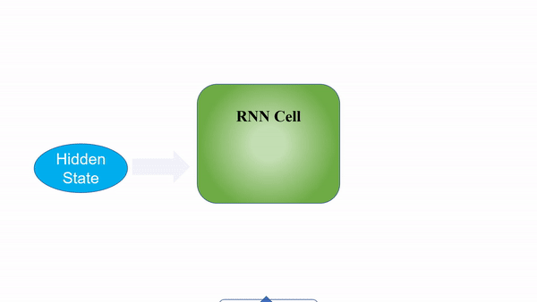
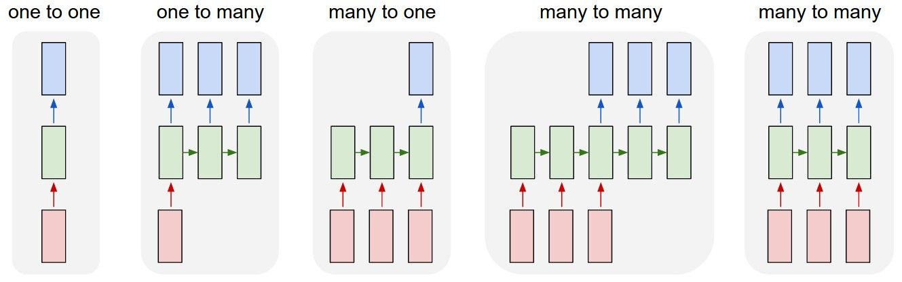
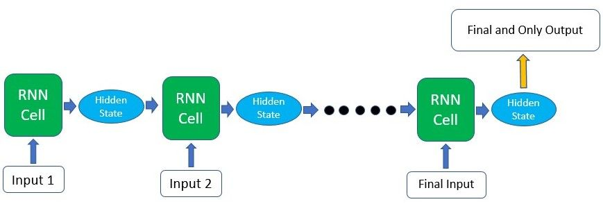
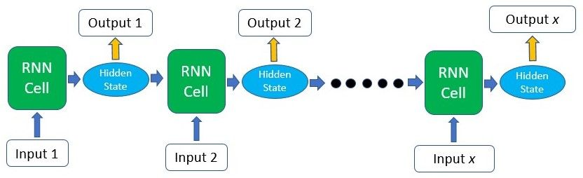
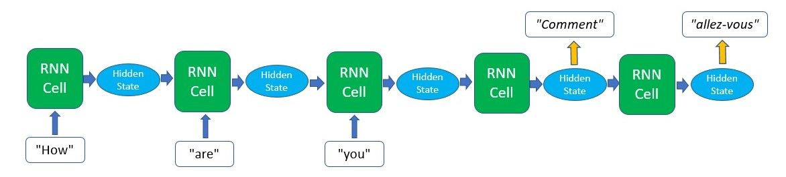

# RNN原理解析

[参考](https://blog.floydhub.com/a-beginners-guide-on-recurrent-neural-networks-with-pytorch/)

## 什么是RNN

RNN (Recurrent Neural Networks) 循环神经网络，是一种循环求解的网络。

一个 RNN 网络包含一个 RNNCell 循环神经网络单元，该单元是循环主体。

输入传递给 RNNCell 后，RNNCell 将输出一个结果和一个隐藏状态，隐藏状态用来描述循环过程的上下文，可以理解成网络对过往数据的记忆

然后，RNNCell 的输出和隐藏状态将再次传入 RNNCell 中，进行循环

> ==**注意:** 在 RNNCell 循环过程中，其权重是相同的==

RNN 运行示意图:

## RNN 作用

RNN 用来预测**序列**(**sequence**)的后续数据。例如: 通过已有股票数据预测未来股价，通过已知天气数据预测未来天气等

**序列**数据的特点是有时间连续性

虽然普通的 DNN 网络，也可以实现数据预测的效果，但是 DNN 没有考虑时序数据的前后关联性

## RNN 的灵活性

根据之前 RNN 运行示意图可知，HiddenState 隐藏状态将在每次循环 RNNCell 时进行传递，但是输出 Output 不一定传递给下一个
RNNCell

根据循环特性我们可以制作不同结构的 RNN，如图:

- 红色是输入、绿色是 RNNCell、蓝色是输出
- one to one: 一对一结构，一个输入产生一个输出，不进行循环
- one to many: 一对多结构，接收一个输入，并通过该输入预测一个序列出来
- many to one: 多对一结构，接收序列输入，得到一个输出
- many to many: 多对多结构，图中有两组

RNN 的灵活性就体现在:

- 输入序列的长度是可变的
- 输出序列的长度是可变的
- 采集输出的位置是可调整的，例如上图最后两个 many to many

以下是一个多对一的例子:

多对多的例子:

也可以是序列到序列，如图:

上图是通过一个语句 `How are you` 预测后续的内容，直到预测到语句结束的符号或长度达到上限则终止循环

## RNN 内部原理

如上图可知 RNNCell 需要接收输入和一个来自上一个 RNNCell 的 HiddenState，那么我们需要在 RNNCell 的内部，更新
HiddenState。若需要在当前 RNNCell 求得输出，则使用 HiddenState 求得输出

以多对多为例，假设每个 RNNCell 都产生一个输出，那么除了第一个 RNNCell 外，后续 RNNCell，都接收两个参数 input 和
HiddenState，并求得当前 RNNCell 的隐藏状态，公式如下:

$$
hidden_t = F(hidden_{t-1}, input_t)
$$

- hidden: 上文提到的 HiddenState，隐藏状态
- t: 代表第 t 个时间步。我们以一次循环为一个时间步
- F: 一个更新 hidden 的函数

将函数 $F$ 实现如下:

$$
hidden_t = tanh(weight_{hidden}*hidden_{t-1} + weight_{input}*input_t)
$$

- $tanh$: 激活函数
- $weight_{hidden}*hidden_{t-1}$: 上个时间步的隐藏状态的线性变换
- $weight_{input}*input_t$: 当前时间步输入的线性变换

当更新完隐藏状态后，我们可以计算当前时间步下 RNNCell 的输出，如下:

$$
output_t = weight_{output}*hidden_t
$$

实际输出就是一个关于 $hidden_t$ 的线性变换

当一个 RNNCell 运行完成后，就可以根据具体需求，实现 一对一、一对多、多对一、多对多、的循环结构了