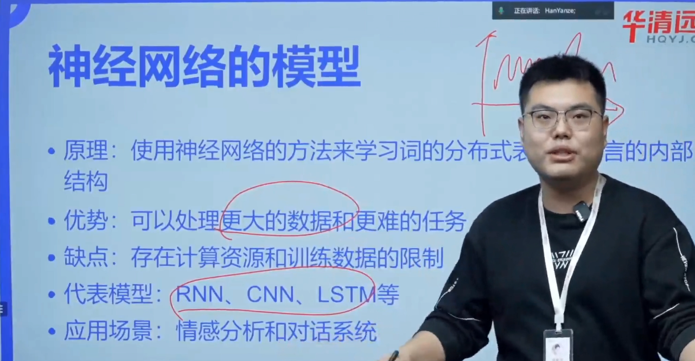

# transformer发展简介

## 部分模型分析

## 开源大模型

模型参数量 1b = 10亿

## 名词解析

## 模型数据来源与差异

## 大模型发展的主要分支

GLM2 开始就借鉴了 LLama 采用了 Decoder-Only 结构

## 大公司发展

## encoder-decoder

输入和输出数量不同，且输出数量应该更多却没有得到正确数量输出时，称为**失步**

encoder-decoder 结构如下

训练方法有几种

上图描述的是 free-running mode，自由运行模式，其思想是拿预测的结果作为下一次的输入预测下一个字，这种方法模型很难训练或学到正确的内容

上图的训练方式叫 teacher-forcing mode，也就是教师强迫训练，我们用真实值 Ground True 作为输入训练模型

free-running mode 和 teacher-forcing mode 通常会一块儿使用，先用 teacher-forcing mode 强制教会模型基本信息，再用 free-running mode 让模型更具泛化性