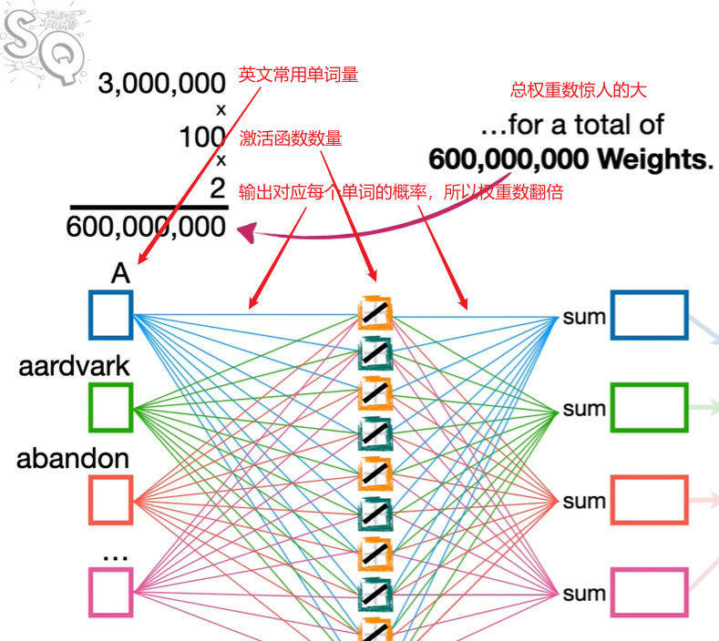
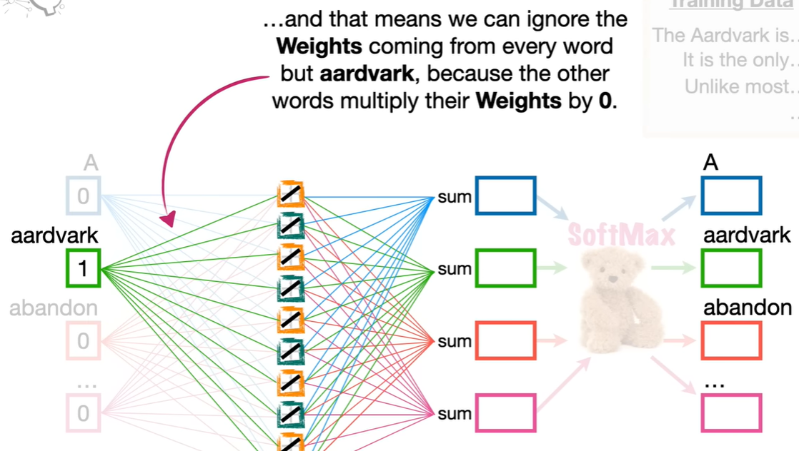
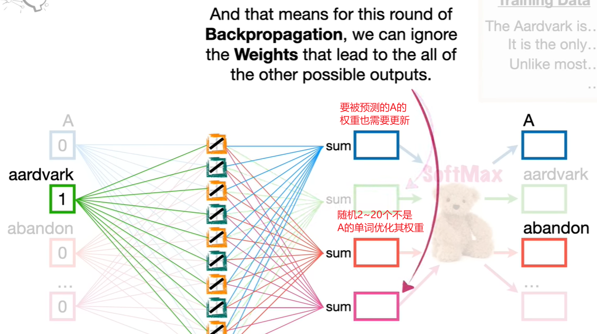
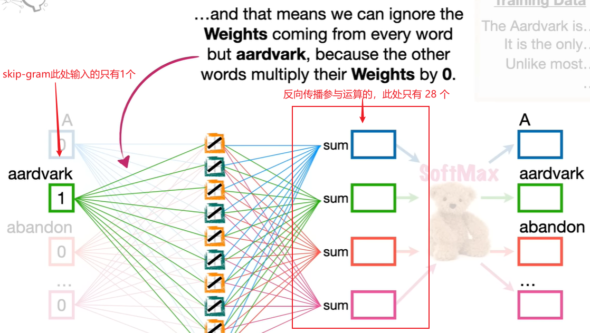
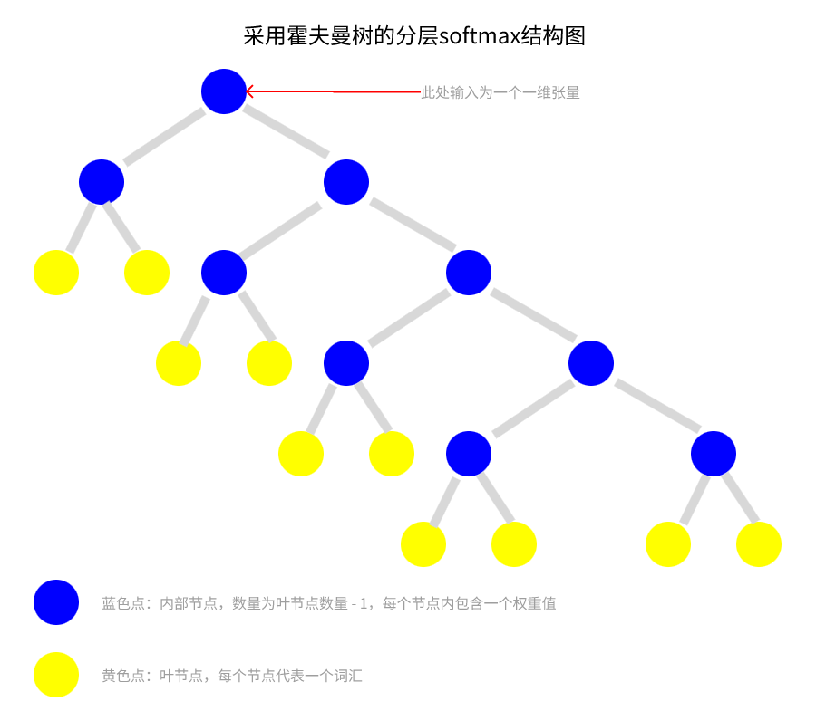
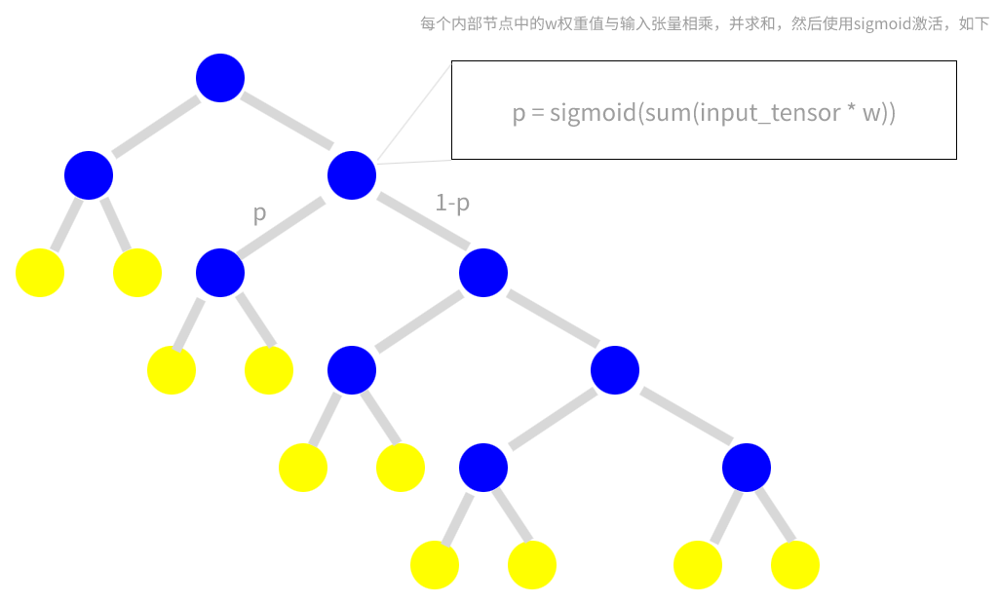
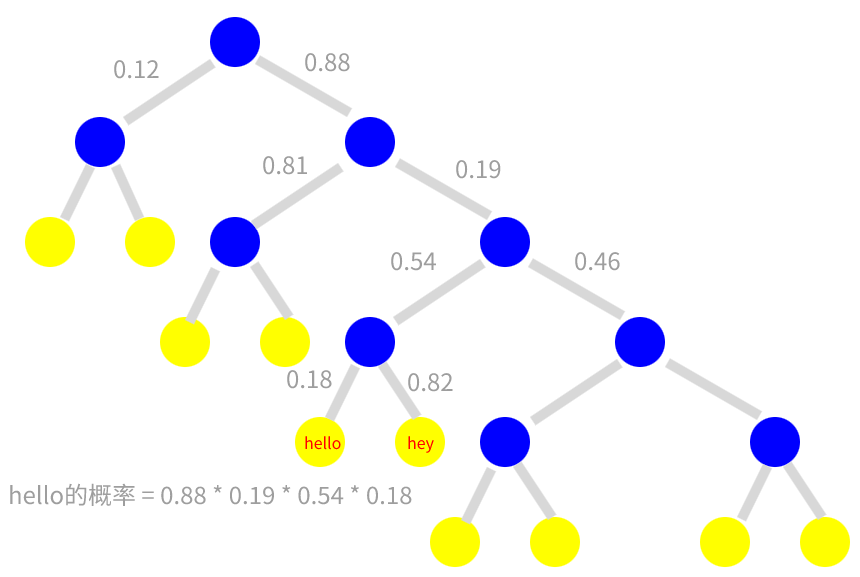

# Word2Vec 模型优化

word2vec 模型训练成本取决于语料数据集大小和嵌入维度，当数据集足够大，嵌入维度足够多时，训练负担将非常重

这里介绍两种优化方法: 负采样 和 分层softmax

这里我们使用 skip-gram 模型做讲解

## 负采样 Negative Sampling

### 什么是负采样

采集非真实值的其他样本的过程称为负采样。

假设一个词的上下文有8个词，那么采集不是这8个上下文词的其他词，就是负采样

### 为什么要负采样

实际应用中，常用单词短语数量将达到三百万，而中间词向量维度（也就是线性变换的输出）也至少有一百个，如图:



我们可以计算出 Word2Vec 模型要优化的权重个数

我们假设 cbow 的输入单词数和 skip-gram 输出单词数都是 8，则:

$$
cbow需要更新的权重数 = 100 * 8 + 3,000,000 * 100 \\
\textit{skip-gram}需要更新的权重数 = 100 + 3,000,000 * 100 * 8
$$

### 负采样原理

负采样的大致原理是，通过训练材料，我们知道要预测的下一个是什么词。然后我们选择2~20个不是想要预测的词，再和想要预测的值一起进行反向传播，优化模型。这样就不用更新全部词汇的权重了。下面介绍具体的流程

首先，我们输入一个词，预测下一个词，则不会优化输入以外的其他词的权重，因为其他词输入为0，乘以权重结果仍然是0，不影响结果，则不用优化权重，如图:

我们假设输入是 `aardvark`，期望预测结果是 `A`



然后我们**负采样**，选择2~20个不想被预测的词汇，如图



我们将想要预测的词，称为**正样本**，不想预测的词，称为**负样本**

最后我们进行反向传播前，我们只保留 正样本 和 负样本，其余单词不计入训练中，这样可以大大减小运算成本

以 skip-gram 模型为例，我们通过输入一个词，得到想要输出的 8 个词，那么这 8 个词是正样本。然后我们随机词库，获取不是想要预测的正样本的其他 20 个负样本。然后，反向传播时，我们只反向传播这 28 个样本。则，优化参数如图:



所以被优化的权重个数为:

$$
\textit{skip-gram}权重个数 = 100 + 100 * 28
$$

### 如何随机负样本？

首先统计词频概率，也就是词语在整个数据集中出现的频率

然后按照频率的大小，进行负采样，这样的话，高频词将更容易被采样到

我们可以使用以下 api:

```py
# list(word_keys): 所有单词的列表
# size=sample_num: 取多少个样本，通常是 5~20 个
# p=list(weight_probs_list): 权重概率列表，也就是词频列表
np.random.choice(list(word_keys), size=sample_num, p=list(weight_probs_list))
```

### 负采样性能

通过实验我们得到，当词汇量不算特别大时，负采样后，进行梯度下降和优化模型的时间消耗几乎和不采用负采样是一样的。所以负采样适合词汇集较大的数据集。

然而，负采样本身会带来性能开销，若词汇集较小，负采样可能会是一种负优化。

例如: 我测试过一次负采样需要 0.02s 左右时间，而一个批次 100 条数数据，则会增加 0.02 * 100 = 2s 的时间。然而梯度下降和优化的时间，无论是否使用负采样都不会变化，稳定在 0.1s 左右。

## 分层softmax Hierarchical Softmax

分层softmax采用了一种霍夫曼树的二叉树结构，如图



黄色节点为==叶节点==，**代表的是词汇表中的每个单词**，**此处会按照词频排列，出现频率高的排列到左边，低的排列到右边**

内部节点中把输入张量和节点内的权重相乘并求和，再求 sigmoid，计算出一个概率值

$$
p = sigmoid(sum(input\_tensor * w))
$$

内部节点的分支，一边采用 p 作为概率，另一边采用 1-p 的概率。这些概率值代表到达叶节点经过该路径的概率，如图:



我们假设每条路径的概率，则到达每个叶节点概率如图:



如上图，到达每个单词的概率，是其路径概率的乘积

通过以上方法，我们可以算出每个节点的概率分布，就得到了分层softmax的结果

### 分层softmax性能

和负采样相同，当数据量不够大时，使用分层softmax会增加节点创建的时间开销，变成负优化。例如: 我们词汇集只有 46677 个词，不足百万，每次分层softmax，需要 cpu 计算 7~8 秒的时间

### 注意事项

当我们在模型中手动使用 softmax 或 分层softmax 时，我们的损失函数应当使用 **负对数似然值损失函数 NLLLoss**