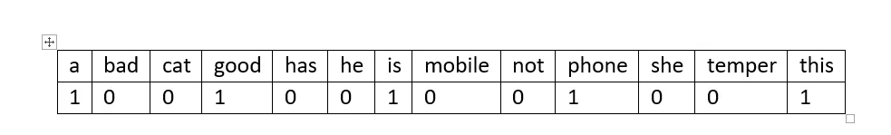
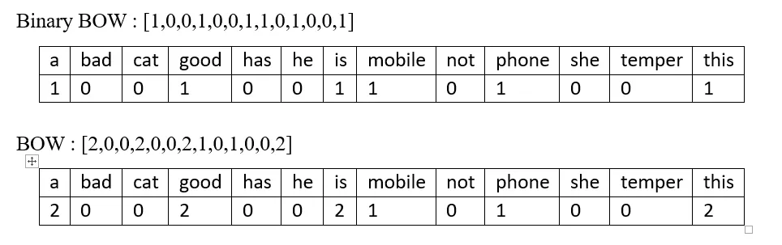

# WordEmbedding 词嵌入

[参考](https://medium.com/analytics-vidhya/nlp-text-encoding-a-beginners-guide-fa332d715854)

## 文本编码

首先，有些基本事实如下

- 机器无法理解文字，词语，句子
- 机器只能处理数字
- 文本数据必须转换成数字，机器才能理解

所以为了实现 NLP 我们必须进行文本编码

文本编码是将有意义的文本转换为数字/向量表示的过程，以保留单词和句子之间的上下文和关系，以便机器能够理解任何文本中关联的模式并能够理解句子的上下文。

常见文本编码方式如下:

- Index-Based Encoding 基于索引的编码
- Bag of Words (BOW) 词袋
- TF-IDF Encoding 词频-逆文档频率编码
- Word embeddings 词嵌入

我们假设一个词库和一个句子，来讲解各种文本编码的基本原理

词库:

```
[“a” , “bad” , “cat” , “good” , “has” , “he” , “is” , “mobile” , “not” , “phone” , “she” , “temper” , “this”]
```

句子:

```
this is a good phone
```

接下来通过不同方式对句子进行编码

### Index-Based Encoding 基于索引的编码

我们首先给每个词添加一个索引，例如:

- a: 0
- bad: 1
- ...
- this: 12

这样依赖我们可以编码我们的句子为:

```
[12 6 0 3 9]
```

one-hot 独热编码就是一种基于索引的编码，把上面的索引转换成 one-hot，如下:

```
[0 0 0 0 0 0 0 0 0 0 0 0 1]
[0 0 0 0 0 0 1 0 0 0 0 0 0]
[1 0 0 0 0 0 0 0 0 0 0 0 0]
[0 0 0 1 0 0 0 0 0 0 0 0 0]
[0 0 0 0 0 0 0 0 0 1 0 0 0]
```

### Bag of Words (BOW) 词袋

词袋是一种不考虑文本顺序的编码，词袋有两种

- Binary BOW 二元词袋
- BOW 词袋

Binary BOW 只考虑单词是否在词库中出现，出现的词，在对应位置设置为 1，其余设置为 0

所以 `this is a good phone` 可以按出现单词进行编码如下:



编码结果如下:

```
[1 0 0 1 0 0 1 0 0 1 0 0 1]
```

而 BOW 词袋会考虑词出现的次数，例如一句话 `this is a good phone this is a good mobile`

那么 BOW 编码如下



可以看到 BOW 编码会统计单词的出现次数，而 Binary BOW 不会

### TF-IDF Encoding 词频-逆文档频率编码

全称: Term Frequency-Inverse Document Frequency

为了进行 TF-IDF 编码 我们要讲解以下要点:

#### 词频

词频（Term Frequency，TF）：TF表示一个词语在文档中出现的频率，通常用词语出现的次数除以文档中总词语数来计算。即，对于一个词语 t 在文档 d 中的 TF 计算如下：

$$
TF(t,d) = \frac{n_{t,d}}{n_d}
$$

- t: 单词
- d: 文档，通常以一个句子作为一个文档
- $n_{t,d}$: 单词在文档中出现次数
- $n_d$: 文档中所有单词总数

假设我们的文档是 `this is a good phone`

那么词汇 `t=this d=this is a good phone`，则 $TF = 1/5$

#### 逆文档频率

逆文档频率（Inverse Document Frequency，IDF）：IDF表示一个词语在文档集合中的普遍程度，即该词语在文档集合中的重要性。IDF的计算方式为总文档数除以包含该词语的文档数，并取对数。即，对于一个词语 t 的IDF计算如下：

$$
IDF(t) = log(\frac{N}{df_t})
$$

- N: 文档集中的文档总数
- $df_t$: 出现指定单词 t 的文档数量
- $log$: e 为底数的对数

我们看一个例子，假设我有 3 句话

```
this is a good phone
a mobile phone is good
she has a bad phone
```

当我们对第一句话的 good 进行编码时，公式中的 $N=3$，$dft=2$，多以:

$$
IDF(good) = log(\frac{3}{2}) \approx 0.4055
$$

#### TF-IDF权重

TF-IDF权重：TF-IDF权重是TF和IDF的乘积，用于衡量一个词语在文档集合中的重要性。TF-IDF权重表示了一个词语在单个文档中的频率与在整个文档集合中的频率之间的平衡。即，对于一个词语 t 在文档 d 中的TF-IDF权重计算如下

$$
\textit{TF-IDF}(t,d)=TF(t,d) \times IDF(t)
$$

## Word Embedding 词嵌入

Word Embedding（词嵌入）是一种将文本数据中的词语映射到**实数向量**空间的技术。在自然语言处理和机器学习中，词嵌入是将文本数据中的词语转换为连续向量表示的一种有效方式。这种表示方式能够保留词语之间的语义关系，并且通常用于文本处理任务，如文本分类、情感分析、命名实体识别等。

**词嵌入的主要思想是将词语映射到一个低维实数向量空间中**，使得在这个空间中具有相似语义的词语在向量空间中彼此之间的距离较近。这种连续向量表示的好处是可以捕捉到词语之间的语义和语法信息，例如，语义上相似的词语在向量空间中会更加接近，而具有相似语法关系的词语在向量空间中也会有类似的几何关系。

词嵌入模型通常是通过大规模文本语料库进行训练得到的，其中最著名的模型之一是Word2Vec。Word2Vec使用了一种称为连续词袋（Continuous Bag of Words, CBOW）和Skip-gram的模型结构来学习词嵌入。除了Word2Vec外，其他常用的词嵌入模型还包括GloVe（Global Vectors for Word Representation）、FastText、BERT等。

词嵌入的应用非常广泛，它在自然语言处理任务中起着至关重要的作用，能够帮助模型更好地理解和处理文本数据。