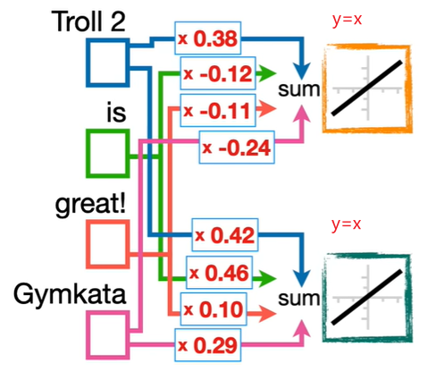

# word2vec模型

[论文](https://arxiv.org/abs/1301.3781)

[参考](https://medium.com/analytics-vidhya/nlp-text-encoding-word2vec-bdba5b900aa9)

[代码实现参考](https://towardsdatascience.com/word2vec-with-pytorch-implementing-original-paper-2cd7040120b0): 这篇文章对认识 pytorch 在文本处理中常用的 API 的学习很有帮助

## 什么是w2v

如同字面意思，是词转向量，也就是说 w2v 是一个将词汇转换成向量的模型



如上图，我们将文本通过全连接得到两个输出，那么中间部分的**红色数字即为权重**，**这些权重就是词嵌入word embedding也叫做词向量word vector**

例如图中单词 is 的词向量是 `[-0.12, 0.46]`

great 的词向量是 `[-0.11, 0.10]`

在论文中，词向量的维度通常是几百个，也就意味着，上图的全连接层应该输出几百个值

### 词向量化的含义

通过上述词汇的两个权重，将两个权重作为两个坐标轴，我们可以将词汇向量化到坐标系，如图:


当我们训练模型后，相似的词语应该比较靠近，如图:


在论文中，经过充分训练的模型甚至可以达到如下效果:

```
以下是些向量运算
国王 King - 男人 Man + 女人 Women = 女王 Queen
更大 bigger - 大 big + 小 small = 更小 smaller
巴黎 Paris - 法国 France + 德国 Germany = 柏林 Berlin
```

## 模型结构

模型结构如图，模型接收 one-hot 编码的文字作为输入


Word2Vec 结构非常简单，大致分为 2 层

- 嵌入层 Embedding Layer: 用来求词嵌入
- 线性层: 用来训练模型

如图:


最后通过一个 softmax 求概率分布

模型输出值代表的是预测的文本的概率，概率越大，意味着模型认为越可能的文字可能性越大

模型输出的具体含义和模型具体的训练方式有关，接下来我们了解下模型的两种训练方式:

- Continuous Bag of Words (CBOW)
- Skip Gram

## 训练方式

我们在训练 w2v 模型时，为了让模型考虑文本在上下文中的含义，例如: 国王和男人的关系，女王和女人的关系，巴黎和法国的关系等等。研究者想出了两种训练模型的方式:

### Continuous Bag of Words (CBOW) 连续词袋

CBOW 连续词袋是一种通过上下文，预测中间词汇的方法，如图:


CBOW 输入输出关系如图:


由图可知，输入通常是上下文共 4 个单词，输出 1 个中间单词

**CBOW 往往在较小的数据集中表现良好**

### Skip Gram 跳字模型

"n-gram" 是指连续的n个词或字符序列，所以 skip gram 可以译为跳过序列

Skip Gram 跳字模型是一种通过中间词预测上下文的训练方法，如图:


skip gram 输入输出关系如图:


由图可知，输入长度为 4，不过每个输入都是相同的，输出 4 个上下文关联的词汇

**Skip-gram 在较大的数据集中往往表现更好**
