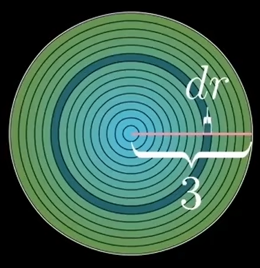
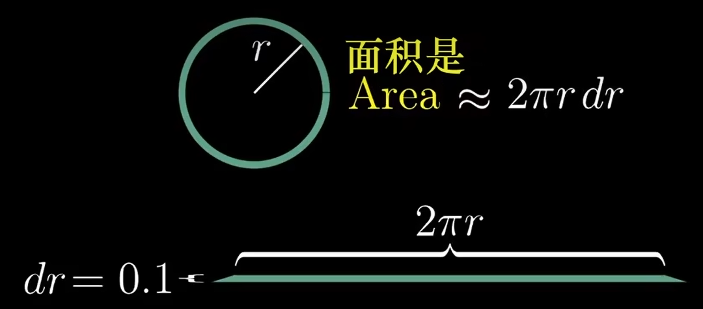
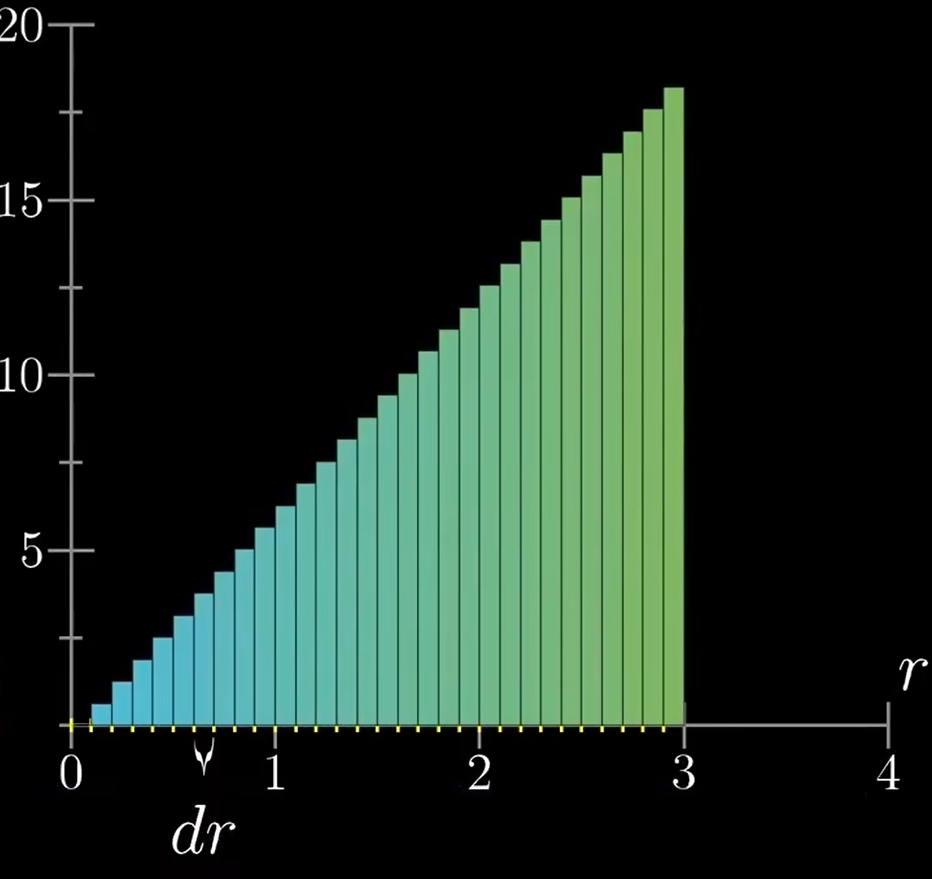
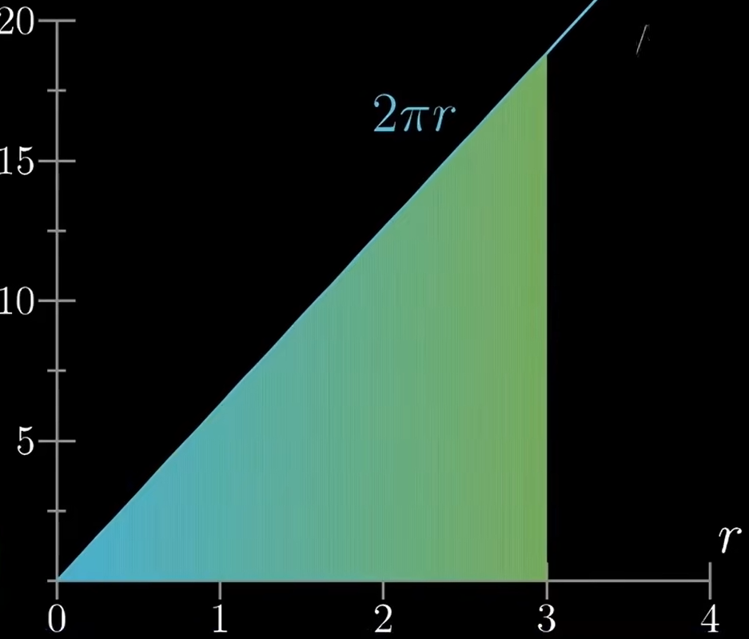
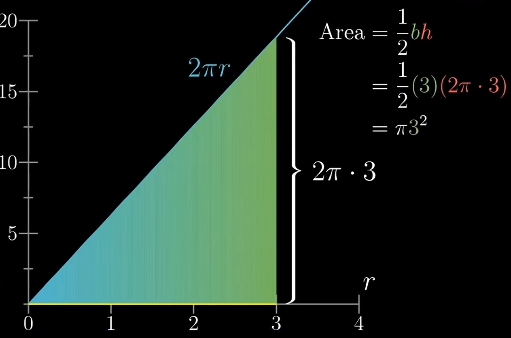
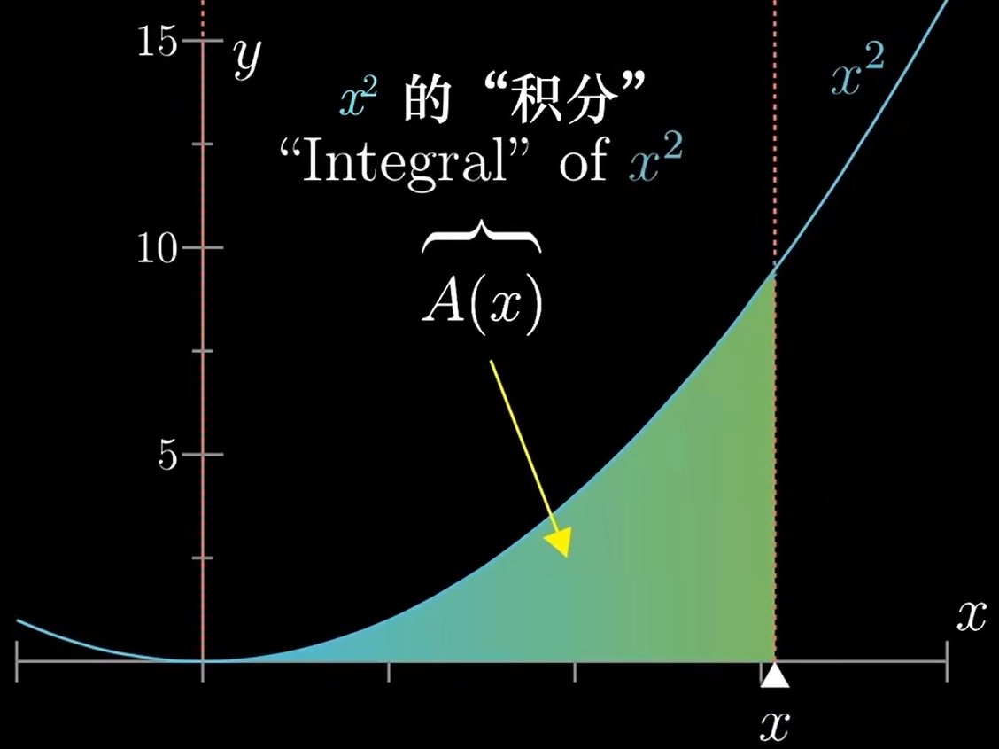
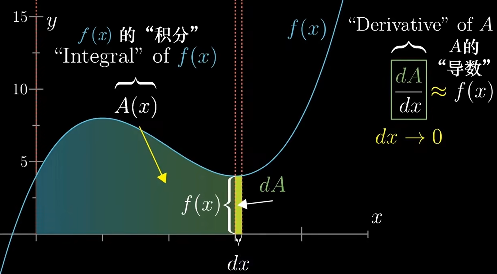

# 【官方双语】微积分的本质 - 01 -

[视频](https://www.bilibili.com/video/BV1cx411m78R/?spm_id_from=333.999.0.0&vd_source=e3e6bb1b164806ab40cbadaa22f05b43)

<div style="background-color: #000; color: #fff; padding: 8px;">
“数学之道在于找出一个这样的<b style="color: #98a8d5;">特例</b>，它包含普遍原则的全部萌芽。”
<div style="color: #ff0; text-align: right;">
—— 大卫 · 希尔伯特
</div>
</div>
<br/>
本视频是对微积分的概览

## 引子 - 如何求圆面积

我们将园切分成无数个同心圆环，如图:



假设园半径为 `3`，每个同心圆环的间距为 `dr`

然后我们可以想象把圆环展开，近似的当作矩形来求面积，例如:



那么这个环带的宽应该是圆周长 `2πr` 高则是圆环间距 `dr`

面积则为 `Area ≈ 2πr dr`

从图中可以发现，当 `dr` **越小**，则这个矩形面积就越**准确**

那若将整个圆所切分出来的所有圆环带拉伸成矩形，并放入一个坐标系中，我们可以得到这样的图:



横轴为半径 `r`

纵轴为 `2πr` 也就是刚才圆环带的周长

每个矩形的窄边为 `dr` 也就是圆环带间距

由于例子中半径为 `3`，所以此处的圆环带到 `3` 则停止了

根据刚才得到的结论 `dr` **越小越准确**

当 `dr` 趋近于 `0` 时，则可以近似的将此图看作一个三角形，如图:



图中的 `2πr` 是 `y` 轴坐标点的函数，则 `2π` 就是斜率

如此一来圆面积就可以**近似于**这个三角形的面积



然后我们把固定的半径参数 `3` 替换成变量 `R` 则得到了我们的圆面积公式:

```math
Area = πR^2
```

## 积分的概念

10m40s 积分概念解释



如图，函数 `A(x)` 是曲线下面积函数，我们称 `A(x)` 是曲线 x<sup>2</sup> 的**积分**

## 导数的概念

14m20s 导数的概念



图比较复杂，分别解释以下数学符号的含义

- `f(x)`: 图中的曲线函数
- `A(x)`: 图中曲线下的面积函数，也是 `f(x)` 的积分
- `dA`: 对应 `dx` 宽度下，`f(x)` 曲线下的面积，如图，该面积应该等于 `f(x)*dx`
- `dx`: x 轴上的增量，导致 `dA` 变化的因子

导数是什么？导数就是当 `dx -> 0` 趋近于 `0` 时，`dA/dx` 这个比值趋近的数就是导数

实际上导数描述了函数某一点的 **瞬时变化率**