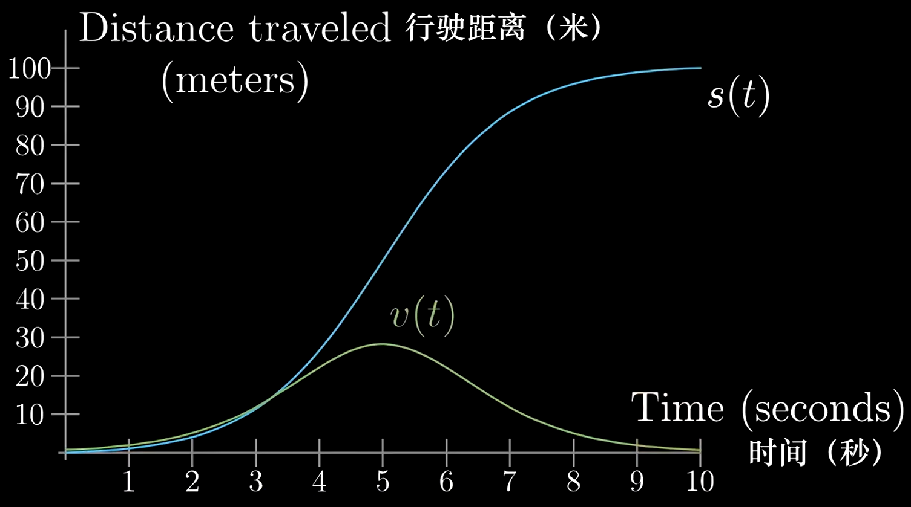
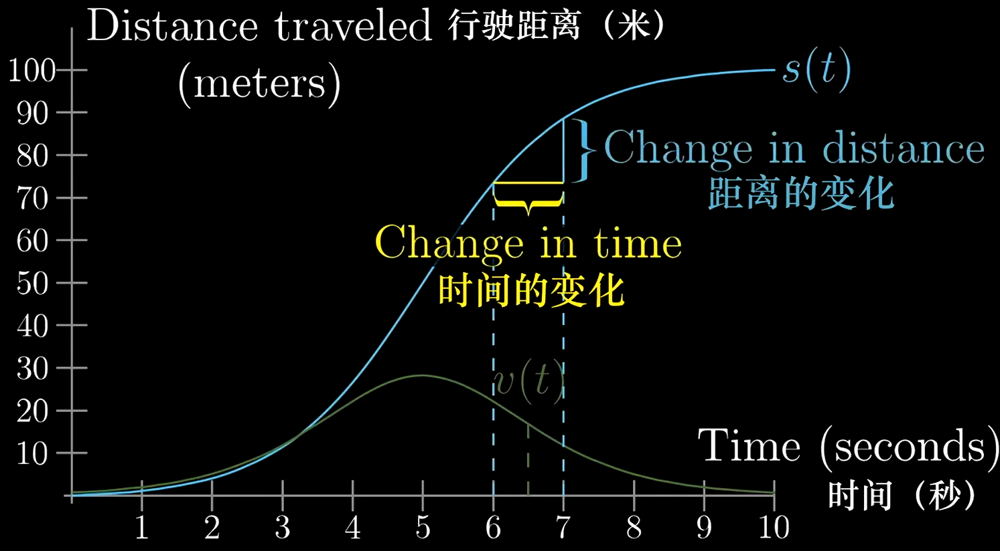
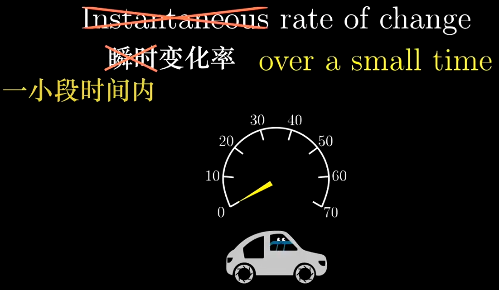
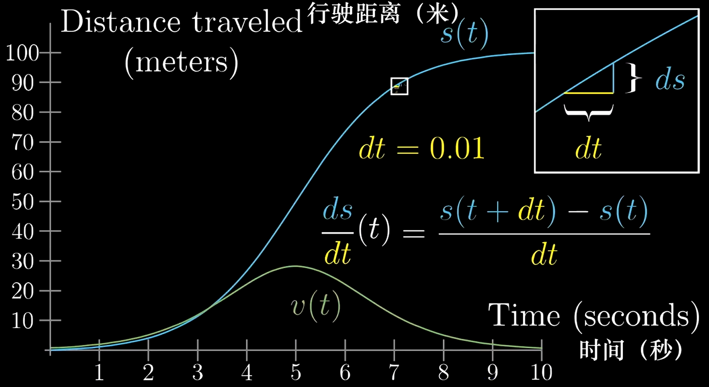
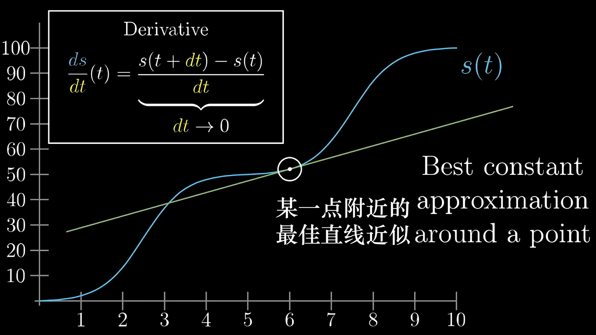
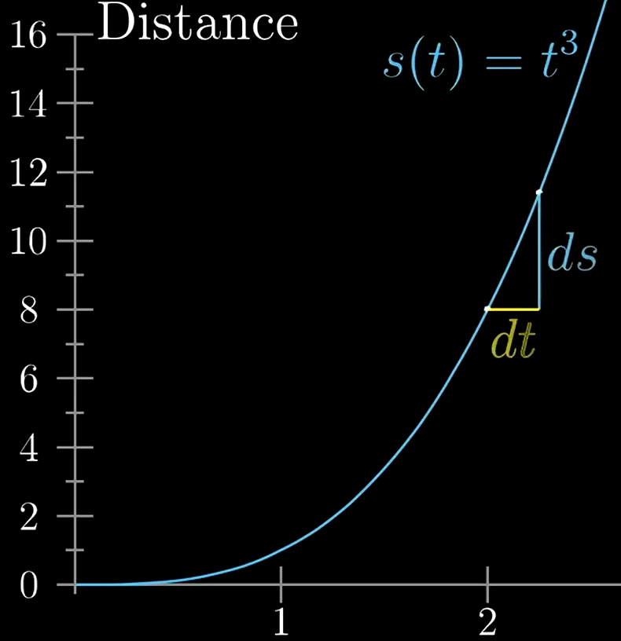

# 【官方双语】微积分的本质 - 02 - 导数的悖论

[视频](https://www.bilibili.com/video/BV1Lx411m7Vj/?spm_id_from=333.788.recommend_more_video.-1&vd_source=e3e6bb1b164806ab40cbadaa22f05b43)

<div style="background-color: #000; color: #fff; padding: 8px;">
“数学法则只要与<b style="color: #4ba8c4;">现实</b>有关，都是不<b style="color: #90ab74;">确定</b>的；若是<b style="color: #90ab74;">确定</b>的，都与<b style="color: #4ba8c4;">现实</b>无关。”
<div style="color: #ff0; text-align: right;">
—— 阿尔伯特 · 爱因斯坦
</div>
</div>
<br/>

学习目标:

1. 学习导数 (Learn derivatives)
2. 避免矛盾 (Avoid paradoxes)

## 引子

假设一辆车在 10s 内行驶了 100m，如图



- `s(t)`: 距离-时间 曲线
- `v(t)`: 速度-时间 曲线

然而 `v(t)` 曲线是有**矛盾**的

### 速度曲线 v(t) 的矛盾

试想一个问题: 速度是这么算出来的？

```math
v = s / t
```

速度应该是**一段距离**比上**一段时间**得到的

而函数 `v(t)` 却能求出某**一个时刻**的速度，这不是很奇怪吗？

实际上速度的计算需要知道变化的距离和变化的时间，如图



所以理论上如图的速度值，描述的应该是 6~7 秒间的平均速度，那么 `v(t)` 这个**瞬时速度**又是怎么算出来的呢？这里出现了矛盾

那么图中的 `v(t)` 是怎么得到的？

`v(t)` 和汽车的车速表的显示原理是一样的，本质上是取很小的时间差例如 0.01s 然后再计算这段时间位移的距离，最后其比值就是速度了，所以



对于汽车来说，没有**瞬时速度**，其实速度表显示的是**很小很小一段时间内**的速度

### 速度曲线 v(t) 的由来



以下是对上图符号的解释

- 右上角区域是放大后的某个时刻的距离-时间图
- `dt`: 一小段变化的时间，例如前面提到汽车车速表的 0.01s
- `ds`: 一小段变化的距离

由此可见，`v(t)` 实际上可以转换成 $\frac{ds}{dt}(t)$；此处将时间值带入 s(t) 函数中，如下:

```math
v(t) = \frac{ds}{dt}(t) = \frac{s(t + dt) - s(t)}{dt}
```

以上速度函数被转换成和距离-时间相关函数。其中，`dt` 被人为设定成了 `0.01`（视频作者故意设置了 `dt` 的值，否则电脑绘制不出 `v(t)` 图）

## 导数的悖论



根据图左上角公式可知，其实上述 `v(t)` 函数某一时刻的值其实就是 `s(t)` 函数的在某个时刻上的**导数**，`v(t)` 实际上就是 `s(t)` 的**导函数**

根据导数的概念，`dt` 既不是 `0`，也不是**无穷小**，而是**趋近于零**

### 矛盾点

所以导数虽然常被称为 **瞬时变化率** 但这个 **瞬时** 实际上指的是 `dt` **趋近于零** 而非某个时刻

所以图中把导数称为: **某点附近的最佳直线近似**

> 之所以被描述为**直线**，是因为 $\frac{ds}{dt}$ 可以看作正切值，则**直线**是该正切值所谓斜率的直线，最终与图中 `s(t)` 曲线相切

## 求导过程

求导过程本质上就是代数求解的过程，其中**保留趋近于零**的值，最后再做处理，例如:

我们有一个距离-时间图是 $s = t^3$



这里我们取 $t = 2$ 来计算导数，则

$$
\frac{ds}{dt}(2) = \frac{s(2 + dt) - s(2)}{dt}
$$

因为 $s(t) = t^3$，带入函数，则

$$
\frac{ds}{dt}(2) = \frac{(2 + dt)^3 - 2^3}{dt}\\
= \frac{2^3 + 3(2)^2dt + 3(2)(dt)^2 + (dt)^3 - 2^3}{dt}\\
= \frac{3(2)^2dt + 3(2)(dt)^2 + (dt)^3}{dt}\\
= 3(2)^2 + 3(2)(dt) + (dt)^2
$$

最终我们发现 当 `dt` 趋近于零时，式子中包含 `dt` 的部分被抹掉了，则最终 $t = 2$ 的导数为:

$$
\frac{ds}{dt}(2) = 3(2)^2
$$

求任意 t 的导函数为:

$$
\frac{ds}{dt}(t) = 3(t)^2
$$
