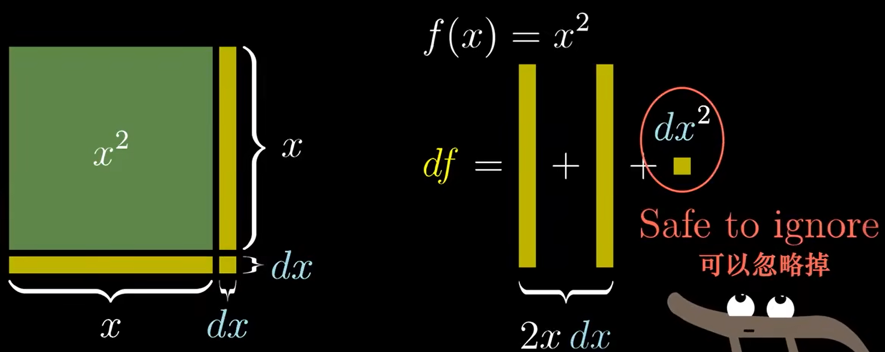
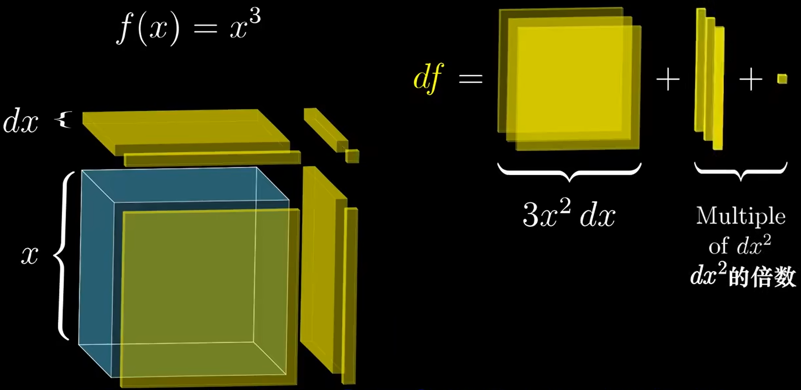
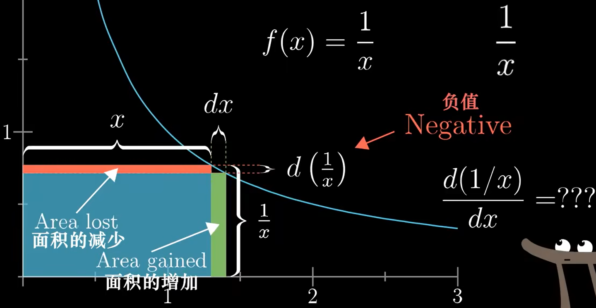
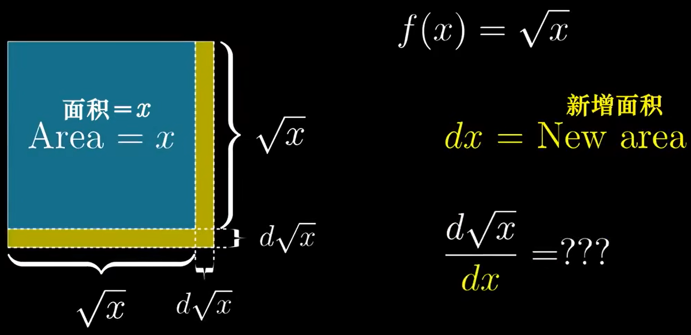
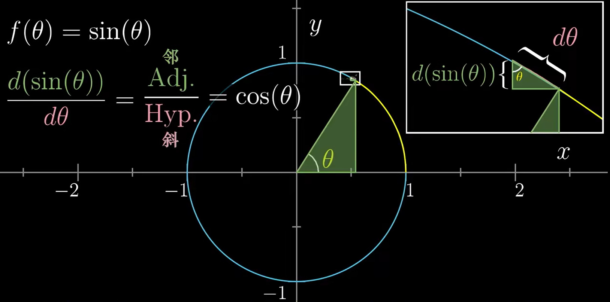
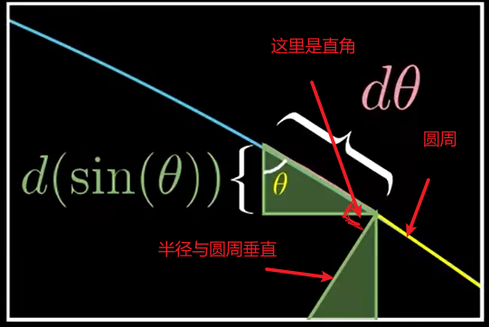
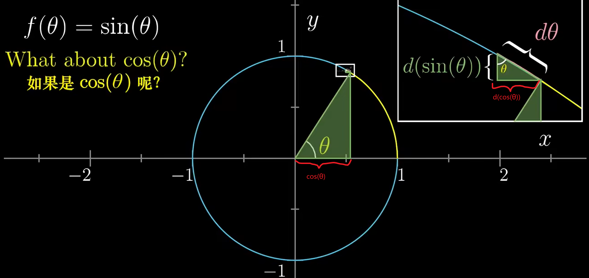

# 【官方双语】微积分的本质 - 03 - 用几何来求导

[视频](https://www.bilibili.com/video/BV1zx411m7Le/?spm_id_from=autoNext&vd_source=e3e6bb1b164806ab40cbadaa22f05b43)

“他曾没有足够的<b style="color: #4ba8c4;">想象力</b>来当数学家。不过他成了一名诗人，现在过得挺好。”

—— 大卫 · 希尔伯特

 

## 求导公式

这里罗列了常见的求导公式

幂函数求导公式

$$
f'(x^n) = nx^{n-1}
$$

分数函数求导公式

$$
f'(\frac{1}{x}) = -1x^{-2} = -\frac{1}{x^2}\\
f'(\frac{1}{x^n}) = -nx^{-(n+1)}
$$

根号函数求导公式

$$
f'(\sqrt{x}) = \frac{1}{2}\sqrt{x}^{-1} = \frac{1}{2}x^{-\frac{1}{2}}
$$

正弦函数求导公式

$$
f'(sin(θ)) = cos(θ)
$$

其余视频中未涉及额求导公式如下

- 常数导数为零: $(a)' = 0$
- $f'(e^x) = e^x$

## 幂函数求导

以 $x^2$ 为例，如图，可以理解成边长为 x 的矩形:

- `dx`: x 的增量
- `df`: 图中黄色区域，也就是面积的增量

所以如图可知，`df` 应该等于两个黄色长条 $x·dx$ 再加上小方块 $dx^2$

$$
df = 2x · dx + dx^2
$$

如图，$dx^2$ 在 $dx$ 趋近于零时，可以忽略

所以函数 $f(x) = x^2$ 导数应该是:

$$
f'(x^2) = \frac{df}{dx} \\
= \frac{2x·dx}{dx} = 2x
$$

$x^3$ 求导也类似，如图:

- `dx`: x 的增量
- `df`: 增大的体积

如图可知:

$$
df = 3x^2dx + 3dx^2x + dx^3
$$

所以求导过程为:

$$
f'(x^3) = \frac{df}{dx} = \frac{3x^2dx + 3dx^2x + dx^3}{dx} \\
= 3x^2 + 3dxx + dx^2\\
当dx趋近于零时\\
= 3x^2
$$

所以幂函数的统一求导公式为

$$
f'(x^n) = nx^{n-1}
$$

## 分数函数求导

如图，是 $\frac{1}{x}$ 的图像

- $dx$: x 的增量
- $d(\frac{1}{x})$: 函数 $\frac{1}{x}$ 由于 x 改变的增量，图中可以看出，x 增加 $d(\frac{1}{x})$ 减少，所以该值为负值

x 的值无论变成多少 $x·\frac{1}{x} = 1$，所以图中红色区域是减少的面积，应该等于绿色区域增加的面积，所以:

$$
x·-d(\frac{1}{x}) = dx·\frac{1}{x + dx}\\
f'(\frac{1}{x}) = \frac{d(\frac{1}{x})}{dx} = -\frac{1}{x(x+dx)}\\
= -\frac{1}{x^2 + xdx}\\
当dx趋近于0时 \\
= -\frac{1}{x^2} = -x^{-2}
$$

所以通用的公式为

$$
f'(\frac{1}{x^n}) = -nx^{-(n+1)}
$$

## 根号函数求导

上图将 $\sqrt{x}$ 作为边长，则蓝色区域面积为 $x$

- $dx$: 增加的面积，图中黄色区域
- $d\sqrt{x}$: 增加的边长

由图可知，黄色面积可以标识如下

$$
dx = 2\sqrt{x}·d\sqrt{x} + (d\sqrt{x})^2\\
dx = d\sqrt{x}(2\sqrt{x} + d\sqrt{x})\\
f'(\sqrt{x})=\frac{d\sqrt{x}}{dx} = \frac{1}{2\sqrt{x} + d\sqrt{x}} \\
当 x 趋近于 0 时 \\
=\frac{1}{2\sqrt{x}} = \frac{1}{2}\sqrt{x}^{-1} = \frac{1}{2}x^{-\frac{1}{2}}
$$

## 正弦函数求导

如图，将正选函数看作一个半径为 1 的园，$θ$ 即正弦值角度，右上角部分是放大后的增量图部分

- $dθ$: 弧度增量，极限的看近似于直线
- $d(sin(θ))$: 正弦值的增量
- 图中右上角小三角形的夹角也是 $θ$，原因如图:
  

则导数应该为:

$$
f'(sin(θ)) = \frac{d(sin(θ))}{dθ} = \frac{邻边}{斜边} = cos(θ)
$$

加入换成求 $cos(θ)$ 导数，则如图:

所以余弦函数导数为:

$$
f'(cos(θ)) = \frac{dcos(θ)}{dθ} = \frac{对边}{斜边} = sin(θ)
$$
