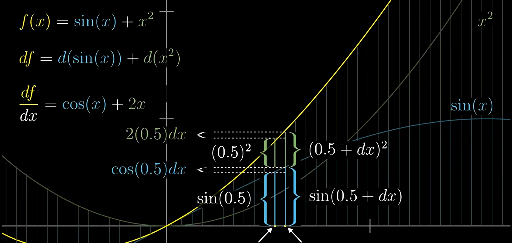
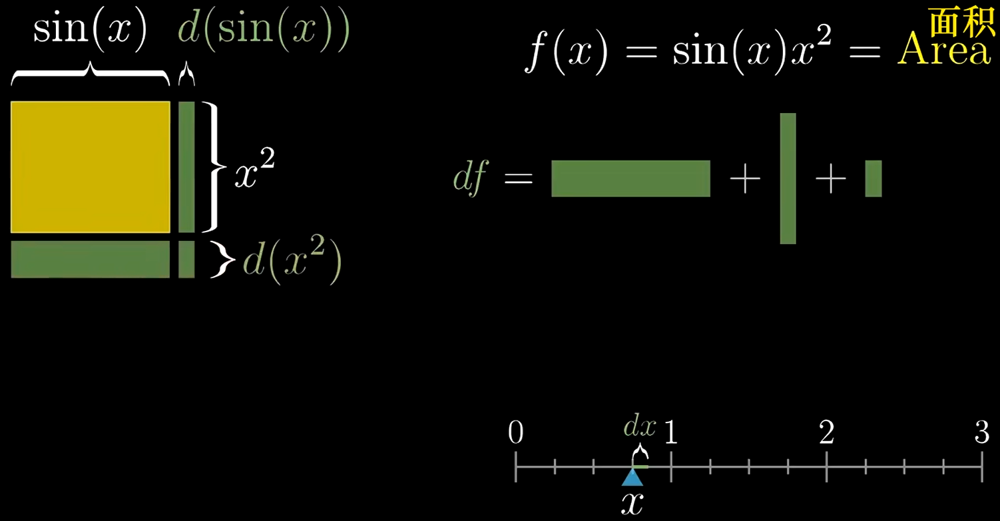
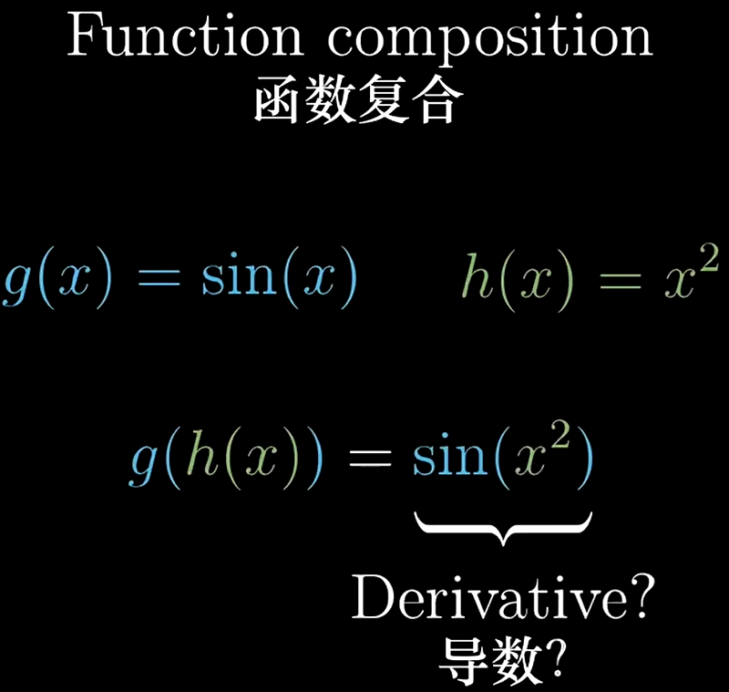
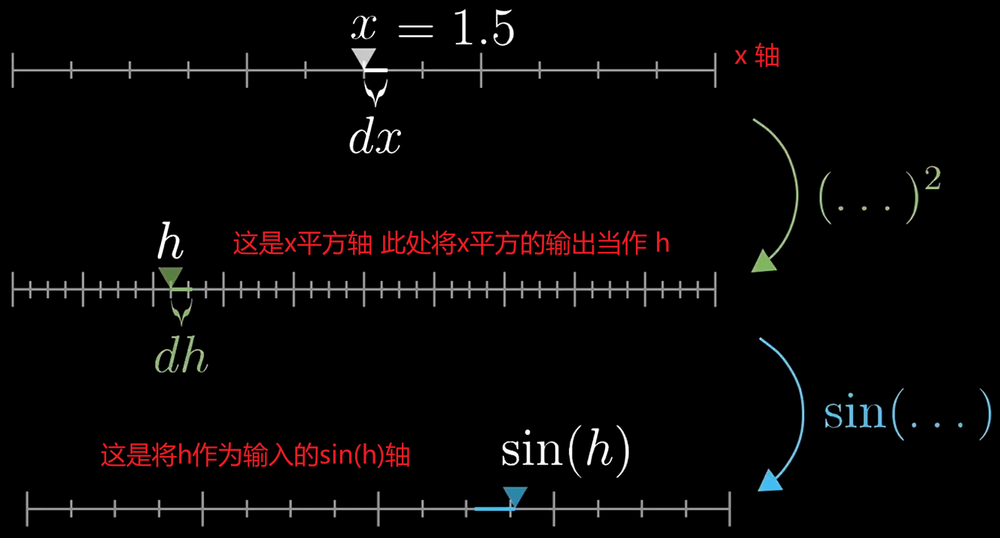
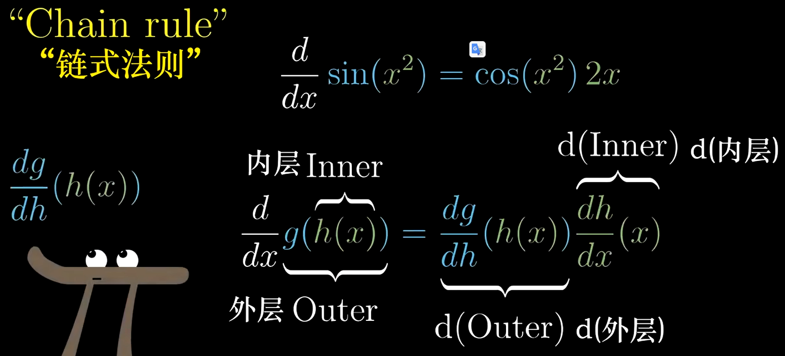
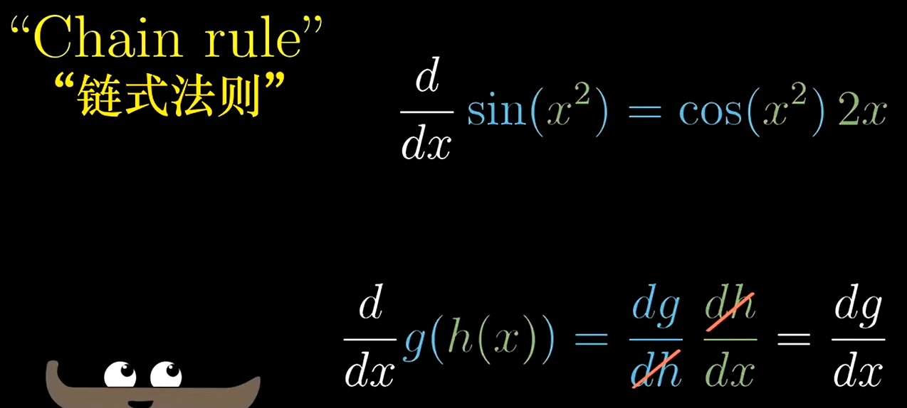

# 【官方双语】微积分的本质 - 04 - 直观理解链式法则和乘积法则

[视频](https://www.bilibili.com/video/BV1Sx411m7Zz/?spm_id_from=333.788.recommend_more_video.-1&vd_source=e3e6bb1b164806ab40cbadaa22f05b43)

本章节目的: 学会复合函数求导

## 加法法则

2m 加法法则

### 结论

当一个函数 $f(x)$ 由两个函数 $g(x) + h(x)$ 组成，则 `两个函数和的导数，等于两个函数导数的和`

$$
\frac{d}{dx}(g(x)+h(x)) = \frac{dg}{dx}+\frac{dh}{dx}
$$

### 求证过程

如下图，我们来求 $f(x) = sin(x) + x^2$ 的导函数

- 黄线: $f(x)$ 的曲线
- 蓝线和绿线: 分别代表 $sin(x)$ 和 $x^2$
- $df$: 由 $dx$ 引起的 $f(x)$ 的增量

如图所示，$df$ 因为

$$
df = d(sin(x)) + d(x^2)
$$

因为我们知道 $sin(x)$ 和 $x^2$ 的导数，所以:

$$
df = cos(x)dx + 2x dx
$$

所以我们可以推导出 $\frac{df}{dx}$:

$$
\frac{df}{dx} = cos(x) + 2x
$$

所以，当我们把 $sin(x)$ 当作 $g(x)$；$x^2$ 当作 $h(x)$ 时:

$$
\frac{df}{dx} = \frac{dg}{dx} + \frac{dh}{dx}
$$

## 乘法法则

4m30s 乘法法则

### 结论

两个函数相乘的导数，等于 `左乘右导加右乘左导`:

$$
\frac{d}{dx}(g(x)h(x)) = g(x)h'(x) + h(x)g'(x)
$$

### 求证过程

我们求 $sin(x)x^2$ 的导数，两个函数相乘，我们想象成求面积，如图

- $df$: 由 $dx$ 产生的 $f(x)$ 的增量，图中的绿色区域面积

所以，$df$ 应该等于 3 块小绿色矩形的和:

$$
df = sin(x)d(x^2) + x^2d(sin(x)) + d(x^2)d(sin(x))\\
当dx趋近于0时，d(x^2)d(sin(x))忽略不计，因为太小了\\
df = sin(x)d(x^2) + x^2d(sin(x))
$$

由于我们已知正弦函数和幂函数的导数，所以带入式中:

$$
df = sin(x)2xdx + x^2cos(x)dx\\
\frac{df}{dx} = sin(x)2x + x^2cos(x)
$$

将 $sin(x)$ 当作函数 $g(x)$；$x^2$ 当作函数 $h(x)$，则

$$
\frac{d}{dx}(g(x)h(x)) = g(x)h'(x) + h(x)g'(x)
$$

## 函数复合 链式法则

### 结论

一个函数的自变量是另一个函数的函数值时，该函数的导数为 `外函数求导，自变量不变，乘以内函数求导`:

$$
\frac{d}{dx}(g(h(x))) = g'(h(x))h'(x)
$$

### 求证过程

8m50s 函数复合

假设我们要求如下函数的导数:

这里用三条轴来解释

由图可知，我们要求的是 $sin(h)$ 的导数

$$
d(sin(h)) = cos(h)dh
$$

又因为 $h = x^2$ 所以

$$
d(sin(x^2)) = cos(x^2)2xdx\\
\frac{d(sin(x^2))}{dx} = cos(x^2)2x
$$

### 链式法则

12m50s 链式法则

此处若将 $sin()$ 函数记作 $g()$；$x^2$ 记作 $h(x)$，则 $sin(x^2)$ 可以视为 $g(h(x))$，则求导规则为:

`外层函数的导数(自变量不变)乘以内层函数的导数`

$$
\frac{d}{dx}g(h(x)) = \frac{dg}{dh}(h(x))\frac{dh}{dx}(x)
$$

通过式子可以发现如下图规律

$dh$ 变化会引起 $dg$ 变化；而 $dx$ 变化会引起 $dh$ 变化，当 $\frac{dg}{dh}$ 和 $\frac{dh}{dx}$ 相乘时，$dh$ 被约掉了，最后变成了 $dx$ 对 $dg$ 产生的变化

概念总结:

一个自变量通过一个复杂函数过程，得到一个值，那么对于复杂函数过程求导就是一个链式过程，代表分别对外层函数和内层函数求导。最终可以得到该自变量发生变化时，整个复杂函数的变化率