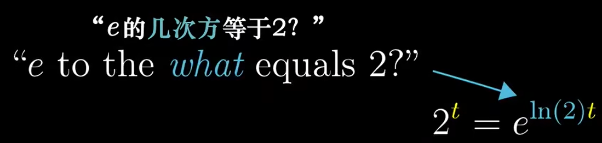

# 【官方双语】微积分的本质 - 05 - 指数函数求导

[视频](https://www.bilibili.com/video/BV11x411e7FN/?spm_id_from=333.788.recommend_more_video.-1&vd_source=e3e6bb1b164806ab40cbadaa22f05b43)

## 指数函数求导方法

4m10s 指数函数求导方法

假设如下函数 $M(t) = 2^t$，则

$$
\frac{dM}{dt} = \frac{2^{t+dt}-2^t}{dt}
$$

指数相加，其实就是同底数相乘

$$
\frac{dM}{dt} = \frac{2^t2^{dt}-2^t}{dt} = 2^t(\frac{2^{dt}-1}{dt})
$$

当 $dt$ 趋近于 0 时，$\frac{2^{dt}-1}{dt}$ 趋近于一个常数

$$
\frac{2^{0.0000001}-1}{0.0000001} = 0.6931472...
$$

所以

$$
\frac{d(2^t)}{dt}(t) = 2^t(0.6931472...)
$$

其他底数的指数函数也是类似的，由自身函数乘以一个常数

## 什么是自然底数e

7m48s 什么是自然底数e

自然底数 $e$ 其实就是让上述常数，也就是 $(0.6931472...)$ 这个部分的值等于 1 时的底数

以下是函数 $M(t) = e^t$ 的求导过程

$$
\frac{dM}{dt}(t) = \frac{e^te^{dt}-e^t}{dt} = e^t(\frac{e^{dt}-1}{dt})
$$

当 $dt$ 趋近于 0 时

$$
\frac{e^{0.0000001}-1}{0.0000001} = 1.0000050...
$$

$e$ 就是这样的底数

## 使用 e 描述指数函数

$e$ 可以用来描述任意底数的指数函数，下图以底数为 2 举例

$ln(2)$ 代表 e 的多少次方等于 2，所以 $e^{ln(2)} = 2$

所以，我们描述任意底数的指数函数时，可以这样写

$$
2^t = e^{ln(2)t} = e^{(0.6931...)t}\\
3^t = e^{ln(3)t} = e^{(1.0986...)t}\\
4^t = e^{ln(4)t} = e^{(1.3863...)t}\\
5^t = e^{ln(5)t} = e^{(1.6094...)t}\\
6^t = e^{ln(6)t} = e^{(1.7918...)t}\\
...
$$

这样的好处是，可以直观的通过一个常数值粗略判断指数函数的增长趋势