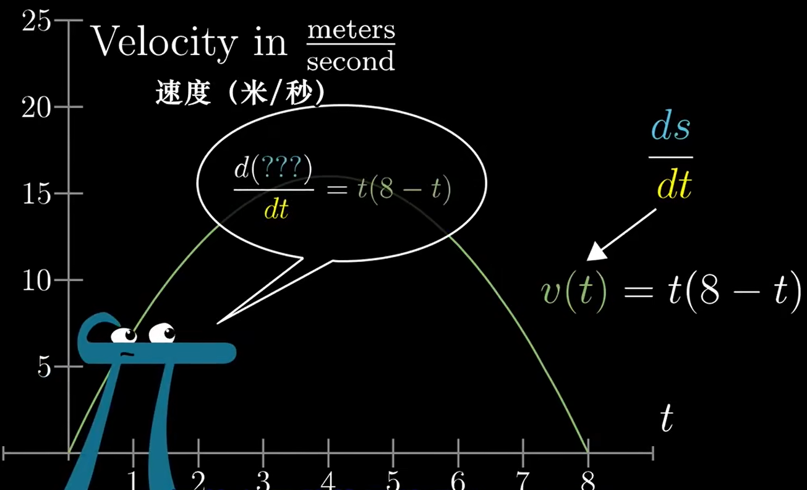
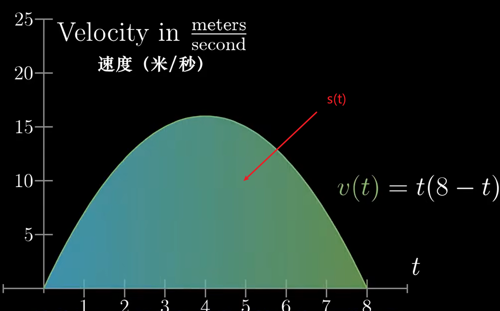
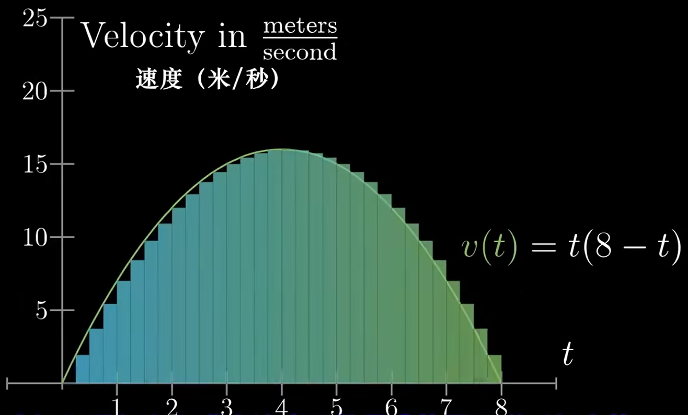
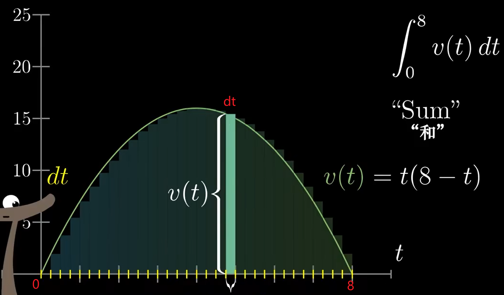

# 【官方双语】微积分的本质 - 08 - 积分与微积分基本定理

[视频](https://www.bilibili.com/video/BV14x411Y7B5/?spm_id_from=333.788.recommend_more_video.-1&vd_source=e3e6bb1b164806ab40cbadaa22f05b43)

“不是<b style="color:#4ba0b8;">几乎显而易见</b>的道理，就根本不要去证明”

—— 亚历山大 · 格洛腾迪克

 

## 什么是积分?

2m 积分是求导的逆运算 原函数 反导数概念

从图像上讲，求函数曲线所围成的面积的过程就叫积分

这里有一个结论，求积分的过程就是将当前曲线当作导函数，求对应导函数的原函数（也称为反导数）的过程。

假设我们有个曲线如图，`速度-时间` 曲线。$v(t) = t(8-t)$

我们知道在 `路程-时间` 曲线中，速度实际上就是该函数的导数，所以假设该 `路程-时间` 函数是 $s(t)$ 那么速度就应该是：

$$
v(t) = \frac{ds}{dt} = t(8 - t)
$$

所以 $v(t)$ 是 $s(t)$ 的导数

又由图可知，距离 $s(t)$ 这个函数，实际上就是图中的面积函数（也就是积分）

## 积分问题

2m40s 积分问题

如何求上述的 $s(t)$，这个问题就是 `积分问题`，我们可以用微分思想将面积切分成小块来看

现在求 $s(t)$ 面积就近似于求这些矩形面积的和，且我们知道矩形宽越小，其结果越接近 $s(t)$

假设图中 $t$ 初始为 0，结束为 8，那么求面积 $s(t)$ 实际上就是非常多个矩形的和，每个矩形都由 $v(t)*dt$ 组成，那么所有矩形和，我们写成

$$
\lim_{dt \to 0}\int_{0}^{8} v(t)dt
$$

8m24s 积分的表述

11m30s 求解原函数

15m37s 微积分基本定理

16m24s 回顾

17m53s 负面积的理解