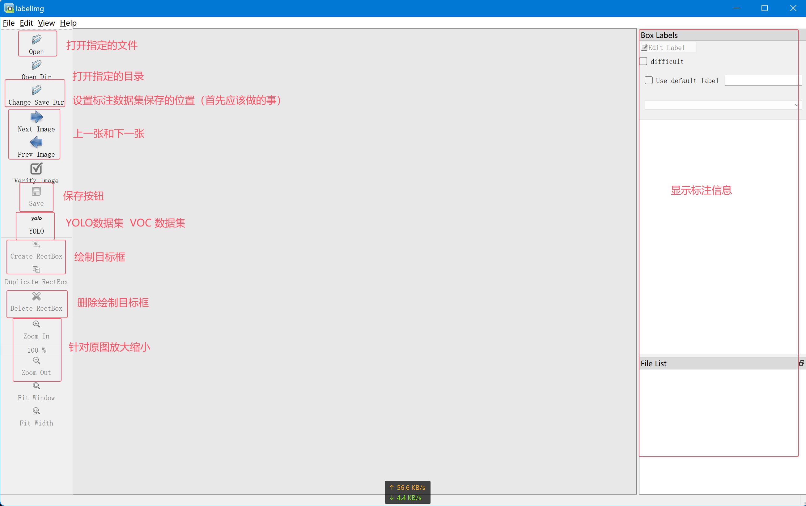

# labelimg


## 安装

```
pip install labelimg
```


## 启动

在项目下输入labelimg，直接启动

```
labelimg
```


## 界面介绍




## 解决labelimg 问题

1、.venv/Lib/site-packages/libs/canvas.py 下的530、532 行修改代码

```
p.drawLine(int(self.prev_point.x()), 0, int(self.prev_point.x()), int(self.pixmap.height()))
            p.drawLine(0, int(self.prev_point.y()), int(self.pixmap.width()), int(self.prev_point.y()))
```

2、.venv/Lib/site-packages/libs/canvas.py 下的526 行修改代码

```
p.drawRect(int(left_top.x()), int(left_top.y()), int(rect_width), int(rect_height))
```

3、.venv/Lib/site-packages/labelImg/labelImg.py 第965行

```
bar.setValue(int(bar.value() + bar.singleStep() * units))
```


## 标注的两种数据集

+ YOLO （txt文件，主要是类别  中心点坐标 以及 宽高参数）
+ Pascal VOC （xml文件，主要是类别 左上角坐标 右下角坐标）


