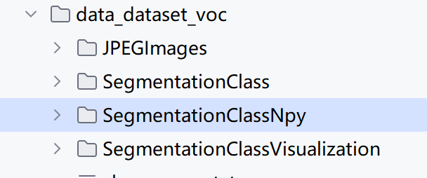

# labelme

访问地址：[GitHub - wkentaro/labelme: Image Polygonal Annotation with Python (polygon, rectangle, circle, line, point and image-level flag annotation).](https://github.com/wkentaro/labelme)


## 安装labelme

```
pip install labelme
```


## 文件目录结构如下：


+ data_anotated  需要标注的图像数据集
+ labelme2voc 将标注之后的结果转化为voc格式

+ labels.txt 数据集中的标签


labels格式如下：

```
__ignore__
_background_ # 背景必须的类别
car
person
cat
sofa
```


## 使用labelme

控制台输入`labelme`

打开标注的QT窗口，标注后得到结果


在控制台输入一条指令：

```
./labelme2voc.py data_annotated data_dataset_voc --labels labels.txt --noobject
```

最终生成的结果

