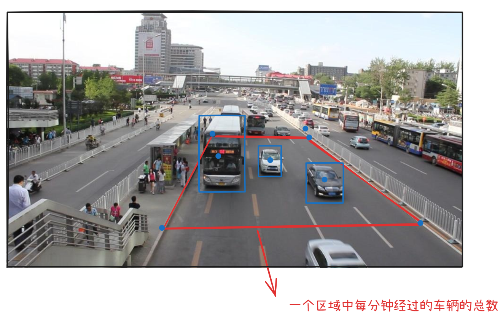
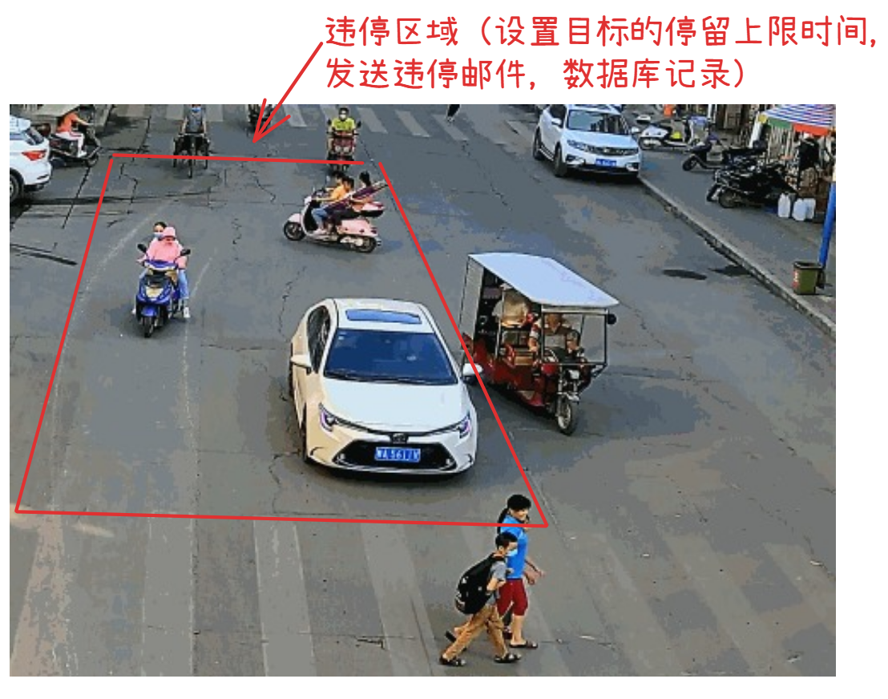

# 城市智慧管理

## 路道交通检测与管理

+ 车流量监测
+ 违停处理

### 车流量监测

数据集：训练用的数据集可以通过VOC、COCO数据集

主要监测对象： 指定区域中的汽车

完成功能：统计每分钟情况下的行驶过的汽车数量（每张图片监测出来时，都需要去计算它的车流量）

概要设计：

+ 车辆监测的模型（可以自定义数据集训练、可以选择官方训练好的yolov8n.pt 等等，官方训练的模型中不可以出现任务以外的其他对象）
+ 将连续拍摄的路口图像生成一个完整的30帧视频，利用监测去监测视频中的车流（需要cv2显示结果）
+ 指定路口区域（此处的红色区域，自测一个区域），该区域需要在视频中标注出来（建议使用cv2，cv2可以读取视频）

+ 将经过该区域的车辆进行统计，并且汇报`每分钟`的车流量，车流量需要显示在整个视频的右上角（tracker跟踪算法）
+ 需要将上述的模型集中的QT界面中去完成上述的操作，用户要求，可以暂时视频，也可以继续播放，（放大，缩小）

## 违停处理

+ 指定停车区域后，监测停车时长，如果时间超过上限，则进行预警（计费）
+ 在该区域中需要识别违停车辆的车牌，并记录，且执行发送信息操作。
+ 需要将上述的模型集中的QT界面中去完成上述的操作，用户要求，可以暂时视频，也可以继续播放，（放大，缩小）

## 关于车流量监测的具体实现

