# Sklearn

sklearn 是基于python语言的机器学习工具包，是目前机器学习项目的主要工具之一。

sklearn 内含大量数据集可供机器学习验证和使用，集成了数据预处理、数据特征选择、
数据特征降维、分类\回归\聚类模型、模型评估等内容

## sklearn数据类型

机器学习最终处理的数据都是数字，只不过这些数据可能以不同的形态被呈现出来，如矩阵、
文字、图片、视频、音频等。

## sklearn结构

+ 数据预处理
+ 数据集
+ 特征选择
+ 特征降维
+ 模型构建
    + 分类模型
    + 回归模型
    + 聚类模型
+ 模型评估
    + 分类模型评估
    + 回归模型评估
    + 聚类模型评估

### 数据预处理-sklearn数据集（sklearn.datasets）

有以下api
```
datasets.load_iris()
datasets.load_boston()
datasets.load_digits()
datasets.load_wine()
datasets.load_files()
datasets.load_image()
load_blobs()
make_classfication()
make_regression()
make_swiss_roll()
make_s_curve()
```

具体描述如下：

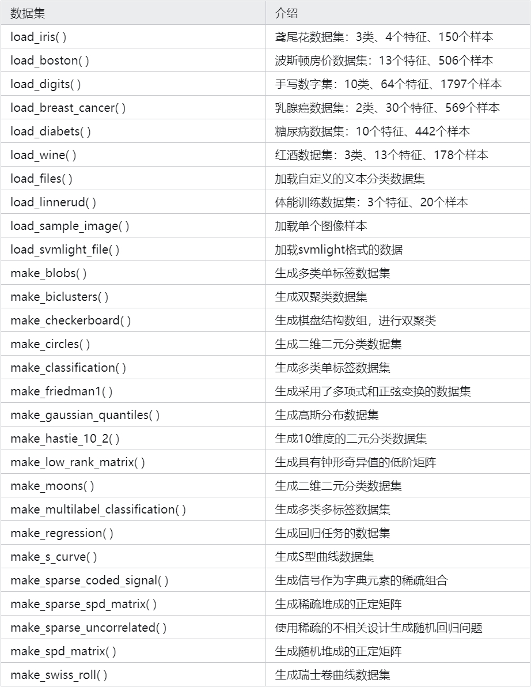

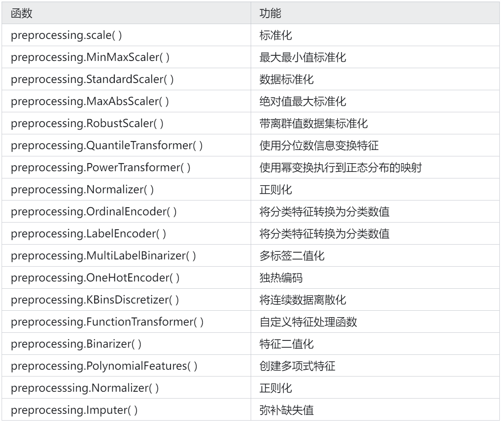

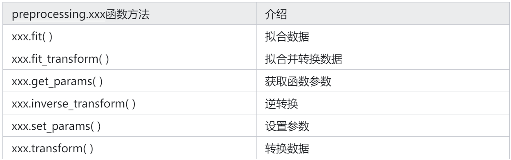

### 数据预处理-数据生成（preprocessing）

### 特征选择

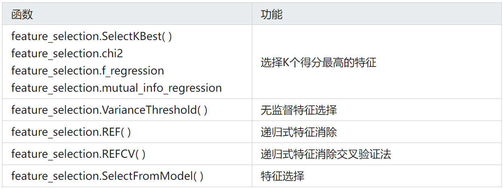

### 特征降维

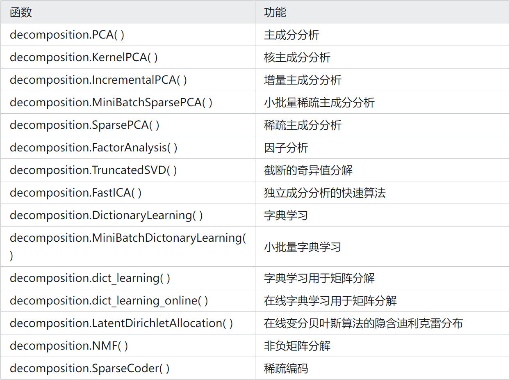

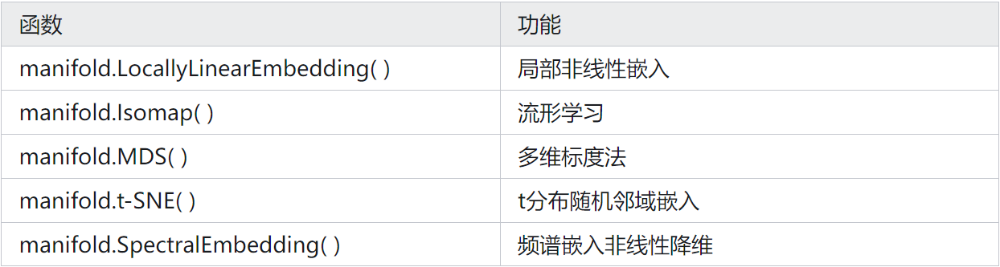

### 分类模型

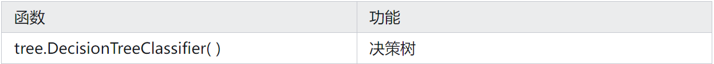

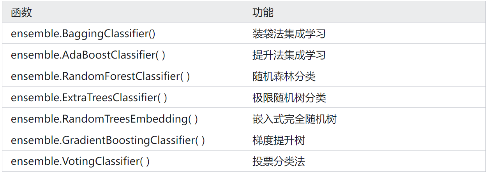

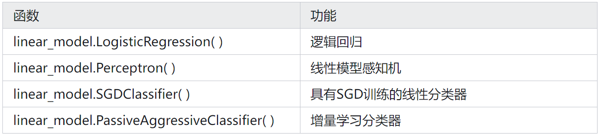

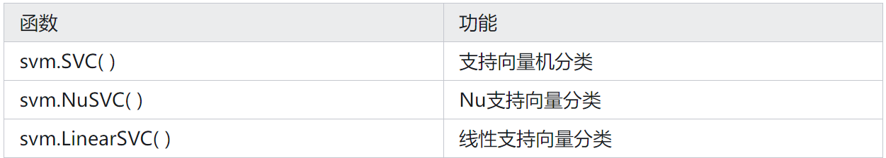

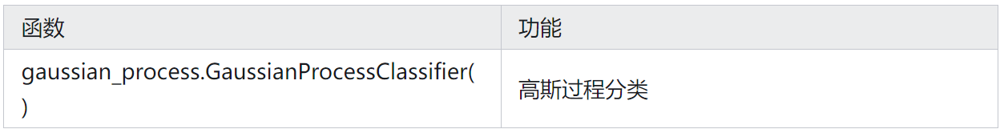

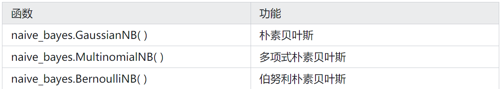

### 回归模型

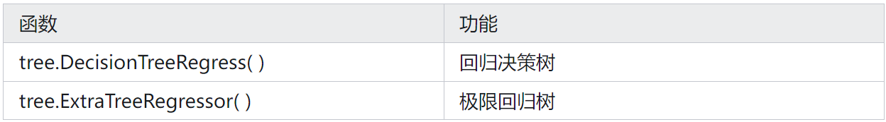

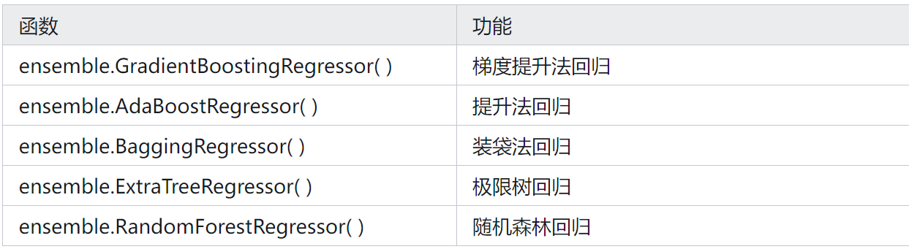

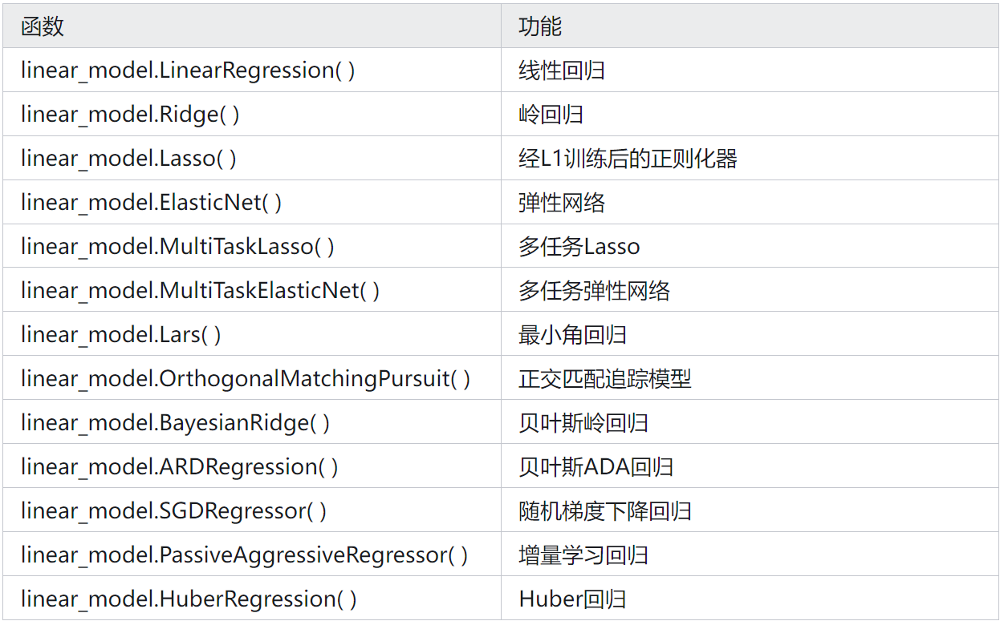

### 聚类模型


### 模型评估


### 模型优化


