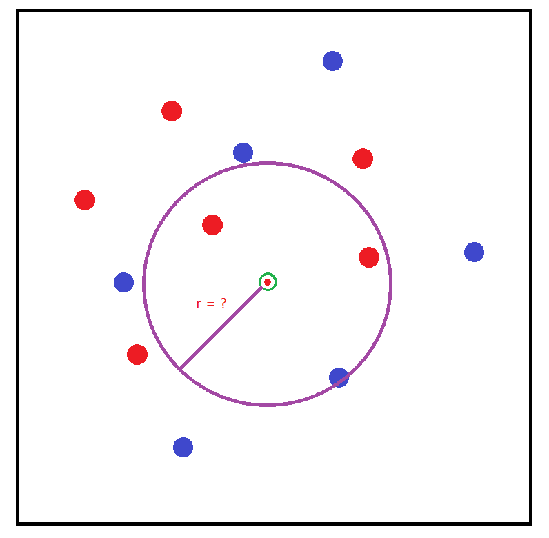
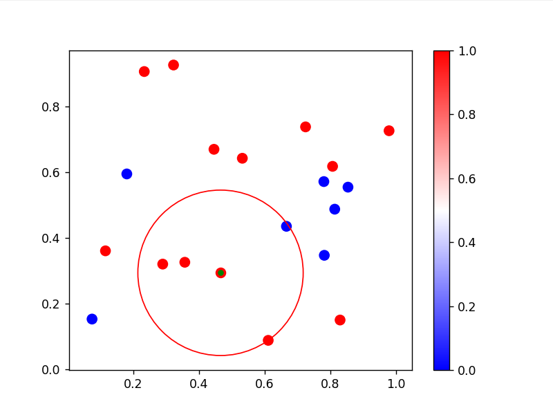
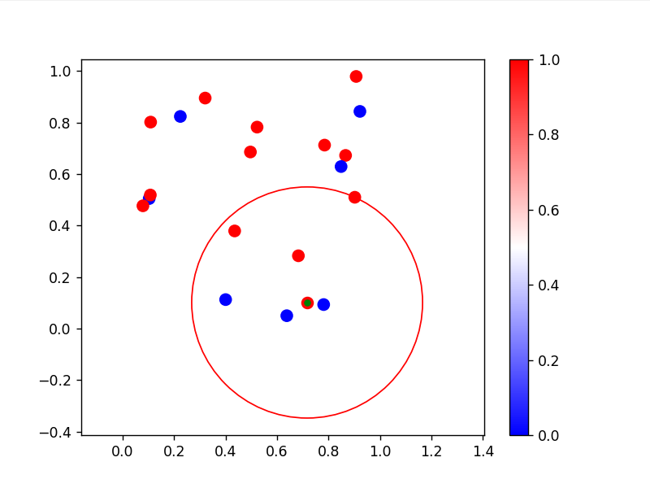

# 要求

假设有一块场地中有 N 个人在玩儿真人 CS，一共有 2 个队伍，红队和蓝队，要求使用 KNN 算法完成以下内容

1. 请随机 N 个人中的一个人作为 KNN 的受测样本，受测样本称为 A
2. 已 A 为中心画圈，圆圈称为 circle
3. circle 半径为 r
4. 当 r 最小为多少的时候，正好能让 circle 内的队友人数（包括自己）大于敌对人数

至少要有 1 个对方的人

或者圈内人数正好多 1 个队友
