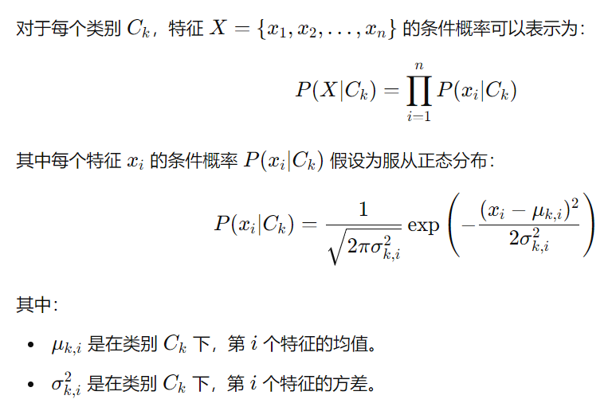

# 要求

使用高斯朴素贝叶斯来预测学生是否及格

具体要求如下:

- 随机 500 个学生，每个学生包含 5 个特征:
    1. 勤劳
    2. 勇敢
    3. 善良
    4. 正直
    5. 乐观
- 每个特征取值为 0~1
- 随机 500 个分数标签作为成绩，分数取值为 0~100
- 根据随机分数，以60分为及格线，得到一个是否及格的分类标签，0 代表不及格，1 代表及格
- 使用高斯朴素贝叶斯预测每个学生是属于及格还是不及格

高斯朴素贝叶斯算法如图:

