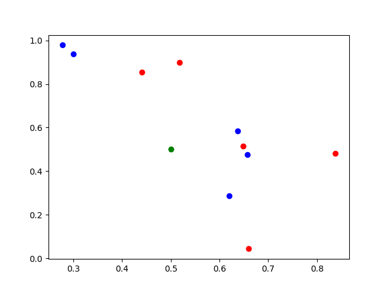

## K近邻算法

又称K最近邻(K-Nearest Neighbor ,KNN)分类算法，是一个成熟且简单的机器学习算法。

该算法的思路是：在特征空间中，如果一个样本附近的K个最近（即特征空间中最近邻）样本的大多数属于某一个类别，则该样本也属于这个类别。

## K近邻算法原理

KNN是通过测量不同特征值之间的距离分类。

我们构建一些蓝色点和红色点，其中绿色点在其中，我们需要得出绿色点究竟是蓝色还是红色

在此基础上我们可以通过点到点的欧拉公式

$$
d = \sqrt{ \sum_{i=1}^{n} (x_i - y_i) ^ 2}
$$

或者曼哈顿公式

$$
d = \sqrt{ \sum_{i=1}^{n} |x_i - y_i|}
$$

1）计算测试数据与各个训练数据之间的距离；

2）按照距离的递增关系进行排序；

3）选取距离最小的K个点；

4）确定前K个点所在类别的出现频率；

5）返回前K个点中出现频率最高的类别作为测试数据的预测分类。
