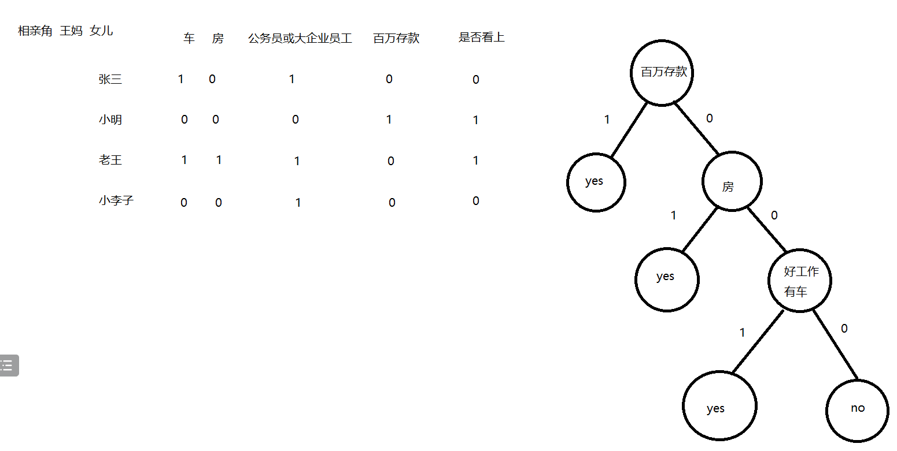

# 决策树模型

[参考视频1](https://www.bilibili.com/video/BV1ar4y137GD/)

[参考视频2](https://www.bilibili.com/video/BV1Xp4y1U7vW/)

## 决策树示意图

==**重点考虑的事情: 如何划分决策标准**==

这个地方可以使用 **熵** 来衡量划分标准

以图中第一个划分标准 “百万存款” 为例，那么有百万存款，和没有百万存款的人之间，信息熵的差值，一定比其他划分标准更大

## 信息熵

信息论中描述数据携带的信息量就是熵

$$
H(X) = -\sum_{i=1}^{n} p(x_i) \log_2 p(x_i)
$$

## 基尼系数

基尼系数是一个衡量指标是否稳定的系数，值越小说明某种指标越稳定，基尼系数用在 CART（Classification and Regression Trees，分类与回归树）

$$
\text{Gini} = 1 - (p_1^2 + p_2^2 + \dotsc + p_n^2)
$$

$p_n$: 每种分类出现的概率