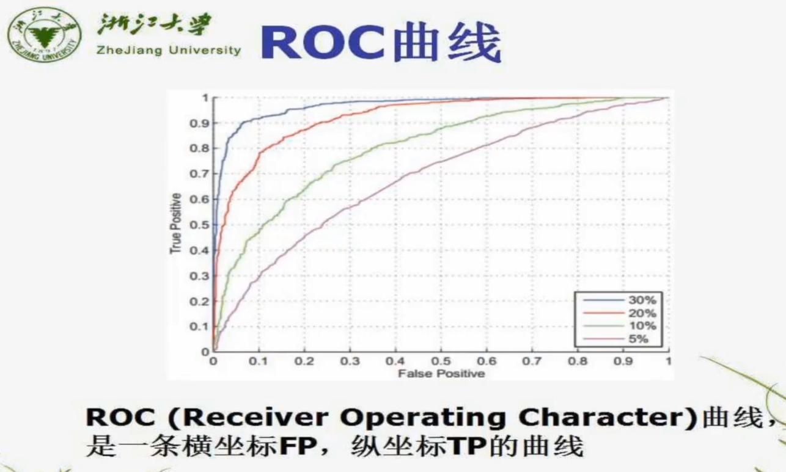
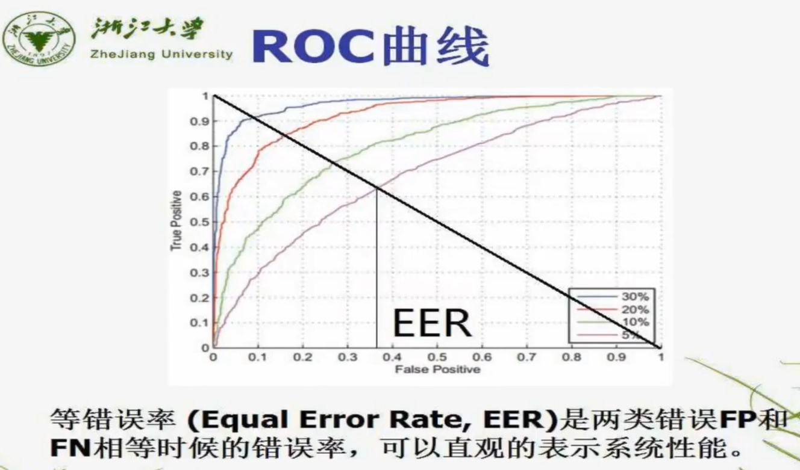

# ROC 曲线

ROC 曲线用于评价模型性能

## 混淆矩阵 Confusion Matrix

混淆矩阵包含以下四个属性

- True Positives (TP): **真阳性**，模型预测标签并根据基本事实正确匹配。
- True Negatives (TN): **真阴性**，模型不会预测标签，也不是真实情况的一部分。
- False Positives (FP): **误报**，模型预测了标签，但它不是基本事实的一部分（I 类错误）
- False Negatives (FN): **假阴性**，模型不预测标签，但它是基本事实的一部分。 （第二类错误）

<table>
    <tr style="background-color: #00afa6;">
        <td></td>
        <td colspan="3" style="color:#fff;">预测</td>
    </tr>
    <tr>
        <td rowspan="3" style="background-color: #bfe7de;">实际</td>
        <td style="background-color: #bfe7de;"></td>
        <td style="background-color: #bfe7de;">正样本</td>
        <td style="background-color: #bfe7de;">负样本</td>
    </tr>
    <tr>
        <td style="background-color: #e4f3ef;">正样本</td>
        <td style="background-color: #e4f3ef;">True Positive(TP)</td>
        <td style="background-color: #e4f3ef;">False Negative(FN)</td>
    </tr>
    <tr>
        <td style="background-color: #bfe7de;">负样本</td>
        <td style="background-color: #bfe7de;">False Positive(FP)</td>
        <td style="background-color: #bfe7de;">True Negative(TN)</td>
    </tr>
</table>

举例来说

- 假如 10 个人中有 7 个男生 3 个女生。
- 假设让AI从所有人中选择所有的女生
- 则 7 个男生是负例，3 个女生是正例
- 结果AI预测了 2 男 2 女 4 个学生

以此我们可以得到如下参数:

- TP: AI正确找到女生的数量 2
- FP: AI错误判断为女生的数量(误报) 2，因为它把 2 个男生当作女生了
- TN: AI正确判断出男生的数量 5，7 个男生中有2个被错误的当作女生了
- FN: AI错误的将女生判断成了男生(假阴性)，数量为 1

则混淆矩阵可以写为:

<table>
    <tr style="background-color: #00afa6;">
        <td></td>
        <td colspan="3" style="color:#fff;">预测</td>
    </tr>
    <tr>
        <td rowspan="3" style="background-color: #bfe7de;">实际</td>
        <td style="background-color: #bfe7de;"></td>
        <td style="background-color: #bfe7de;">正样本(女生)</td>
        <td style="background-color: #bfe7de;">负样本(男生)</td>
    </tr>
    <tr>
        <td style="background-color: #e4f3ef;">正样本(女生)</td>
        <td style="background-color: #e4f3ef;">(TP)2</td>
        <td style="background-color: #e4f3ef;">(FN)1</td>
    </tr>
    <tr>
        <td style="background-color: #bfe7de;">负样本(男生)</td>
        <td style="background-color: #bfe7de;">(FP)2</td>
        <td style="background-color: #bfe7de;">(TN)5</td>
    </tr>
</table>

### TP、FN、FP、TN 的关系

1. TP + FN = 所有正样本
2. FP + TN = 所有负样本
3. TP + FP = 模型预测的正样本总数
4. TN + FN = 模型预测的负样本总数

## ROC 曲线

图中的 TP FP 用概率表示的，且 TP + FN = 1，FP + TN = 1 作为计算概率的分母

### 如何绘制一条曲线

SVM 测试公式：

$$
若 \ \overset{N}{\underset{i=1}\sum}\alpha_iY_iK(X_i, X) + b \geq 0 \ 则 \ Y = +1 \\
若 \ \overset{N}{\underset{i=1}\sum}\alpha_iY_iK(X_i, X) + b \lt 0 \ 则 \ Y = -1
$$

不等式右侧的 0 称为**阈值**，假设我的阈值为 -15 ~ 15，分为 100 个点

则使用每个阈值都能算出一组 TP FP，记作 ROC 曲线上的一个点

那么阈值从小到大带入计算所有的 TP FP 则能画出一条曲线

### 不同曲线代表什么

图中不同颜色的曲线代表不同的模型系统

例如: 红色代表 svm 区分样本是猫还是不是猫，绿色曲线代表 svm 区分样本是狗还是不是狗，紫色代表人脸识别系统，蓝色代表手势识别系统等

## 模型性能指标

### 相同 FP 下衡量各系统的 TP

在不同的应用场景中，对 FP 的容忍程度不同，例如人脸识别时，TP 代表正确识别数据库中已有数据，FP 代表数据库中没有的数据但识别成功了！，这种场景是不可容忍的，所以衡量人脸识别系统的话，就可以选择 FP = 0 时，对比各系统的 TP，TP越高越好

再比如我们想识别是否是狗，那么我希望能识别更多种类的狗，则 FP 的容忍度高一点，则可以选择 FP = 0.2 时，TP 最高的系统表现最好

### AUROC(Area Under the ROC Curve) 或 AUC

这个是算 ROC 曲线下的面积的指标，是种较为综合的指标

### EER 等错误率曲线

上图 EER 线上的点代表 TP + FP = 1 的点，TP + FP 代表所有被系统认为是正样本的数量

那么 EER 线和 4 个曲线相交交点处，TP 越大，则系统性能越好