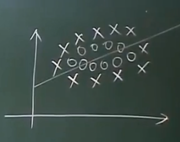
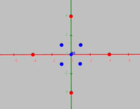
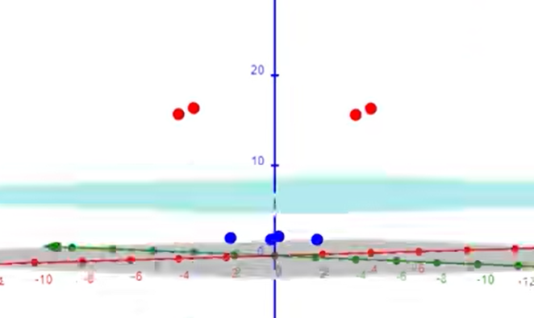

# svm 处理非线性

## 改造线性优化问题

1. 最小化 $\frac{1}{2}\|W\|^2 + C\overset{N}{\underset{i=1} \sum}\xi_i$
2. 限制条件 $Y_i[W^TX_i + b] \geq 1 - \xi_i$ $(i=1 \sim N)$
3. $\xi_i \geq 0$

- $\xi_i$: 松弛变量
- $C$: 人为指定的系数用于平衡 $\xi_i$ 和 $W$ 的权重，需要人为尝试去取值
- $C\overset{N}{\underset{i=1} \sum}\xi_i$ 叫做**正则项**，添加正则项目的，是为了让目标函数规范化，让原来SVM在非线性问题上无解的情况，变得有解

当 $\xi_i$ 无穷大时，$1 - \xi_i$ 就无穷小，则条件 2 必定满足，有无穷个解，所以需要限制 $\xi_i$，所以 $C$ 作为系数用来平衡 $\xi_i$

目前已知项有: $X$ $Y$ $C$

需要求: $W$ $b$ $\xi_i$

## 低维到高维映射

线性不可分问题

此时需要进行升维，用 $\phi(X)$ 替代原样本 $X$

且数据维度越高，越可能被线性分割

所以，**当 X 变成无限维**时，则**必定线性可分**

### 使用核函数 Kernel 替代 $\phi$

我们知道 $\phi$ 转换的样本回变成无限维，但我们无法描述 $\phi$ 本身，这里可以使用核函数 Kernel 替代 $\phi$，公式如下

$$
Kernel(X_1, X_2) = \phi(X_1)^T\phi(X_2)
$$

已知常用核函数有两种

#### 高斯核函数

$$
K(X_1, X_2) = \exp(-\frac{\|X_1 - X_2\|^2}{2\sigma^2})
$$

$\sigma$ 是高斯核函数的宽度参数，它控制了特征空间中向量间的相似度。较大的 $\sigma$ 值意味着向量间的相似度更容易被接受，而较小的 $\sigma$ 值则相反。

#### 多项式核

$$
K(X_1, X_2) = (X_1^TX_2 + 1)^d
$$

$d$ 是多项式阶数，$d$ 若有限则 $\phi$ 升维后也是有限维的

## 如何使用核函数？

原优化问题限制条件为:

$$
Y_i[W^TX_i + b] \geq 1 - \xi_i
$$

X 升维后:

$$
Y_i[W^T\phi(X_i) + b] \geq 1 - \xi_i
$$

有因为已知:

$$
K(X_1, X_2) = \phi(X_1)^T\phi(X_2)
$$

**那么接下来我们讨论如何用 K 替代 X 升维后的 $\phi(X_i)$**