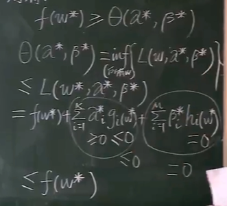
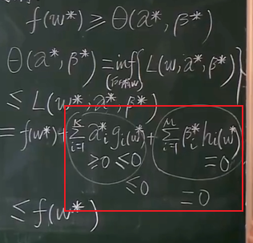

# 原问题和对偶问题

目标: 已知核函数 K，解优化问题 $Y_i[W^T\phi(X_i) + b] \geq 1 - \xi_i$

首先我们记住，这里指的**原问题和对偶问题都是优化问题，为了优化某个函数或值为最大或最小值**

## 原问题

原问题的**普适**(普遍适用)定义:

- 最小化: $f(w)$
- 限制条件:
  - $g_i(w) \leq 0$ $(i = 1 \sim K)$
  - $h_i(w) = 0$ $(i = 1 \sim M)$

之所以称上述定义为普适定义，因为最小化问题，只要求倒数就是最大化问题；$g_i(w) \leq 0$ 只要加一个负号就能转换成 $-g_i(w) \geq 0$

所以上述定义涵盖了所有情况

## 对偶问题

定义函数 $L(w, \alpha, \beta)$:

$$
L(w, \alpha, \beta) \\
= f(w) + \overset{K}{\underset{i=1}\sum} \alpha_i g_i(w) + \overset{M}{\underset{i=1}\sum} \beta_i h_i(w) \\
= f(w) + \alpha^Tg(w) + \beta^Th(w)
$$

- $f(w)$ 是原问题中需要最小化的函数
- $g_i(w)$ $h_i(w)$ 是原问题的限制条件
- $\alpha$ $\beta$ 是向量，维度等于 $K$ 和 $M$

则对偶问题的定义是:

- 最大化: $\theta(\alpha, \beta)=\underset{所有w}\inf\{L(w, \alpha, \beta)\}$
- 限制条件: $\alpha_i \geq 0$ $(i=1 \sim K)$

这里的 $\underset{所有w}\inf\{L(w, \alpha, \beta)\}$ 解释如下:

inf 代表无穷，此处代表取最小值，即在所有 $w$ 的集合中找到一个权重 $w$，使得 $L(w, \alpha, \beta)$ 达到其最小值。

**问题解析为:**

最大化: $\theta(\alpha, \beta)=\underset{所有w}\inf\{L(w, \alpha, \beta)\}$

1. 确定一组 $\alpha \beta$ 就能求出一个 $w$ 使 $L(w, \alpha, \beta)$ 最小
2. 我们需要确定一组 $\alpha \beta$ 使 $\theta(\alpha, \beta)$ 最大

## 原问题和对偶问题的关系

### 关系1

若 $w^*$ 是原问题的解，而 $\alpha^*
$，$\beta^*$ 是对偶问题的解，则:

$$
f(w^*) \geq \theta(\alpha^*, \beta^*)
$$

证明过程:

这里的关系是根据原问题和对偶问题的限制条件推导出来的

### 原问题与对偶问题的间距G

由于关系1的存在，则有:

$$
G = f(w^*) - \theta(\alpha^*,\beta^*) \geq 0
$$

在某些特定优化问题中，$G = 0$

## 强对偶定理

若:

- $f(w)$ 为凸函数
- $g(w) = Aw + b$；$h(w) = Cw + d$，也就是说 $g(w)$ 和 $h(w)$ 是线性函数

则:

此优化问题的原问题和对偶问题的间距 $G = 0$

即

$$
f(w^*) = \theta(\alpha^*,\beta^*)
$$

根据**强对偶定理**和**关系1**，我们可以得到如下结论

$$
f(w^*) = \theta(\alpha^*,\beta^*) \\
= \underset{所有w}\inf\{L(w^*,\alpha^*,\beta^*)\} \\
= f(w^*) + \overset{K}{\underset{i=1}\sum}\alpha_i^*g_i(w^*) + \overset{M}{\underset{i=1}\sum}\beta_i^*h_i(w^*)
$$

- 因为对偶问题的限制条件 $h_i(w^*) = 0$ 所以 $\overset{M}{\underset{i=1}\sum}\beta_i^*h_i(w^*) = 0$
- 为了让等式成立，则 $\overset{K}{\underset{i=1}\sum}\alpha_i^*g_i(w^*)= 0$

==**因此得出 KKT 条件**(KKT是三个人名的缩写)==

- $\forall{i} = 1 \sim K$
- 或者 $\alpha_i^* = 0$
- 或者 $g_i^*(w^*) = 0$

## 下一步

将优化问题 $Y_i[W^T\phi(X_i) + b] \geq 1 - \xi_i$ 转换成强对偶问题，利用KKT条件，再求解