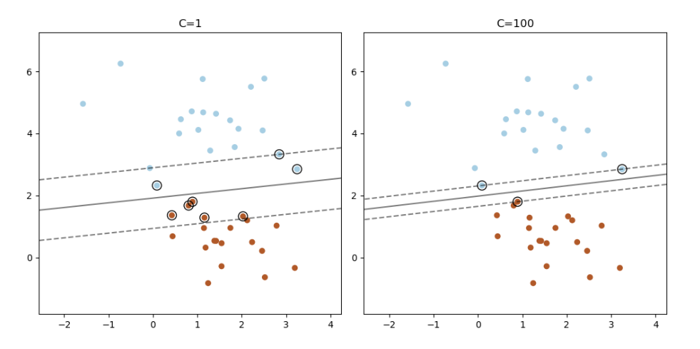

# 总结svm训练和测试

此处对 svm 算法做一个总结

## 训练流程

### 数据集

输入 $\{(X_i, y_i)\} \ i=1\sim N$

### 解优化问题

最大化:

$$
\theta(\alpha) = \overset{N}{\underset{i=1}\sum}\alpha_i - \frac{1}{2} \overset{N}{\underset{i=1}\sum}\overset{N}{\underset{j=1}\sum}\alpha_i\alpha_jY_iY_jK(X_i, X_j)
$$

限制条件

- $0 \leq \alpha_i \leq C$
- $\overset{N}{\underset{i=1}\sum}\alpha_i Y_i = 0$

### 解 b

通过[解优化问题](#解优化问题)得到所有 $\alpha_i$

任取一个 $0 \lt \alpha_i \lt C$

$$
b = \frac{1-\overset{N}{\underset{j=1}\sum}\alpha_jY_iY_jK(X_i,X_j)}{Y_i}
$$

## 测试流程

输入测试样本 X

$$
若 \ \overset{N}{\underset{i=1}\sum}\alpha_iY_iK(X_i, X) + b \geq 0 \ 则 \ Y = +1 \\
若 \ \overset{N}{\underset{i=1}\sum}\alpha_iY_iK(X_i, X) + b \lt 0 \ 则 \ Y = -1
$$

则还有一些结论

1. 让所有 $\alpha_i$ 都不等于 0 的向量，是支持向量
2. 支持向量越多，说明模型不够好，需要调整参数，或者数据集本身无规律，不可分类
3. 不等式右侧的 0 是阈值，阈值变化直接影响分类结果，当阈值小于 0 是，会把更多样本分为 +1

## C 值的选择

https://scikit-learn.org/stable/auto_examples/svm/plot_linearsvc_support_vectors.html#sphx-glr-auto-examples-svm-plot-linearsvc-support-vectors-py

C 值决定了软间距的容忍度