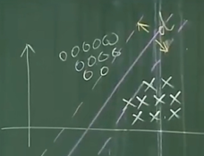

# 支持向量机 线性模型问题

[参考视频](https://b23.tv/Z413qRi)

[参考视频](https://b23.tv/RVqWtIc)

## 线性问题定义

支持向量机是少量样本下的准确分类算法 （小样本方法）

用直线把 o x 样本分开，这个直线就是**线性模型**

这种能够用直线划分的样本集称为**线性可分训练样本集**

不能用直线划分的样本集叫做**非线性可分训练样本集**（也叫线性不可分）

## 哪条直线分割最好

从图中感觉，2 号线划分样本感觉比较好，为什么？

这种情况下，1，3 号线无法划分误差样本

### 评价指标

将直线**平行**上下移动并与**样本点相交**，则上下边界线距离 d 最大时，

且

直线处于**平行边界线的中间**

则找到的直线最佳，如图

