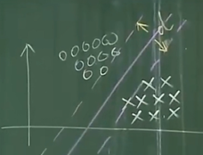
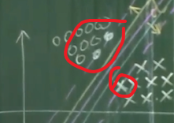
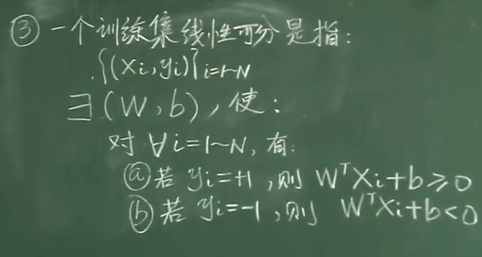
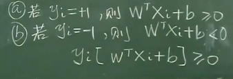
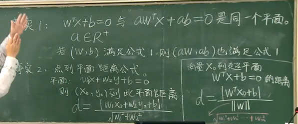
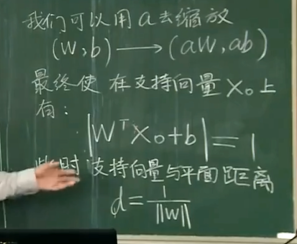

# 线性模型的数学描述

## d: 间隔 (Margin)

图中 d 代表 Margin

## 支持向量

与上下边界线相交的点叫**支持向量**（support vector）

## 决策边界

分类样本的超平面称为决策边界

## 数据集与标签

数学描述: $(X_1, Y_1)(X_2,Y_2) \dots (X_N,Y_N)$

- $X$: 代表多个特征的样本，是个**向量**，例如 $X_1 = [x_1, x_2, x_3]$
- $Y$: 代表样本标签，定义为 $+1$ 或 $-1$

## 线性模型

SVM 使用一个超平面（Hyperplane）划分样本，那么模型有两个参数 $(W, b)$，模型表达式为:

$$
W^T X + b = 0
$$

- $W$ 是维度和 $X$ 相同的**向量**
- $b$ 是常数
- $W^T$ 是 $W$ 的转置，$W^T X$ 结果也是常数（矩阵乘法）

目标: 通过数据集，求出 $W$ 和 $b$

## 机器学习过程

1. 定义模型方程
2. 指定待定参数
3. 使用训练样本和算法确定待定的参数

## 线性可分训练集

训练集中的样本，放入模型 $W^TX+b$ 中，则有两种情况：

- $Y_i = +1$ 时，$W^TX_i + b \geq 0$
- $Y_i = -1$ 时，$W^TX_i + b \lt 0$

综合上述 a，b 两个条件，可以推导出公式

$$
Y_i[W^TX_i + b] \geq 0
$$

此处 $Y_i$ 是正负 1，所以可以看作是**符号位**

- $Y_i = +1$ 时 $W^TX_i + b$ 结果大于 0
- $Y_i = -1$ 时 $W^TX_i + b$ 结果小于 0

## SVM 优化问题

==**最大化 Margin 的问题，被转换成了以下问题**==:

1. 最小化 $\frac{1}{2}\|W\|^2$
2. 限制条件 $Y_i[W^TX_i + b] \geq 1$ $(i=1 \sim N)$

### 推导过程

右下角是样本点 $X_0$ 到超平面的距离公式

$$
d = \frac{W^TX_0 + b}{\|W\|} \\
\|W\| = \sqrt{w_1^2+w_2^2+w_3^2+\dots+w_n^2}
$$

### 事实1

参数 (W, b) 乘以缩放系数 a 代表同一个超平面

视频中举例 $Y_i[W^TX_i + b] \geq 1$ 成立，那么 $Y_i[W^TX_i + b] \geq 2$ 成立吗？

**当大于等于的值比 1 大时，最终求出的 W b 实际是原来大于等于 1 时，求出的 W b 的 a 倍**

#### 为何 $Y_i[W^TX_i + b] \geq 1$？

因为 $Y_i$ 是人为规定的必须是 $\pm 1$，结合公式 $Y_i[W^TX_i + b] \geq 1$，我们认为，对于任意样本 $X_i$ 到决策边界 $W^TX + b = 0$ 的距离，必须大于等于 $Y_i$，也就意味着，带入 $X_i$ 到超平面公式中则

$$|W^TX_i + b|\geq |Y_i| = 1$$

将 $Y_i$ 作为符号位带入上述公式，并去掉绝对值，则有:

$$Y_i[W^TX_i + b] \geq 1$$

### 事实2

右下角部分，就是套用点到直线距离公式，求向量 $X_o$ 到超平面 $W^TX_o + b$ 的距离公式，这个距离就是先前提到的 $d$ (Margin)

$\|W\|$ 实际就等于 $\sqrt{w_1^2 + w_2^2 + w_3^2 + \dots + w_i^2}$

又因为事实1，则可以通过 a 缩放 (W, b) 后，在支持向量上有: $|W^TX_o + b|=1$，公式右侧不一定是 1，可以是任意正实数，代表超平面缩放系数

此时简化 d 的公式为

$$
d = \frac{|W^TX_o+b|}{\|W\|} = \frac{1}{\|W\|}
$$

### 这个地方我的理解如下:

因为 $Y_i[W^TX_i+b] \geq 1$，$Y_i$ 为正负一，实际就是符号位，那么去掉符号我们用绝对值代替，则为:

$$
|W^TX_i+b| \geq 1
$$

当样本点 $X_i$ 为支持向量时，则应该:

$$
|W^TX_i+b| = 1
$$