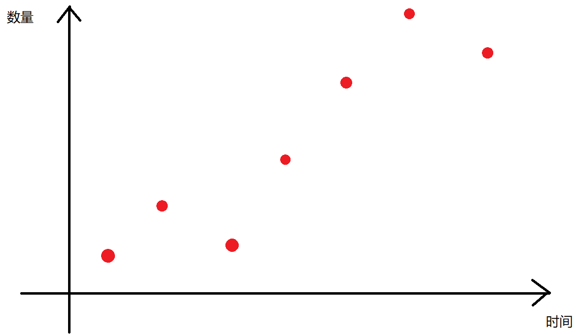
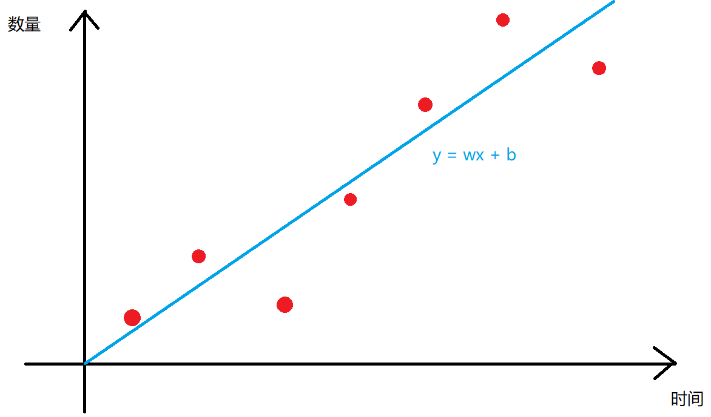
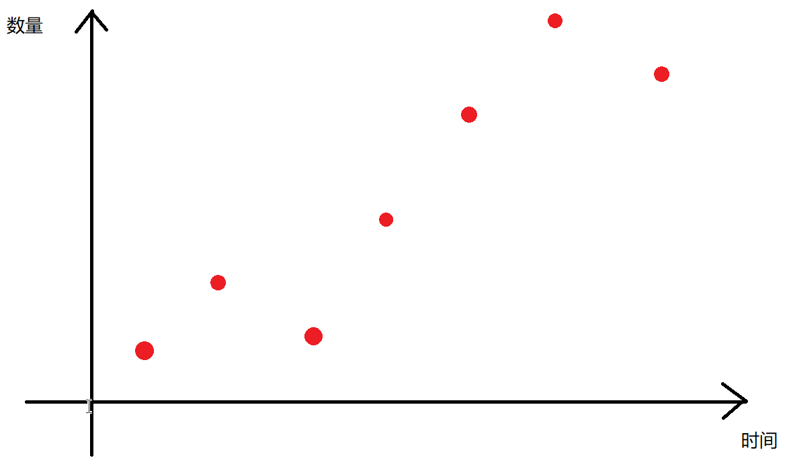
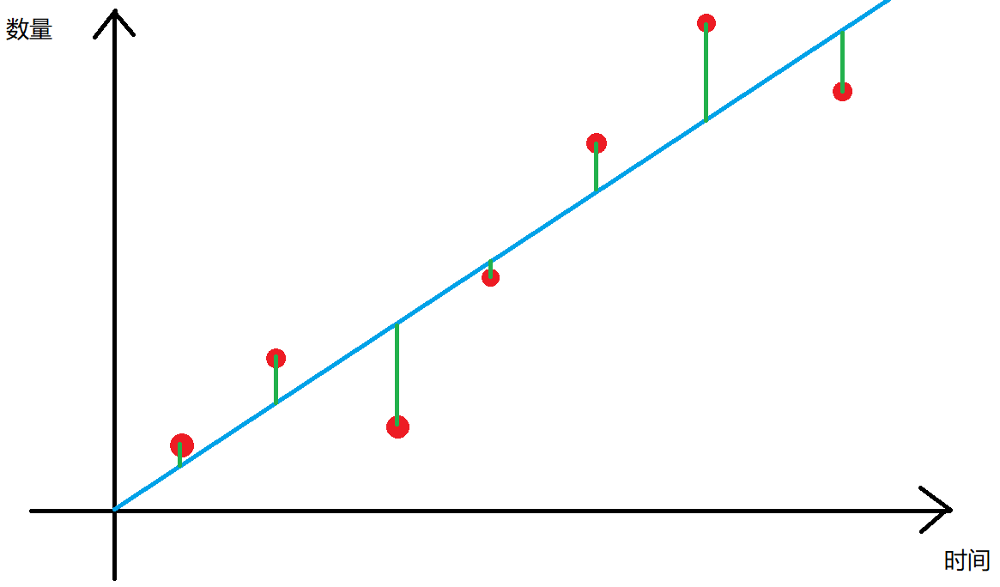
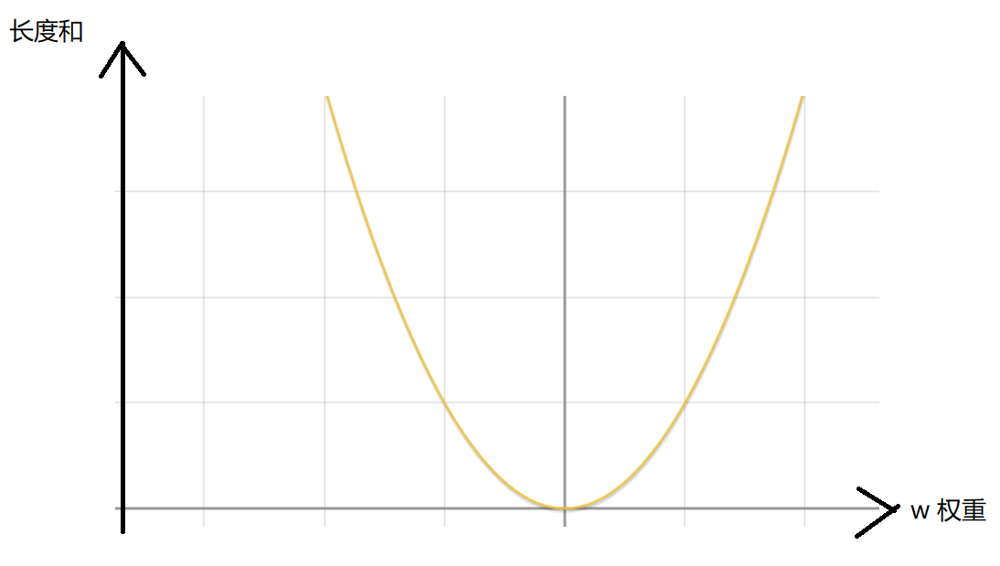
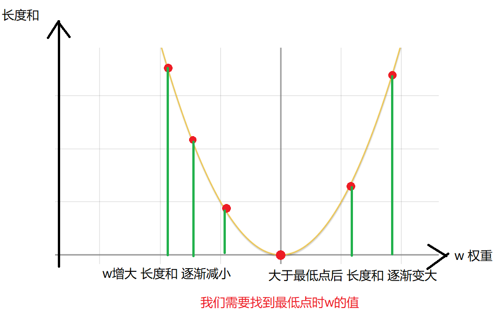
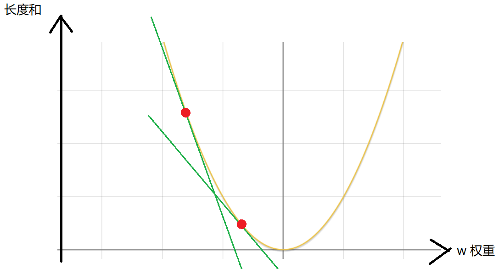

# 机器学习-梯度下降

## 线性回归

`线性回归` 这个词可以拆分成两个部分

- 线性: 使用线性函数，本节用直线函数来学习
- 回归: 这是个音译词，意思是寻找本质，相当于通过一个直线函数描述特征，找到直线直线后，丢入特征会预测一个值

我们假设一个场景，我们做实验，将一对兔子放到实验室中，然后让他们繁殖，假设我有一组数据，包含不同时间，兔子的数量，那么我们大致可以得到以下的一幅图



那么我们可以找到一条直线，能够很好的模拟兔子繁殖的规律，如图



该支线为 `y = wx + b`

寻找这条直线的过程就是**线性回归**

> 实际上这条直线，就是我们学习的线性层函数 **`nn.Linear`**

当我们找到一条直线能很好的模拟兔子繁衍规律，则我们称该直线 **拟合** 得很好，否则就 **拟合** 得不好

- 欠拟合: 模型学习不足，不能很好的预测数据
- 过拟合: 在一个数据集上学得太死了，训练数据集外的样本准确率低

## 机器学习

机器学习就是让机器推算出合适的参数的过程，例如 `y = wx + b` 中，机器自己去推算 `w` 和 `b` 的过程就是**机器学习**

## 梯度下降算法

### 为什么要用梯度下降法

机器怎么学习? 如何寻找 `w` 和 `b` ?

我们先忽略 `b` 来看坐标系中，可能的直线有哪些



如何判断一条直线拟合更好呢? 我们可以求每个点到直线距离的平方，即**方差**，如图



当找到一条直线，其绿线部分**长度和**最小，则认为找到了拟合最好的直线

**衡量模型是否拟合数据拟合得很好，用==损失函数loss function==(代价函数cost function)来衡量**

此处我们使用均方误差损失函数 MSELoss

$$
MSELoss = \sum((\_y - y)^2)
$$

那么我们把 w 斜率作为横坐标，**长度和** 作为纵坐标，则可以获取如下坐标图像:





此处函数图像是一个**凸函数**，==**凸函数上有唯一的极值**==，非常适合用梯度下降求极值

若我们如图所示，找到了最低点时的 `w`，则意味着此时，以 `w` 为直线斜率的直线能最好的**拟合**数据

为了找到这个 `w` 我们使用梯度下降法

### 如何梯度下降

==找到切线斜率，并乘以一个系数 $\alpha$，系数又称为学习率 learning rate

我们为了找到上图中的最低点，那么我们可以先在曲线上任取一点作为起始点，然后让 `w` 朝着最低点进行**下降**（也就是移动），理论上讲，`w` 的移动幅度是任意的，那么怎么样才能最快的到达最低点呢?

我们可以借助过曲线上一点的切线来进行**下降**

过取曲线上的一点做切线如下:



由图可见，小红点沿着切线下降，可以准确且快速的找到最低点，那么我应该怎么算出**小红点的下一个状态**应该在哪里呢？

这里我们人为规定 `w` 变化的幅度与切线斜率正相关，也就是**斜率越陡峭下降越快，斜率越平缓下降越慢**

切线斜率的求法和导数知识相关

导数相关知识，详见
- [1.微积分本质-概览](./1.微积分本质-概览.md)
- [2.导数的悖论](./2.导数的悖论.md)
- [3.用几何来求导](./3.用几何来求导.md)


### 什么是梯度?

通过求导，算出的 **纵坐标的变化率** 就是梯度，即**切线的斜率**

### 为什么叫梯度下降?

因为我们利用梯度，让 `w` 的值，沿着梯度进行递减，达到让小红点下降到最低点的目的，所以叫梯度下降

### 梯度下降更新规则

那么下一个 `w` 的值应该取多少呢? 更新 `w` 的规则如下:

```math
w = w - α\frac{dw}{dy}
```

上述公式 `α` 叫做学习率，是人为规定的值，通常是 `0.001`

`dy/dw` 就是 `w` 处的导数

当判断到当前 `w` 的切线斜率，**趋近于 0** 时，就认为，`w` 走到最低点了
