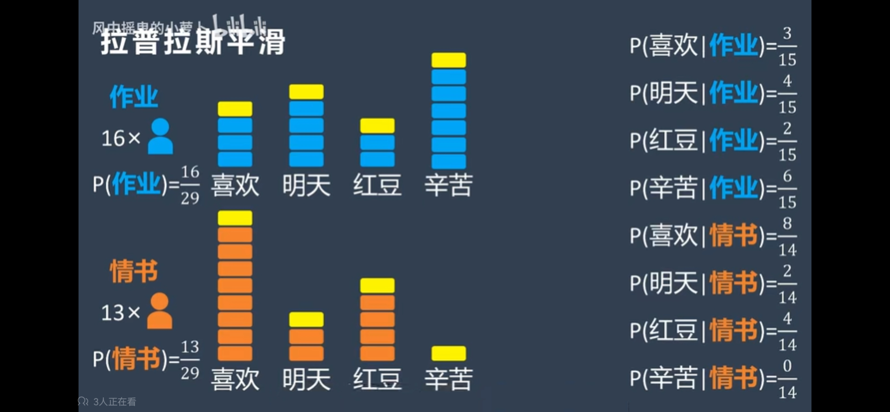

# 朴素贝叶斯分类器

朴素贝叶斯（Naive Bayes）是基于贝叶斯定理的分类算法，具有简单但有效的特点。==**它假设特征之间是条件独立的**==，即给定类标签时，特征之间相互独立。虽然这一假设在现实中往往不成立，但朴素贝叶斯分类器在很多实际应用中表现仍然非常好。

## 朴素贝叶斯分类器的基本原理

朴素贝叶斯分类器使用贝叶斯定理计算每个类标签的后验概率，并选择后验概率最大的类作为预测结果。假设我们有一个待分类的样本 \( \mathbf{x} = (x_1, x_2, \ldots, x_n) \)，对应的类标签集合为 \( C = \{c_1, c_2, \ldots, c_k\} \)，则朴素贝叶斯分类器的目标是找到使后验概率 \( P(c_i|\mathbf{x}) \) 最大的类 \( c_i \)：

\[ c_{\text{MAP}} = \arg\max_{c_i \in C} P(c_i|\mathbf{x}) \]

根据贝叶斯定理，后验概率 \( P(c_i|\mathbf{x}) \) 可以表示为：

\[ P(c_i|\mathbf{x}) = \frac{P(\mathbf{x}|c_i) P(c_i)}{P(\mathbf{x})} \]

==**朴素贝叶斯有以下特点:**==

$P(\mathbf{x})$ 表示每种类别下特征 𝑋 的总和，即所有可能类别下特征 𝑋 的总概率，当**每个特征对于每种类别都是独立发生时**，就意味着 $P(\mathbf{x})$ 是一个常数，恒定不变

所以 \( P(c_i|\mathbf{x}) \) 正比于 \( P(\mathbf{x}|c_i) P(c_i) \)，则 $P(\mathbf{x})$ 可以忽略不计，所以只需最大化 \( P(\mathbf{x}|c_i) P(c_i) \)：

\[ c_{\text{MAP}} = \arg\max_{c_i \in C} P(c_i) \prod_{j=1}^{n} P(x_j|c_i) \]

## 朴素贝叶斯分类器的实现步骤

1. **训练阶段**：
   - 计算每个类的先验概率 \( P(c_i) \)。
   - 计算每个特征在给定类条件下的条件概率 \( P(x_j|c_i) \)。

2. **预测阶段**：
   - 对于待分类样本 \( \mathbf{x} \)，计算每个类的后验概率 \( P(c_i|\mathbf{x}) \)。
   - 选择后验概率最大的类作为预测结果。

## 示例

以下是一个简单的朴素贝叶斯分类示例，假设我们有如下训练数据：

| 天气   | 温度 | 湿度 | 风速 | 打篮球 |
| ------ | ---- | ---- | ---- | ------ |
| 晴天   | 高   | 高   | 弱   | 否     |
| 晴天   | 高   | 高   | 强   | 否     |
| 阴天   | 高   | 高   | 弱   | 是     |
| 雨天   | 中   | 高   | 弱   | 是     |
| 雨天   | 低   | 正常 | 弱   | 是     |
| 雨天   | 低   | 正常 | 强   | 否     |
| 阴天   | 低   | 正常 | 强   | 是     |
| 晴天   | 中   | 高   | 弱   | 否     |
| 晴天   | 低   | 正常 | 弱   | 是     |
| 雨天   | 中   | 正常 | 弱   | 是     |

### 训练阶段

1. **计算先验概率 \( P(是) \) 和 \( P(否) \)**：
   \[ P(是) = \frac{5}{10} = 0.5 \]
   \[ P(否) = \frac{5}{10} = 0.5 \]

2. **计算条件概率 \( P(\text{天气=晴天}|\text{是}) \)、\( P(\text{温度=高}|\text{是}) \) 等**：
   \[ P(\text{天气=晴天}|\text{是}) = \frac{1}{5} = 0.2 \]
   \[ P(\text{温度=高}|\text{是}) = \frac{1}{5} = 0.2 \]
   \[ \ldots \]

### 预测阶段

假设我们有一个新的样本 \( \mathbf{x} = (\text{晴天}, \text{高}, \text{高}, \text{弱}) \)，计算其后验概率：

1. **计算 \( P(是|\mathbf{x}) \)**：
   \[ P(是|\mathbf{x}) = P(是) \cdot P(晴天|是) \cdot P(高|是) \cdot P(高|是) \cdot P(弱|是) \]
   \[ = 0.5 \cdot 0.2 \cdot 0.2 \cdot 0.2 \cdot 0.2 = 0.5 \cdot 0.0016 = 0.00016 \]

2. **计算 \( P(否|\mathbf{x}) \)**：
   \[ P(否|\mathbf{x}) = P(否) \cdot P(晴天|否) \cdot P(高|否) \cdot P(高|否) \cdot P(弱|否) \]
   \[ = 0.5 \cdot 0.6 \cdot 0.6 \cdot 0.6 \cdot 0.4 = 0.5 \cdot 0.0864 = 0.0432 \]

由于 \( P(否|\mathbf{x}) > P(是|\mathbf{x}) \)，我们预测新样本的类标签为“否”。

这个示例展示了朴素贝叶斯分类器的基本工作原理和实现步骤。通过利用特征的条件独立假设，朴素贝叶斯分类器能够高效地进行概率计算和分类。

## 拉普拉斯平滑

根据我们上面的例子知道，若某种特征，因为样本不足等原因导致概率为 0，则整体概率都会为 0。

为了解决这个问题，我们引入拉普拉斯平滑技巧

将每个特征的出现次数都 +1，使得分母不为零即可，例如

图中，**情书**部分的**辛苦**这个特征出现次数为 0，会导致 $P(辛苦|情书) = \frac{0}{14}$，此时给每个特征数量都 +1，避免分子为 0