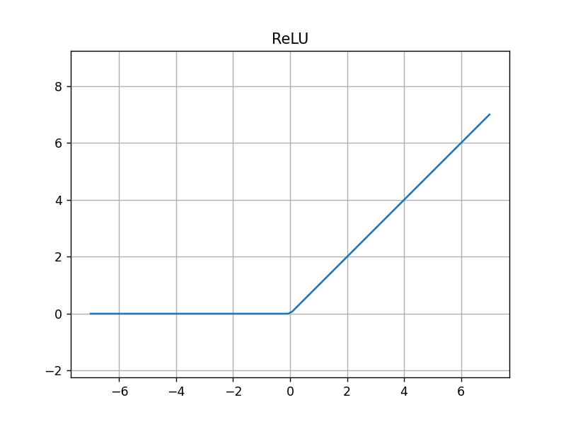
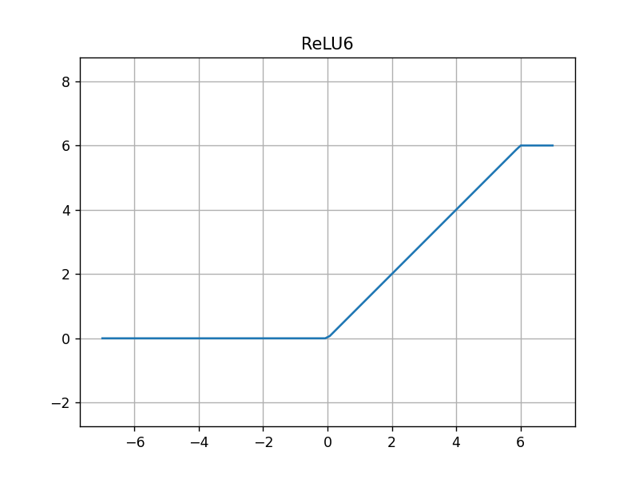
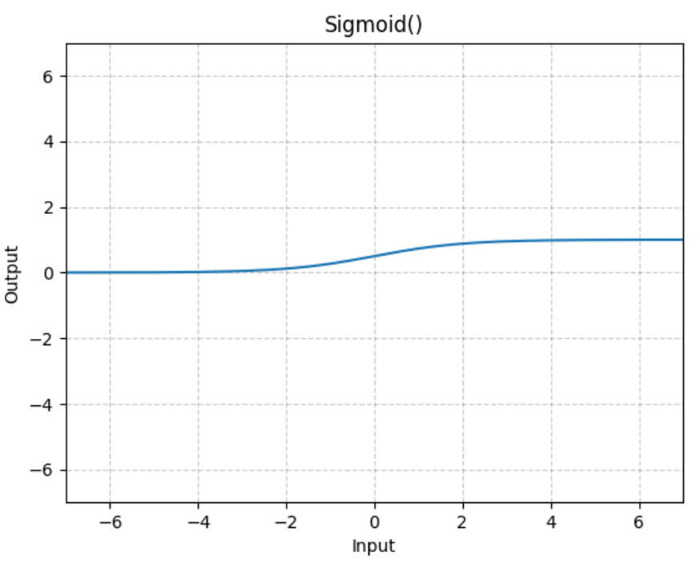
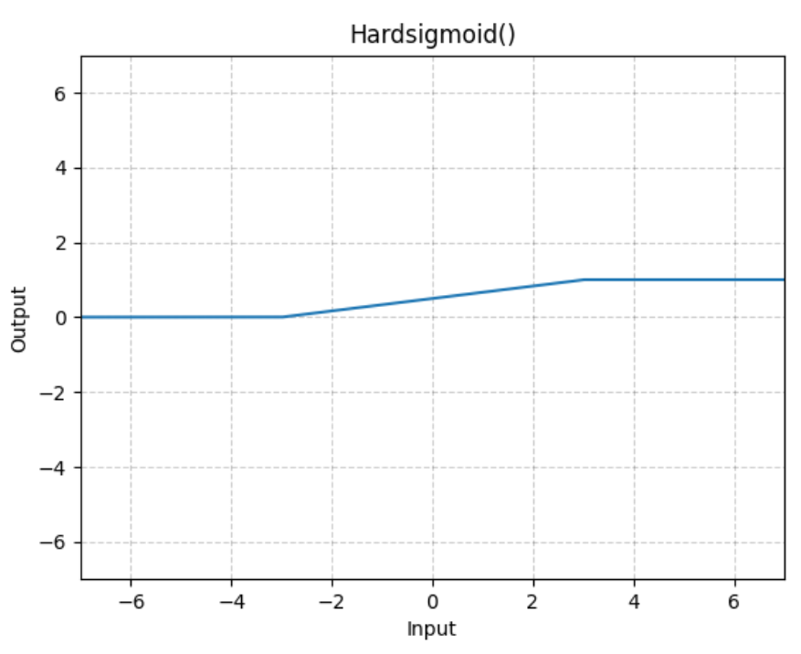
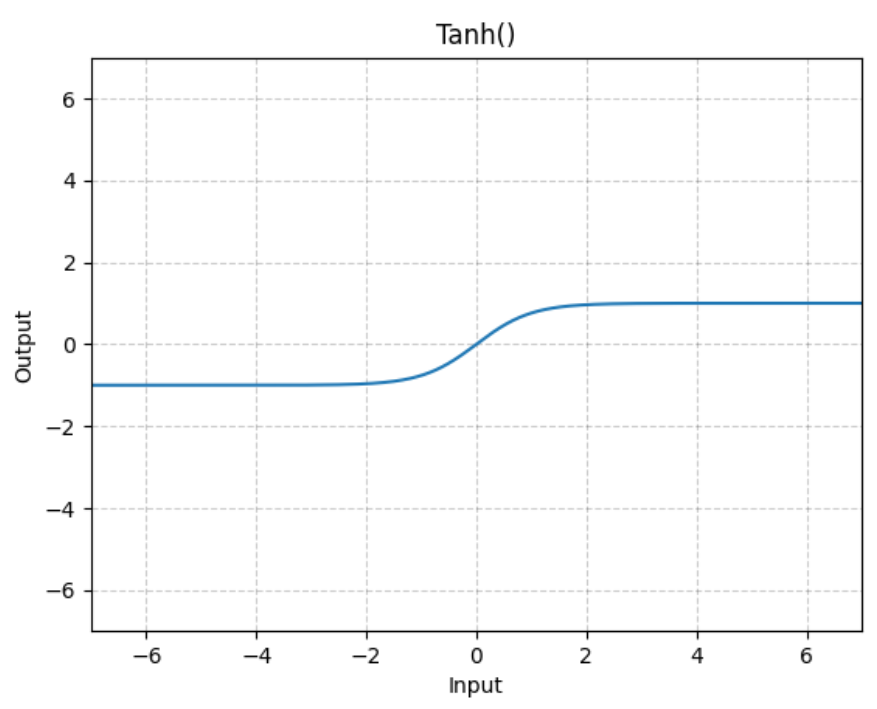
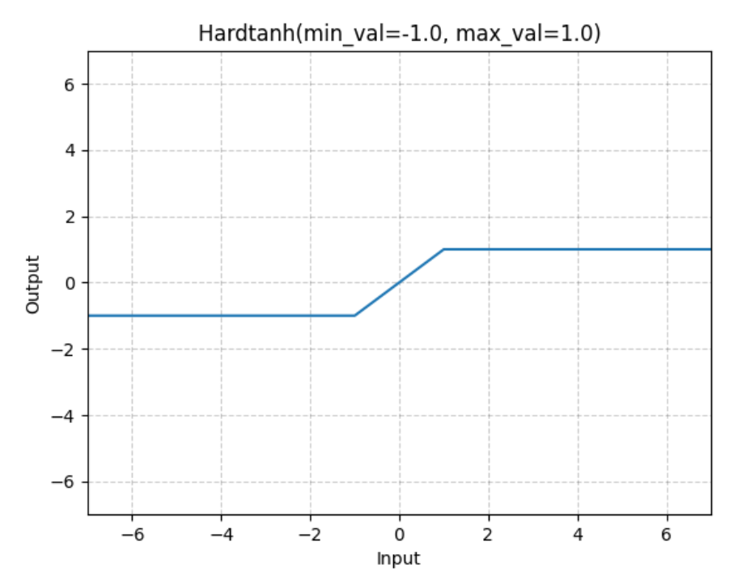

# 激活函数

[官方非线性激活函数API文档](https://pytorch.org/docs/stable/nn.html#non-linear-activations-weighted-sum-nonlinearity)

## 什么是激活函数？

模拟神经元触发信号的函数是激活函数，主要用来进行非线性激活

## 为何要用激活函数？

为了引入非线性值，参考 [线性回归中的非线性预测示例](../机器学习算法/线性回归/非线性预测示例.py)

## relu

$$
\text{ReLU}(x) = (x)^{+} = \text{max}(0, x)
$$

relu 还有一些变体，例如: [LeakyRelU](https://pytorch.org/docs/stable/generated/torch.nn.LeakyReLU.html), [GeLU](https://pytorch.org/docs/stable/generated/torch.nn.GELU.html)

## relu6

$$
\text{ReLU6}(x) = \text{min}(\text{max}(0, x), 6) 
$$

## sigmoid

$$
\text{Sigmoid}(x) = \sigma(x) = \frac{1}{1 + \text{exp}(-x)}
$$

==**作用: 一般用于二元分类**==

==**对应损失函数为 BCELoss 二元交叉熵损失**==

## hard-sigmoid

$$
\text{Hardsigmoid}(x) =
\begin{cases}
    0 & \text{if } x \leq -3 \\
    1 & \text{if } x \geq +3 \\
    x/6 + 1/2 & \text{otherwise}
\end{cases}
$$

## tanh

$$
\text{Tanh}(x) = \tanh(x) = \frac{\exp{(x)} - \exp{(-x)}}{\exp{(x)} + \exp{(-x)}}
$$

tanh 在求注意力机制中有用到

## hard-tanh

$$
\text{HardTanh}(x) = 
\begin{cases}
\text{max\_val} & \text{if } x \gt \text{max\_val} \\
\text{min\_val} & \text{if } x \lt \text{min\_val} \\
x & \text{otherwise}
\end{cases}
$$

## softmax

$$
\text{Softmax}(x_i) = \frac{\exp{(x_i)}}{\sum_j\exp{(x_j)}}
$$

对一组数据求其概率分布，例如: 3, 2, 1, 则他们的概率为 0.5, $\frac{1}{3}$, $\frac{1}{6}$

$$
3的softmax结果=\frac{e^3}{e^3 + e^2 + e^1}
$$

==**softmax 常用于多分类问题，求概率分布**==

**对应损失函数为 CrossEntropyLoss 交叉熵损失函数**

## log-softmax

$$
\text{LogSoftmax}(x_i) = \log \left( \frac{\exp{(x_i)}}{\sum_j\exp{(x_j)}} \right)
$$

log-softmax 是在 softmax 基础上执行一个 log 函数，例如: `np.log(softmax(x))`

==**对应损失函数为 NLLLoss 负对数似然损失函数**==

## pytorch 中的激活函数

以 torch.nn.functional.relu 和 torch.nn.functional.relu_ 为例

后面带了下划线 `_` 结尾的函数，是就地修改函数，等价于 `nn.ReLU(inplace=True)`