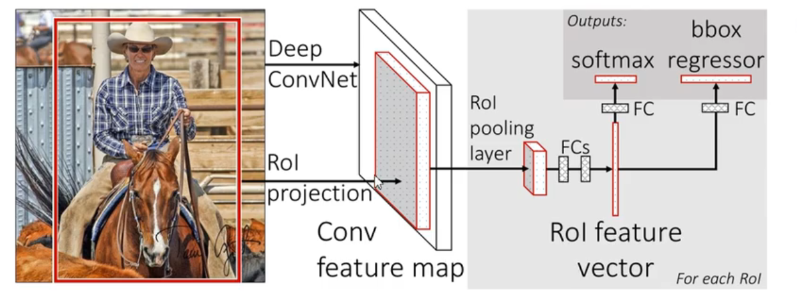
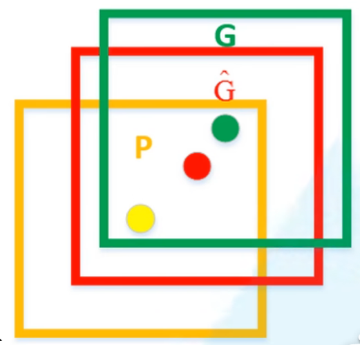

# Fast-RCNN

> 其论文的名字就是 Fast R-CNN，[原文链接](https://arxiv.org/abs/1504.08083)。Fast R-CNN与R-CNN相同，同样使用**VGG16作为网络的backbone**，与R-CNN相比训练时间快9倍，测试推理时间快213倍，准确率从62%提升至66%(再Pascal VOC数据集上)。

算法流程分为3个步骤：

+ 一张图像生成1K~2K个候选区域（使用Selective Search方法）
+ 将图像输入网络得到相应的特征图，将SS算法生成的候选框投影到特征图上获得相应的特征矩阵
+ 将每个特征矩阵通过ROI pooling层缩放到7x7大小的特征图，接着将特征图展平通过一系列全连接层得到预测结果

## Fast RCNN处理过程

#### 1）候选区域的生成

与R-CNN一样，利用Selective Search算法通过图像分割的方法得到一些原始区域，然后使用一些合并策略将这些区域合并，得到一个层次化的区域结构，而这些结构就包含着可能需要的物体。

但是，Fast R-CNN与R-CNN不同的是，这些生成出来的候选区域不需要每一个都丢到卷积神经网络里面提取特征，而且只需要在特征图上映射便可。

#### 2）投影特征图获得相应的特征矩阵

Fast-RCNN没有像RCNN一样，其不限制输入的图像的尺寸，其将整张图像送入网络，得到了一个特征图。紧接着从特征图像上提取相应的候选区域。这些候选区域的特征不需要再重复计算，简洁了不少的时间。

正负样本问题：

在Fast R-CNN中，并不适用SS算法提供的所有的候选区域，SS算法会差不多得到2000个候选框，但是训练的过程中其实只需要使用其中的一部分就可以了，Fast R-CNN中好像只挑选了其中的64个。其中还是分为正样本与负样本，正样本指的是在候选框中确实存在所需检测目标的样本；而负样本指的是候选框中没有所需检测的目标，也就是只有背景。

正样本的定义为候选框与真实的目标边界框的iou大于0.5；负样本的定义为候选框与所有真实的目标边界框的iou值最大的区间为0.1-0.5。重点是其实没有完全适应SS算法提供的所以的边界框。

#### 3）ROI层缩放

有了训练样本之后，将训练样本的候选框通过ROI Pooling层缩放到统一的尺寸。

Fast R-CNN中的ROI Pooling是一种将不同尺寸的Region of Interest（RoI，即感兴趣区域）映射到相同大小的特征图上的池化操作。其主要目的是从RoI中提取特征，以便后续进行分类和定位。

具体来说，ROI Pooling在Fast R-CNN中的操作步骤如下：

1. 首先，将RoI映射到特征图上的对应区域位置。RoI的尺寸通常是对应输入图像的，而特征图是输入图像经过一系列卷积层后的输出。
2. 然后，将每个RoI划分为固定大小的子区域（例如n x n）。由于RoI的尺寸可能不同，这一步操作实际上是平均划分，以保证每个子区域在特征图上的大小一致。
3. 对每个子区域进行最大池化操作，即取每个子区域内像素值的最大值作为该区域的“代表”。这样，每个RoI经过ROI Pooling操作后就变为固定大小的特征图（例如n x n）。

#### 4）展平特征图利用全连接层得到预测结果

**概率分类器**

输出N+1个类别的概率（N为检测目标的种类, 1为背景）共N+1个节点。

其中的第0个节点表示的背景的概率。剩下的20个是其他所需检测的类别概率。这个概率是经过softmax处理之后的，是满足一个概率分布的，其和为1.而既然现在是需要预测21个类别的概率，所以目标概率预测的全连接层为21个节点。

**边界框回归器**

输出对应N+1个类别的候选边界框回归参数(dx , dy , dw , dh )。需要注意，这是每一个类别都有这4个参数。所以共(N+1)x4个节点。

也就是4个4个为一组，一组为一个边界框回归参数。那么如何根据回归参数得到最后的预测边界框？

对应着每个类别的候选边界框回归参数（dx , dy , dw , dh）

#### 5）预测

Softmax分类器

输出N+1个类别的概率（N为检测目标的种类，1为背景）共N+1个节点

bbox regressor 边界框回归器

输出对应N+1个类别的候选边界框回归参数$(d_x,d_y,d_w,d_h)$ 共（N+1）x 4个节点

P为预测的边界框位置、G为实际的目标边界框位置、$\hat{G}$为回归后的目标边界框位置

$$
\hat{G_x} = P_wd_x(P) + P_x \\
\hat{G_y} = P_hd_y(P) + P_y \\
\hat{G_w} = P_wexp(d_w(P)) \\
\hat{G_h} = P_hexp(d_h(P))
$$

$$
P_x,P_y,P_w,P_h 分别为候选框的中心x，y坐标以及宽高\\
\hat{G_x},\hat{G_y},\hat{G_w},\hat{G_h} 分别为最终预测的边界框中心x，y坐标，以及宽高
$$

#### 6）Fast R-CNN 损失率

Multi-task loss

$$
L(p,u,t^u,v) = L_{cls}(p,u) + \lambda[u \ge 1]L_{loc}(t^u,v) \\
L_{cls}(p,u) ：分类损失 \\
\lambda[u \ge 1]L_{loc}(t^u,v) : 边界框回归损失
$$

$$
p是分类器预测的softmax概率分布$p=(p_0,...,p_k)$ \\

u是对应目标真实类别标签\\

t^u对应边界框回归其预测的对应类别u的回归参数(t_x^u,t_y^u,t_w^u,t_h^u)$\\

v对应真实目标的边界框回归参数v_x,v_y,v_w,v_h\\

分类损失
$$

$$
L_{cls}(p,u) = -log(p_u)
$$

边界框回归损失

$$
\lambda ：权重参数 \\

u \ge 1 : 艾弗森括号，满足条件时为1，不满足时为0 \\

L_{loc}(t^u,v) = \sum_{i \in (x,y,w,h)} smooth_{L1}(t_i^u - v_i) \\

smooth_{L1}(x) = \begin{cases} 0.5x^2 & if |x| < 1 \\ |x|-0.5 & otherwise \end{cases}
$$
