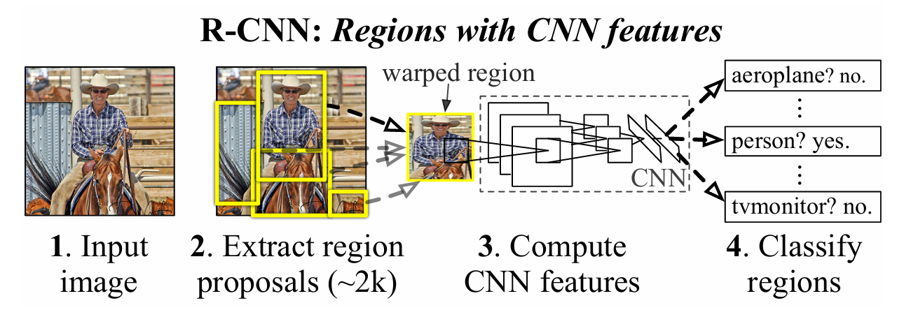
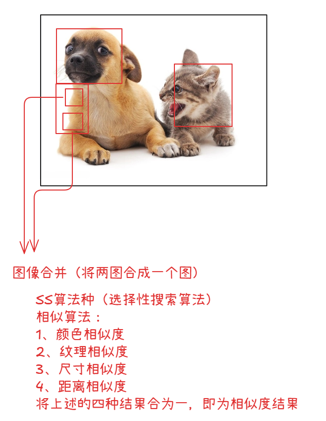
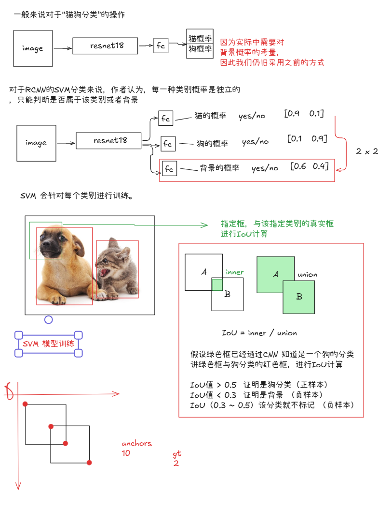
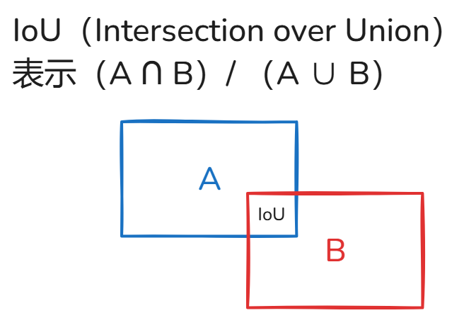
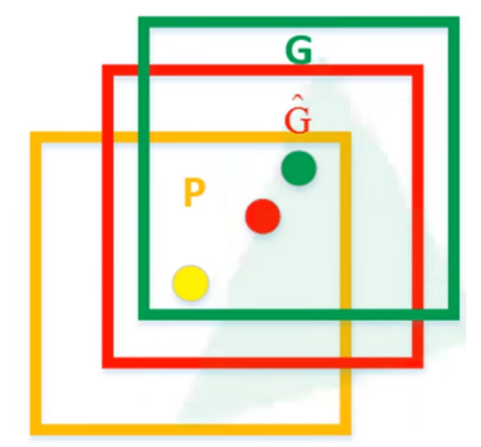

# RCNN

RCNN 算法流程步骤：

+ 一张图像生成1K~2K个候选区域(使用选择性搜索方法)
+ 对每个候选区域，使用深度网络提取特征
+ 特征送入每一类的支持向量机分类器，判别是否属于该类
+ 使用回归器精细修正候选框位置

## 1、候选区域的生成

利用Selective Search算法通过图像分割的方法得到一些原始区域，然后使用一些合并策略将这些区域合并，得到一个层次化的区域结构，而这些结构中就包含我们需要检测的物体。

> 此处单独看Selective Search知识点

## 2、对于候选区域，使用深度网络提取特征

> 此处的2000是指的ss算法·生成的anchors的个数，如果anchors的个数是10，那么此处的结果应该是（10，4096）

将2000候选区域缩放到227x227像素，接着将候选区域输入事先训练好的AlexNetCNN网络获取4096维的特征得到2000x4096维矩阵

## 3、特征送入每一类的SVM分类器，判定类别

> 20是指的实际中，关于物体的分类的类别数量，实际上20个分类，必须包含背景的类别（此处，也需要明白背景概率判定下，如果是背景，则也不需要在图中标注出来，因此它的anchors即为 （0，0，0，0））

将2000x4096维特征与20个支持向量机组成的权值矩阵4096x20相乘获得2000x20维矩阵表示每个建议框是某个目标类别的得分。分别对上述2000x20维矩阵中每一列即每一类进行`非极大值抑制`剔除重叠建议框，得到该列即该类中得分最高的一些建议框

### 非极大值抑制

> 其一、此处因使用IoU 因此最容易与 先验框（bbox、anchors）筛选和分类环节有类似之处
>
> 其二、非极大值抑制只在生成预测框时，使用，预处理阶段不使用该过程

非极大值抑制步骤：

+ 寻找得分最高的目标
+ 计算其他目标与该目标的iou值
+ 删除所有iou值大于给定阈值的目标

## 4、使用回归器精细修正候选框位置

对NMS处理后剩余的建议框进一步筛选。接着分别用20个回归器对上述20个类别中剩余的建议框进行回归操作，最终得到每个类别的修正后的得分最高的边界框。

如图，黄色框口P表示建议框区域建议绿色窗口G表示实际框基本事实，红色窗口G表示地区建议书进行回归后的预测窗口，可以`最小二乘法解决的线性回归问题`.

