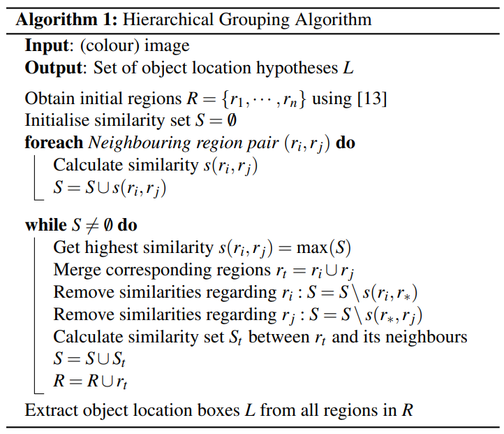

# 选择性搜索


[toc]


## **一、概述**

在R-CNN中架构的第一步是要寻找推荐区域（Region Proposal），也就是找出可能的感兴趣区域（Region Of Interest, ROI）。获取推荐区域的方法有下三种，分为：滑动窗口、规则块和**选择性搜索**。

第一种就是滑动窗口。滑动窗口本质上就是穷举法，利用不同的尺度和长宽比把所有可能的大大小小的块都穷举出来，然后送去识别，识别出来概率大的就留下来。很明显，这样的方法复杂度太高，产生了很多的冗余候选区域，在现实当中不可行。

第二种是规则块。在穷举法的基础上进行了一些剪枝，只选用固定的大小和长宽比。但是对于普通的目标检测来说，规则块依然需要访问很多的位置，复杂度高。

第三种是**选择性搜索**。从机器学习的角度来说，前面的方法召回是不错了，但是精度差强人意，所以问题的核心在于如何有效地去除冗余候选区域。**其实冗余候选区域大多是发生了重叠，选择性搜索利用这一点，自底向上合并相邻的重叠区域，从而减少冗余**。


## 二、算法流程

选择性搜索相关论文早在2012年发表于IJCV会议，论文名为:[Selective Search for Object Recognition](https://link.zhihu.com/?target=https%3A//ivi.fnwi.uva.nl/isis/publications/2013/UijlingsIJCV2013/UijlingsIJCV2013.pdf)。这篇论文不单单讲解了选择性搜索



从图中可以看出，选择性搜索输入的是彩色图像，输出为候选的目标边界框集合。选择性搜索主要流程主要分成以下几个步骤：

```
输入: 一张图片
输出：候选的目标位置集合L
 
算法：
1: 利用切分方法得到候选的区域集合R = {r1,r2,…,rn}
2: 初始化相似集合S = ϕ
3: foreach 遍历邻居区域对(ri,rj) do
4:     计算相似度s(ri,rj)
5:     S = S  ∪ s(ri,rj)
6: while S not=ϕ do
7:     从S中得到最大的相似度s(ri,rj)=max(S)
8:     合并对应的区域rt = ri ∪ rj
9:     移除ri对应的所有相似度：S = S\s(ri,r*)
10:    移除rj对应的所有相似度：S = S\s(r*,rj)
11:    计算rt对应的相似度集合St
12:    S = S ∪ St
13:    R = R ∪ rt
14: L = R中所有区域对应的边框
```

首先通过基于图的图像分割方法初始化原始区域，就是将图像分割成很多很多的小块。然后我们使用贪心策略，计算每两个相邻的区域的相似度，然后每次合并最相似的两块，直到最终只剩下一块完整的图片。然后这其中每次产生的图像块包括合并的图像块我们都保存下来，这样就得到图像的分层表示了呢。


## 三、关于相似度量

相似度量主要使用了颜色相似度、纹理相似度、大小相似度和吻合相似度。

#### 相似度计算方法：

相似度计算方法将直接影响合并区域的顺序，进而影响到检测结果的好坏。

论文在对比各种颜色空间特点后，选择RGB空间进行计算。

而在度量中采用4种公式，成为互补相似度测量（Complementary Similarity Measures），且结果都在[0-1]


**2.纹理相似度**


**3.尺度相似度**


整个相似度计算公式：


R-CNN 存在的问题：

- 测试速度慢
- 测试一张图约需要 53s (多核CPU)，用SS算法提取候选框用时约 2s，一张图像内候选框之间存在大量的重叠，提取特征操作冗余（Fast RCNN将会对其进行优化）。
- 训练速度慢
- 过程及其繁琐
- 训练所需空间大
- 对于 SVM 和 bbox 回归训练，需要从每个图像中的每个目标候选框提取特征，并写入磁盘。对于非常深的网络如 VGG16，从 VOC2007 训练集上的 5k 张图像上提取的特征需要上百GB的存储空间。


## 关于selective search函数的参数理解

- `image`：输入的图像，通常是一个RGB图像。
- `scale`：用于控制分割的尺度，较小的值会产生更多的区域。
- `sigma`：用于控制高斯模糊的程度，影响区域的平滑度。
- `min_size`：最小区域大小，小于此值的区域将被忽略。
- `mode`：分割模式，通常有“quick”和“rotation”两种模式。


Selective Search算法通过以下步骤生成候选区域：

1. ‌**图像分割**‌：使用基于图的图像分割方法将图像分割成小区域。
2. ‌**区域合并**‌：计算相邻区域的相似度，将相似度最高的两个区域合并，并重复此过程，直到没有更多可以合并的区域。
3. ‌**相似度计算**‌：考虑颜色、纹理、尺寸和空间交叠等因素来计算区域间的相似度。
4. ‌**多样性策略**‌：通过使用不同的色彩空间、相似性度量和起始区域来增加抽样的多样性。


### 性能和优化建议

- ‌**性能优化**‌：可以通过调整`scale`和`sigma`参数来平衡计算时间和候选区域的数量。较小的`scale`值和较大的`sigma`值会增加计算量，但可能产生更多的高质量候选区域。
- ‌**内存管理**‌：确保在处理大图像时，系统有足够的内存和处理能力。
- ‌**参数调整**‌：根据具体应用场景调整`min_size`和`mode`参数，以达到最佳效果。

通过以上步骤和示例代码，你可以有效地使用`selective_search`函数进行目标检测中的候选区域生成。