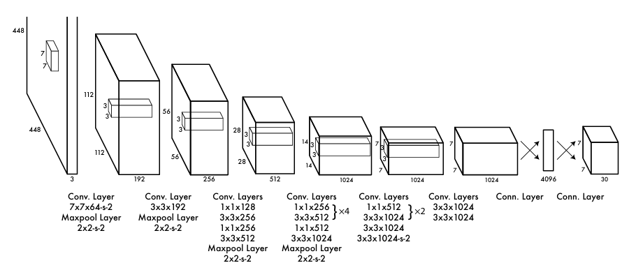
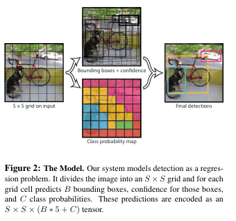
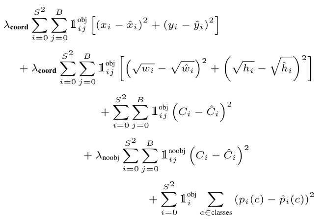

### YOLOv1（2016）

（论文地址：https://arxiv.org/pdf/1506.02640.pdf）

#### 模型介绍

在YOLOv1提出之前，R-CNN系列算法在目标检测领域中独占鳌头。R-CNN系列检测精度高，但是由于其网络结构是双阶段（two-stage）的特点，使得它的检测速度不能满足实时性，饱受诟病。为了打破这一僵局，涉及一种速度更快的目标检测器是大势所趋。

2016年，Joseph Redmon、Santosh Divvala、Ross Girshick等人提出了一种单阶段（one-stage）的目标检测网络。它的检测速度非常快，每秒可以处理45帧图片，能够轻松地实时运行。由于其速度之快和其使用的特殊方法，作者将其取名为：You Only Look Once（也就是我们常说的YOLO的全称），并将该成果发表在了CVPR2016上，从而引起了广泛地关注。

YOLO的核心思想就是把目标检测转变成一个回归问题，利用整张图作为网络的输入，仅仅经过一个神经网络，得到bounding box（边界框）的位置及其所属的类别。

#### 网络结构

现在看来，YOLOv1的网络结构十分清晰，是一种传统的one-stage的卷积神经网络：

+ 网络输入：448x448x3的彩色图片
+ 中间层：由若干卷积层和最大池化层组成，用于提取图片的抽象特征
+ 全连接层：由两个全连接层组成，用来预测目标的位置和类别的概率值
+ 网络输出：7x7x30 (20个分类 + 1 置信度 + 4 位置信息 + 1 置信度 + 4 位置信息)的预测结果

#### 实现细节

（1）检测策略

YOLOv1采用的是“分而治之”的策略，将一张图片平均分成7x7个网格，每个网格分别负责预测中心点落在该网格内的目标。在Faster R-CNN中，是通过一个RPN来获得目标的感兴趣区域，这种方法精度高，但是需要额外再训练一个RPN网络，这无疑增加了训练的负担。在YOLOv1中，通过划分得到了7x7个网格，这49个网格就相当于是目标的感兴趣区域。通过这种方式，我们就不需要再额外设计一个RPN网络，这正是YOLOv1作为单阶段网络的简单快捷之处。

**具体实现（labels获取）过程如下：**

1. 将一副图像分成SxS个网格（grid cell），如果某个object的中心落在这个网格中，则这个网络就负责预测这个object。
2. 每个网格都要预测B个bounding box，每个bounding box要预测和confidence共5个值。
3. 每个网格还要预测一个类别信息，记为C个类。
4. 总的来说，SxS个网格，每个网格要预测B个bounding box，还要预测C个类。网络输出就是一个SxSx(5 x B + C)的张量。

在实际过程中，YOLOv1把一张图片划分为了7x7个网格，并且每个网格预测2个Box（Box1和Box2），20个类别。所以实际上，S=7，B=2，C=20。那么网络输出的shape也就是：。

（2）目标损失函数

损失由三部分组成，分别是：坐标预测损失、置信度预测损失、类别预测损失。

+ 使用的是差方和误差。需要注意的是，w和h在进行误差计算的时候取得是它们的平方根，原因是对不同大小的bounding box预测中，相比于大bounding box预测偏一点，小box预测偏一点更不能忍受。而差方和误差函数中对同样的偏移loss是一样。为了缓和这个问题，作者用了一个比较取巧的办法，就是将bounding box的w和h取平方根代替原本的w和h。
+ 定位误差比分类误差更大，所以增加对定位误差的惩罚，使。
+ 在每个图像中，许多网格单元不包含任何目标值。训练时就会把这些网格里的框的“置信度”分数推到零，这往往超过了包含目标的框的梯度。从而可能导致模型不稳定，训练早期发散。因此要减少了不包含目标的框的置信度预测的损失，使。

#### 性能表现

（1）优点

1. YOLO检测速度非常快。标准版本的YOLO可以每秒处理45张图像；YOLO的极速版本每秒可以处理150帧图像。这就意味着YOLO可以小于25毫秒延迟，实时地处理视频。对于欠实时系统，在准确率保证的情况下，YOLO速度快于其他方法。
2. YOLO实时检测的平均精度是其他实时监测系统的两倍。
3. 迁移能力强，能运用到其他新的领域（比如艺术品目标检测）。

（2）局限性

1. YOLO对相互靠近的物体，以及很小的群体检测效果不好，这是因为一个网格只预测了2个框，并且都只属于同一类。
2. 由于损失函数的问题，定位误差是影响检测效果的主要原因，尤其是大小物体的处理上，还有待加强。（因为对于小的bounding boxes，small error影响更大）。
3. YOLO对不常见的角度的目标泛化性性能偏弱。