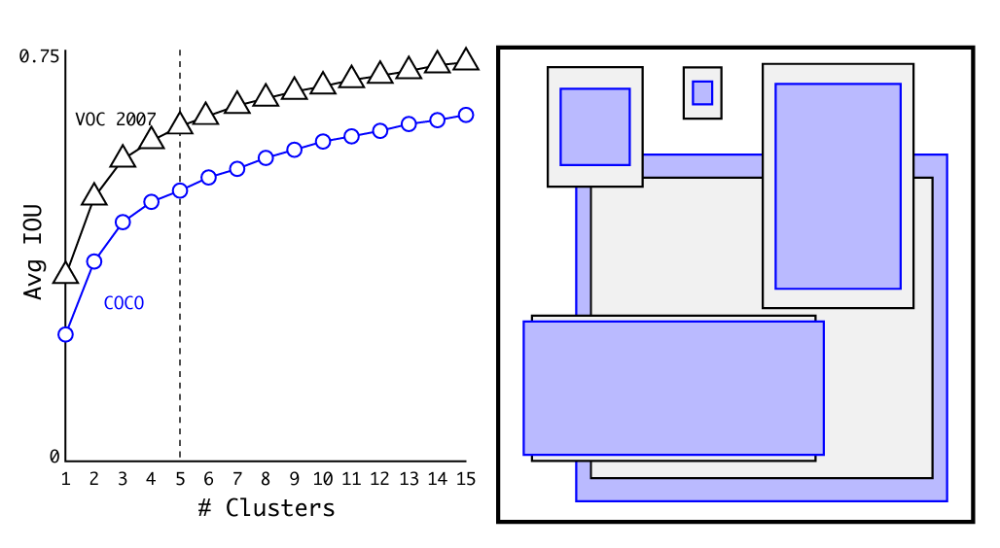
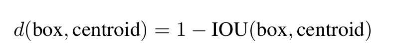
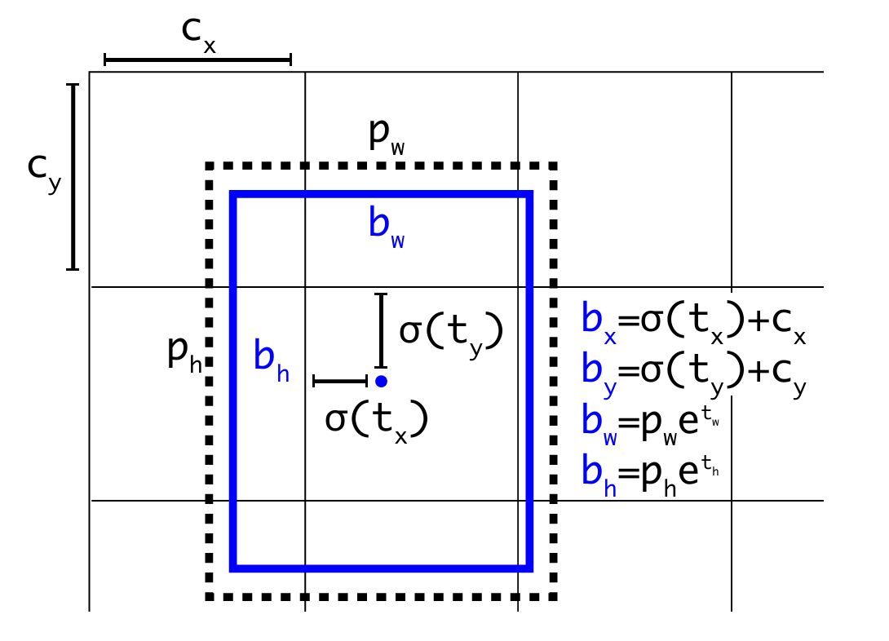
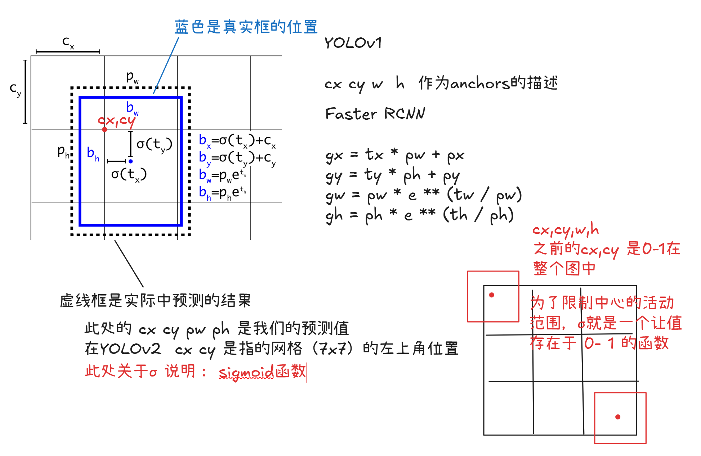
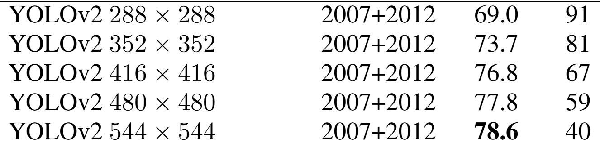
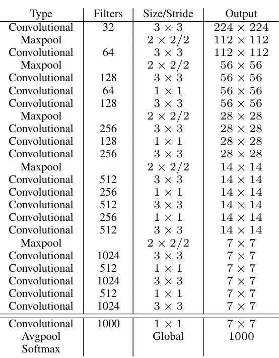

### YOLOv2（2016）

（论文地址：https://arxiv.org/pdf/1612.08242.pdf#page=4.24）

#### 改进部分

YOLOv2 Joseph Redmon和Ali Farhadi发表在CVPR 2017。它包括了对原始YOLO的一些改进，保持相同的速度，也更强大，能够检测9000个类别，这些改进有以下几点：

（1）在所有卷积层上的**批量归一化**改善了收敛性，并作为一个正则器来减少过拟合；

（2）**高分辨率分类器**，和YOLOv1一样，在ImageNet以224x224的分辨率对模型进行了预训练。然而，这一次，他们在分辨率为448x448的ImageNet上对模型进行了10次微调，提高了网络在高分辨率输入下的性能；（作者将backbone首先做了预训练。）

（3）**完全卷积**  它们去掉了池化层、全连接层，采用了全卷积架构（全卷积就会减少特征丢失）。

（4）**使用Anchor来预测边界框**。他们使用一组先验框（Two-stage 中的内容）Anchor，这些Anchor具有预定义的形状，用于匹配物体的原型形，每个网格单元都定义了多个Anchor，系统预测每个Anchor的坐标和类别。网络输出的大小与每个网格单元的Anchor数量成正比。  （全文的意思是说，我们在设置Anchor上，采用尺寸size，比例ratios的方式来设置Anchors，就是采用Faster RCNN的）

（5）**维度聚类**。（重点）挑选好的Anchor有助于网络学习预测更准确的边界盒。作者对训练中的边界盒进行了k-means聚类，以找到更好的先验。他们选择了五个Anchor，在召回率和模型复杂性之间进行了良好的权衡。

此处的k-means函数主要使用以下方式进行聚类设置

（6）**改变直接预测位置**。与其他预测偏移量的方法不同，YOLOv2遵循同样的理念，预测了相对于网格单元的位置坐标，网络为每个单元预测了五个bounding box，每个bounding box有五个值，
$$
t_x,t_y,t_w,t_h,t_o \\
其中相当于YOLOv1的Pc，最终得到的bounding box。
$$

（7）**细粒度的特征**。与YOLOv1相比，YOLOv2去掉了一个池化层，对于416x416的输入图像，得到13x13的特征图。（大图像得到的mAP高于小图像）

（8）**多尺度训练**。由于YOLOv2不使用全连接层，输入可以是不同的尺寸。为了使YOLOv2对不同的输入尺寸具有鲁棒性，作者随机训练模型，每10批改变尺寸（从320x320到608x608）（随机改变的大小都是32的倍数）。

#### 网络结构

**YOLOv2 采用 Darknet-19 作为特征提取网络，其整体结构如下：**

改进后的YOLOv2：Darknet-19，总结如下：

1. 与VGG相似，使用了很多3x3卷积核；并且每一次池化后，下一层经过卷积之后的通道数=池化输出的通道 x 2。
2. 在每一层卷积后，都增加了BN层进行预处理。
3. 采用了降维的思想，把1x1的卷积置于3x3之间，用来压缩特征。
4. 在网络最后的输出上增加了一个global average pooling层。
5. 整体上采用了19个卷积层，5个池化层。

为了更好的说明，将Darknet-19与YOLOv1、VGG16网络进行对比：

VGG-16：大多数检测网络框架都是以VGG-16作为基础特征提取器，它功能强大，准确率高，但是计算复杂度较大，所以速度会相对较慢。因此YOLOv2的网络结构将从这方面改进。
YOLOv1：基于GoogLeNet的自定义网络，比VGG-16的速度快，但是精度稍不如VGG-16。
Darknet-19：速度方面，处理一张图片仅需要55.8亿次运算，相比于VGG306.9亿次，速度快了近6倍。精度方面，在ImageNet上的测试精度为：top1准确率为72.9%，top5的准确率为91.2%。

关于YOLOv2的损失：
$$
Loss = L_{conf}(C,c) + L_{coord}(B,b) + L_{cls}(G,g) \\
置信度损失：二值交叉熵损失 BCELoss \\
边框回归参数损失：均方差损失 MSELoss \\
分类损失：二值交叉熵损失 BCELoss
$$

#### 性能表现

在VOC2007数据集上进行测试，YOLOv2在速度为67fps时，精度可以达到76.8的mAP；在速度为40fps时，精度可以达到78.6的mAP 。可以很好的在速度和精度之间进行权衡。下图是YOLOv1在加入各种改进方法后，检测性能的改变。可见在经过多种改进方法后，YOLOv2在原基础上检测精度具有很大的提升。

相对于YOLOv1而言，不足之处在于，没有进行多尺度特征的结合预测，传递模块（Pass-Through Module）的使用在提升细粒度特征的同时也对特征的空间，分布产生了一定影响，以及对小目标的检测能力没有明显提升。