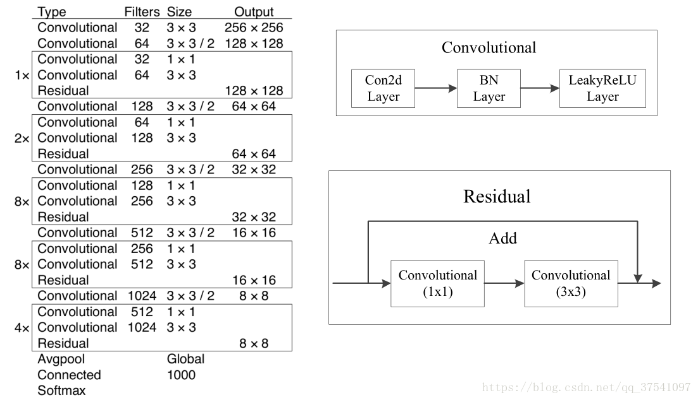
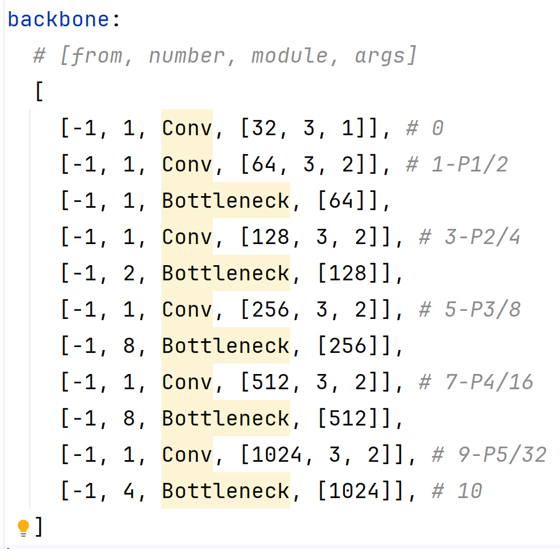
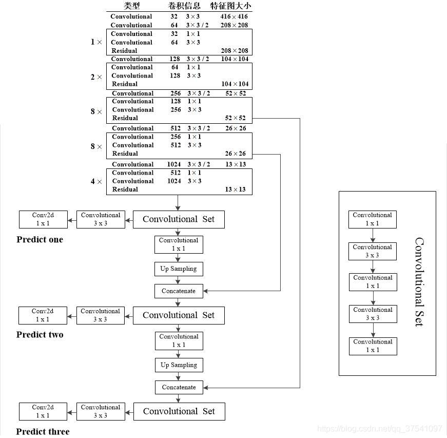
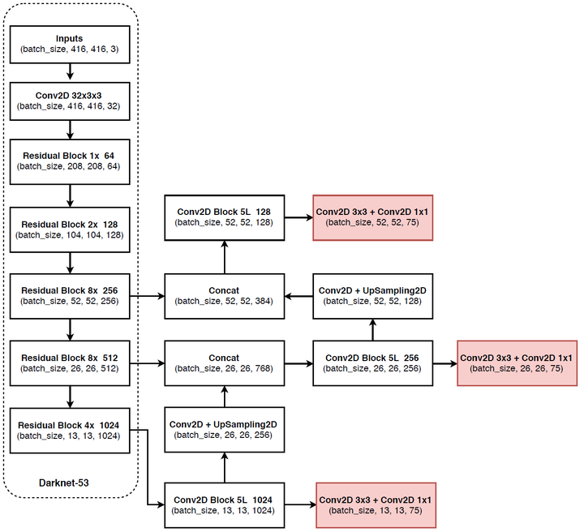
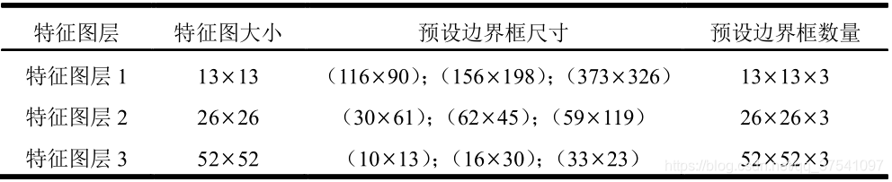

### YOLOv3 （2018）

（论文地址：https://arxiv.org/pdf/1804.02767.pdf）

#### 模型介绍

2018年，作者Redmon又在YOLOv2的基础上做了一些改进。特征提取部分采用Darknet-53网络结构代替原来的Darknet-19，利用特征金字塔网络结构实现了多尺度检测，分类方法使用逻辑回归代替了softmax，在兼顾实用性的同时保证了目标检测的准确性。

从YOLOv1到YOLOv3，每一代性能的提升都与backbone（骨干网络）的改进密切相关。在YOLOv3中，作者不仅提供了darknet-53，还提供了轻量级的tiny-darknet。如果你想检测精度与速度兼备，可以选择darknet-53作为backbone；如果你想达到更快的检测速度，精度方面可以妥协。那么tiny-darknet是你很好的选择。总之，YOLOv3的灵活性使得它在实际工程中得到很多人的青睐。

#### 网络结构

相比于 YOLOv2 的 骨干网络，YOLOv3 进行了较大的改进。借助残差网络的思想，YOLOv3 将原来的 darknet-19 改进为darknet-53。论文中给出的整体结构如下：

以上的结构，在YOLOv3的源码中：

在yolov3/models/yolov3.yaml

Darknet-53主要由1x1和3x3的卷积层组成，每个卷积层之后包含一个批量归一化层和一个Leaky ReLU，加入这两部分的目的是为了防止过拟合。卷积层、BN层以及LeakyReLU共同组成Darknet-53的基本CBL。因为在Darknet-53中共包含53个这样的CBL，所以称其为Darkent-53。

为了更加清晰地了解Darknet-53的网络结构，可以看下面这张图：

为了更好的理解此图，下面对主要单元进行说明：

CBL：一个卷积层、一个BN层和一个Leaky ReLU组成的基本卷积单元。
res unit：输入通过两个CBL后，再与原输入进行add；这是一种常规的残差单元。残差单元的目的是为了让网络可以提取到更深层的特征，同时避免出现梯度消失或爆炸。
ResX：X个残差组件。
concat：将Darknet-53的中间层和后面的某一层的上采样进行张量拼接，达到多尺度特征融合的目的。这与残差层的add操作是不一样的，拼接会扩充张量的维度，而add直接相加不会导致张量维度的改变。
最后面的蓝色立方体表示三种尺度的输出。
与Darknet-19相比，Darknet-53主要做了如下改进：

没有采用最大池化层，转而采用步长为2的卷积层进行下采样。
为了防止过拟合，在每个卷积层之后加入了一个BN层和一个Leaky ReLU。
引入了残差网络的思想，目的是为了让网络可以提取到更深层的特征，同时避免出现梯度消失或爆炸。
将网络的中间层和后面某一层的上采样进行张量拼接，达到多尺度特征融合的目的。

#### 改进部分

（1）**输入端**

自适应锚框计算：引入了自适应锚框计算的机制，旨在更好地适应各种目标的尺寸和长宽比例变化。
初始锚框定义：首先，根据训练集的标注框，选择初始的锚框。可以使用一些聚类算法（如k-means）对标注框进行聚类，以确定一组代表性的锚框。
锚框调整：对于每个训练样本，根据该样本中的目标框与初始框的匹配程度，调整初始框的大小和长宽比例。这可以通过计算目标框与锚框的IoU（交并比）来确定匹配程度，并根据匹配程度调整锚框的尺寸。
锚框聚类：根据经过调整的锚框，再次进行聚类，得到一组更适应当前数据集的锚框。这些聚类过程通常是迭代进行的，直到达到一定的收敛条件。
锚框选择：根据聚类得到的锚框集合，可以选择一定数量的锚框用于目标检测。通常，可以根据聚类结果中的锚框长宽比例的分布情况，选择一些具有代表性的锚框。
自适应缩放：根据目标尺寸来自动调整输入图像的大小。这样可以更好地适应不同尺度的目标，提高目标检测的准确性。

（2）**主干网络**

YOLOv3的主干网络Darknet-53包含卷积层（Convolutional Layer）、残差层（Residual Layer）、特征融合层（Feature Fusion Layer），网络层数的加深提高了检测精度，大量残差网络模块的引入减少了由网络层数加深引起的梯度下降问题，金字塔池化模块的引入可以实现多尺寸的输入和统一尺寸的输出。

（3）**颈部网络**

YOLOv3的颈部网络是FPN（多尺度检测，特征融合），FPN（Feature Pyramid Network）是一种用于目标检测和语义分割任务的特征金字塔网络结构。它的设计目的是解决单尺度特征提取网络在处理不同尺度目标时的困难。

FPN的主要思想如下：

特征提取：首先，通过卷积神经网络（如ResNet）进行特征提取。这些特征具有不同的尺度和语义信息。
顶层池化：为了获取更高分辨率的特征，FPN使用自顶向下的顶层池化操作，将较低分辨率的特征图上采样到较高分辨率。这可以通过上采样或插值等方法实现。
横向连接：为了融合不同层次的特征信息，FPN引入横向连接，将上一层的特征与下一层的上采样特征进行逐元素相加（Element-wise Sum）。这样可以将低级别的细节信息与高级别的语义信息相结合，产生具有多尺度特征的金字塔结构。
特征融合：为了进一步提升特征表达能力，FPN在每个金字塔层级上引入一个额外的卷积层，进行特征融合和调整。
（4）**输出端**

YOLOv3在输出的改进是多标签预测（softmax函数变为logistics分类器）。在YOLOv1中，通常使用softmax函数作为分类器的激活函数，将每个类别的输出转化为概率分布。

然而，对于YOLOv3这样的多标签检测任务，一个目标可能属于多个类别，使用softmax函数会导致多个类别的概率之和超过1，不符合多标签问题的要求。因此，在YOLOv3中，采用了logistic分类器作为分类器的激活函数。

logistic分类器将每个类别的输出视为独立的二分类问题，对每个类别使用sigmoid函数进行激活。sigmoid函数将输出限制在0到1之间，表示每个类别的存在概率。

#### 性能表现

如下图所示，是各种先进的目标检测算法在COCO数据集上测试结果。很明显，在满足检测精度差不都的情况下，YOLOv3具有更快的推理速度。

如下表所示，对不同的单阶段和两阶段网络进行了测试。通过对比发现，YOLOv3达到了与当前先进检测器的同样的水平。检测精度最高的是单阶段网络RetinaNet，但是YOLOv3的推理速度比RetinaNet快得多。