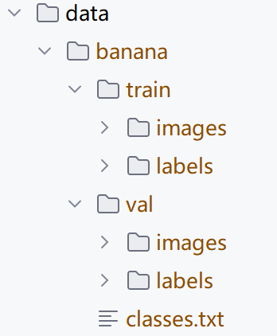
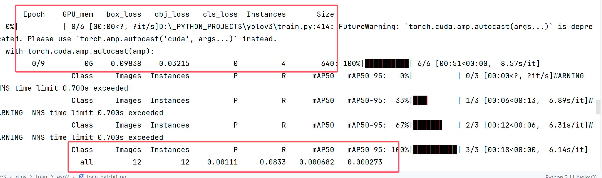
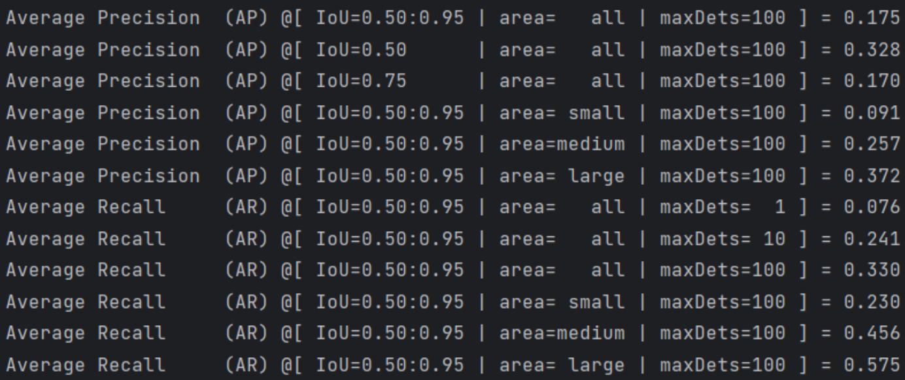
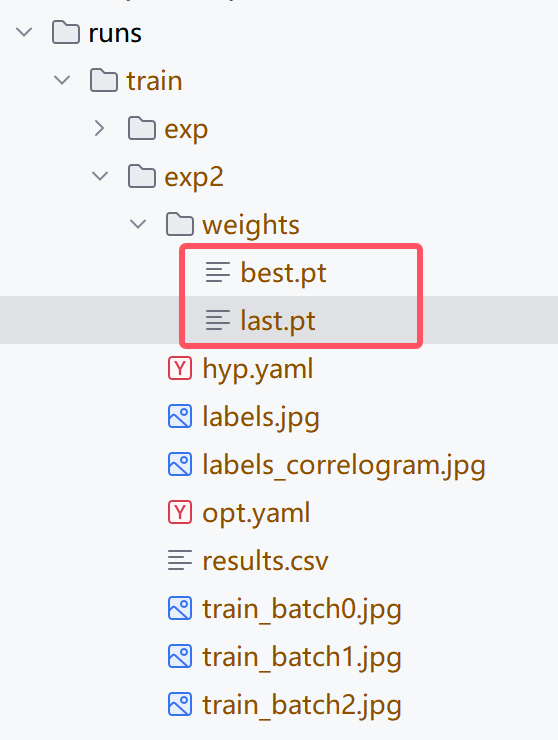

# YOLOv3 自定义数据集训练


## 准备yolo数据集

工具：

+ labelimg


如果数据是没有任何标注的内容，就需要自己进行标注（或者用yolo自动标注）


此处使用了香蕉图，进行标注，标注后的文件格式如下：



+ images 放置原图位置
+ labels 放置标签的位置
+ classes.txt  类别名称


## 准备数据集的yaml文件


将上述的banana放入data下，且在data文件下新建一个`banana.yaml`

写入对应的配置

```
train: ./data/banana/train/images # train images (relative to 'path') 128 images
val: ./data/banana/val/images

# 类别数量
nc: 1

# Classes 类别的标签
names: [ 'banana' ]
```


## 开始训练数据

在控制台输入训练的命令：

```
python train.py --data banana.yaml --epochs 10 --cfg yolov3.yaml  --batch-size 2 
```


## 训练过程中需要关注的信息



第一个区域：

+ Epoch 次数
+ GPU占用
+ box_loss 边框损失
+ obj_loss  confidence置信度损失
+ cls_loss  类别损失
+ Intances  参与此次Epoch的实例数量
+ Size 图像大小


第二个区域：

+ Class  参与的类别数量
+ Images 总共的图像数量
+ Instances 总共的实例数量
+ P precious 准确率
+ R recall  召回率
+ mAP50： IOU阈值为0.5 时，整个数据的mAP （IOU > 0.5 时为正样本下的mAP，单独样本大样本情况）
+ mAP50-95 ：IOU阈值为0.5~0.9（累积所有的IOU计算），得到 整个数据的mAP（每个IOU下的mAP的均值，可以测试该样本的多尺度检测的状况）


## 训练结束后需要关注的信息

pycocotools的数据信息（有些yolo模型中会使用该插件）



small   检测区域 < 32x32 的大小

medium  32 x 32 < 检测区域 < 64 x 64 中等大小区域

large  检测区域 > 64 x 64


运行结束后，我们找到生成pt文件（训练好的模型）



+ best.pt 主要用于预测
+ last.pt 主要用于继续训练


## 预测

```bash
python detect.py --weights yolov5s.pt --source 0                               # webcam
                                               img.jpg                         # image
                                               vid.mp4                         # video
                                               screen                          # screenshot
                                               path/                           # directory
                                               list.txt                        # list of images
                                               list.streams                    # list of streams
                                               'path/*.jpg'                    # glob
                                               'https://youtu.be/LNwODJXcvt4'  # YouTube
                                               'rtsp://example.com/media.mp4'  # RTSP, RTMP, HTTP stream
```


## 关于YOLO的其他功能

+ 语义分割（segment）
+ 图片分类（classifier）
+ 特征点检测
+ 热力图（注意力机制，YOLOv11提出来的）
+ 图像语言模型（看图描述....）


## 关于AutoDL中运行YOLO（非常建议）


+ git clone yolo的项目
+ 上传yolo项目（.venv  pt文件尽量都删掉）