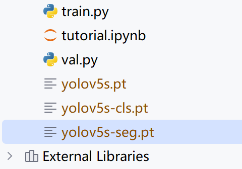

## Utralytics中YOLOv3版本


git下载项目到指定目录

```
git clone https://github.com/ultralytics/yolov3.git
```


> 注意将requiement.txt 屏蔽，一定要将torch和torchvision注释掉


通过pycharm打开该项目（根据requirements的要求，安装所需要的库文件，如果说已经安装了torch，就尽量不要安装新的torch）


## 使用

1、下载对应的尺寸权重（此处使用的是yolov5s的权重）




2、然后找到数据集，将数据集放置在指定位置，然后使用命令方式训练模式。

```
python detect.py --weights yolov5s.pt --source 0                               # webcam
                                               img.jpg                         # image
                                               vid.mp4                         # video
                                               screen                          # screenshot
                                               path/                           # directory
                                               list.txt                        # list of images
                                               list.streams                    # list of streams
                                               'path/*.jpg'                    # glob
                                               'https://youtu.be/LNwODJXcvt4'  # YouTube
                                               'rtsp://example.com/media.mp4'  # RTSP, RTMP, HTTP stream
```

