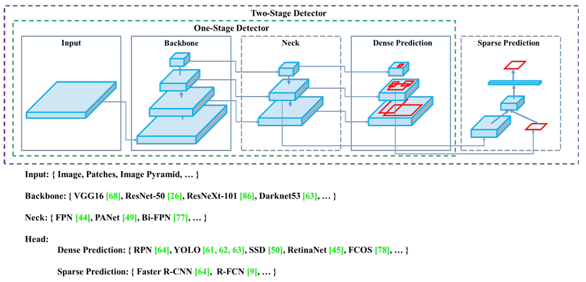
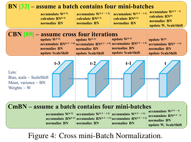

### YOLOv4（2020）

（论文地址：https://arxiv.org/pdf/2004.10934.pdf）

#### 模型介绍

从YOLOv3后，YOLO没有新版本。直到2020年4月，Alexey Bochkovskiy、Chien-Yao Wang和Hong-Yuan Mark Liao在ArXiv发布了YOLOv4[50]的论文。起初，不同的作者提出一个新的YOLO "官方 "版本让人感觉很奇怪；然而，YOLOv4保持了相同的YOLO理念——实时、开源、端到端和DarkNet框架——而且改进非常令人满意，社区迅速接受了这个版本作为官方的YOLOv4。

YOLOv4的独特之处在于：

是一个高效而强大的目标检测网络。它使我们每个人都可以使用GTX 1080Ti 或2080Ti的GPU来训练一个超快速和精确的目标检测器。

在论文中，验证了大量先进的技巧对目标检测性能的影响。

对当前先进的目标检测方法进行了改进，使之更有效，并且更适合在单GPU上训练；这些改进包括CBN、PAN、SAM等。

关于CBN

> 这里结合此图对 BN 和其两种改进策略进行说明。所以需要注意的是，这里存在两个 batch 相关的概念：
>
> batch：指代与 BN 层的统计量 实际想要相对应的数据池，也就是图片样本数。
> mini-batch：由于整个 batch 独立计算时，受到资源限制可能不现实，于是需要将 batch 拆分成数个 mini-batch，每个 mini-batch 单独计算后汇总得到整个 batch 的统计量。从而归一化特征。
> 我们日常在分割或者检测中使用 BN 时，此时如果不使用特殊的设定，那么 batch 与 mini-batch 是一样的。CBN 和 CmBN 所做的就是如何使用多个独立的 mini-batch 的数据获得一个近似于更大 batch 的统计量以提升学习效果。

CBN 主要用来解决在 Batch-Size 较小时，BN 的效果不佳问题。CBN 连续利用多个迭代的数据来变相扩大 batch size 从而改进模型的效果。这种用前几个 iteration 计算好的统计量来计算当前迭代的 BN 统计量的方法会有一个问题：过去的 BN 参数是由过去的网络参数计算出来的特征而得到的，而本轮迭代中计算 BN 时，它们的模型参数其实已经过时了。

假定 batch=4*mini batch，CBN 在 t次迭代：

模型基于之前的梯度被更新。此时的 BN 的仿射参数也是最新的。
除了本次迭代的统计量，也会使用通过补偿后的前 3 次迭代得到的统计量。这 4 次的统计量会被一起用来得到近似于整个窗口的近似 batch 的 BN 的统计量。
使用得到的近似统计量归一化特征。
使用当前版本的仿射参数放缩和偏移。

关于PAN

`PAN`（`Path Aggregation Network`）结构其实就是在`FPN`（从顶到底信息融合）的基础上加上了从底到顶的信息融合

论文地址：[1803.01534](https://arxiv.org/pdf/1803.01534)

但`YOLOv4`的`PAN`结构和原始论文的融合方式又略有差异，原始论文中的融合方式add，即特征层之间融合时是直接通过相加的方式进行融合的，但在`YOLOv4`中是通过在通道方向`Concat`拼接的方式进行融合的。

关于SAM

论文：[arxiv.org/pdf/2304.02643](https://arxiv.org/pdf/2304.02643)

图 4：Segment Anything Model （SAM） 概述。重量级图像编码器输出图像嵌入，然后可以通过各种输入提示有效地查询该图像嵌入，以分摊的实时速度生成对象掩码。对于对应于多个对象的不明确提示，SAM 可以输出多个有效掩码和关联的置信度分数。（Encoder-Decoder 模型非常适用）

知乎详细解答：[ICCV'2023|Segment Anything：目标检测、分割一切 - 知乎](https://zhuanlan.zhihu.com/p/686547490)

#### 网络结构

先详细介绍一下YOLOv4的基本组件：

CBM：Yolov4网络结构中的最小组件，由Conv+Bn+Mish激活函数三者组成。
CBL：由Conv+Bn+Leaky_relu激活函数三者组成。
Res unit：借鉴Resnet网络中的残差结构，让网络可以构建的更深。
CSPX：借鉴CSPNet网络结构，由卷积层和X个Res unint模块Concate组成。
SPP：采用1×1，5×5，9×9，13×13的最大池化的方式，进行多尺度融合。
YOLOv4 = CSPDarknet53（主干） + SPP附加模块（颈） + PANet路径聚合（颈） + YOLOv3（头部）

CSPNet

论文地址：[arxiv.org/pdf/1911.11929](https://arxiv.org/pdf/1911.11929)

图 2：（a） DenseNet 和 （b） 我们提出的跨阶段部分 DenseNet （CSPDenseNet） 的插图。CSPNet 将 Base Layer 的特征图分为两部分，一部分会经过密集块和过渡层;然后，另一部分与传输的 Feature Map 相结合，进入下一阶段。

#### 改进部分

（1）输入端

Mosaic数据扩增：将四张不同的训练图像随机拼接在一起，形成一张马赛克图像。这种方式可以帮助模型学习并适应不同的场景、目标形状和尺度变化。
（2）主干网络

CSPDarknet-53骨干网络：YOLOv4采用了称为CSPDarknet-53的新的骨干网络结构，它基于Darknet-53，并通过使用CSP（Cross Stage Partial）模块来提高特征表示的能力。
SAM（Spatial Attention Module）：通过引入SAM模块，YOLOv4能够自适应地调整特征图的通道注意力权重。以增强对目标的感知能力。
Mish激活函数：YOLOv4采用了CSPDarknet-53作为其主干网络，该网络中的每个残差块（residual block）都应用了Mish激活函数。这使得网络能够从输入到输出的特征变换过程中引入非线性变换，并帮助网络更好地捕捉输入数据的复杂特性。
（3）颈部网络

PANet特征融合：YOLOv4引入了PANet（Path Aggregation Network）模块，用于在不同尺度的特征图之间进行信息传递和融合，以获取更好的多尺度特征表示。
SPP：具体是在CSPDarknet-53网络的后面，通过在不同大小的池化层上进行特征提取，从而捕捉到不同尺度上的上下文信息。
（4）输出端

 在YOLOv4中，确实引入了一种新的距离度量指标，称为CIOU。

CIOU是一种改进的目标检测损失函数，用于衡量预测框和真实框之间的距离。CIOU是DIoU的进一步扩展，除了考虑框的位置和形状之间的距离外，还引入了一个附加的参数用于衡量框的长宽比例的一致性。

CIOU的计算公式如下：，其中，IoU表示传统的交并比（Intersection over Union），d表示预测框和真实框中心点之间的欧氏距离，c表示预测框和真实框的对角线距离。在CIOU中，α是一个参数，用于平衡框长宽比例的一致性和框位置之间的距离。v是一个辅助项，用于惩罚预测框和真实框之间的长宽比例差异。

CIOU损失是通过最小化CIOU来优化目标检测模型。它可以作为定位损失函数的一部分，用于衡量预测框的定位准确性。通过CIOU损失的引入，YOLOv4可以更好地优化边界框的位置、形状和长宽比例，从而提高目标检测的准确性和鲁棒性。

#### 性能表现

如下图所示，在COCO目标检测数据集上，对当前各种先进的目标检测器进行了测试。可以发现，YOLOv4的检测速度比EfficientDet快两倍，性能相当。同时，将YOLOv3的AP和FPS分别提高10%和12%，吊打YOLOv3!

综合以上分析，总结出YOLOv4带给我们的优点有：

与其他先进的检测器相比，对于同样的精度，YOLOv4更快（FPS）；对于同样的速度，YOLOv4更准（AP）。
YOLOv4能在普通的GPU上训练和使用，比如GTX 1080Ti和GTX 2080Ti等。
论文中总结了各种Tricks（包括各种BoF和BoS），给我们启示，选择合适的Tricks来提高自己的检测器性能。

原作者的消融图实验：（实验测试结果表明  实验中，检测器在使用 SPP、PAN 和 SAM 时获得最佳性能。）

补充anchors 正负样本的问题。

