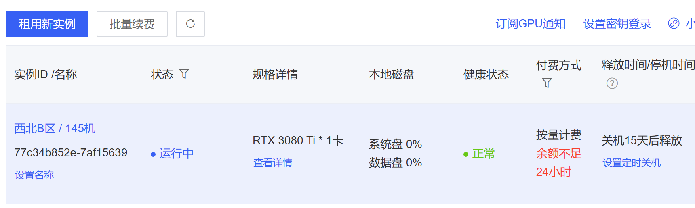
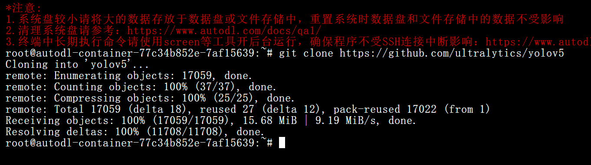
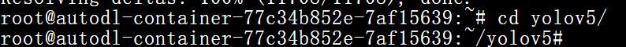
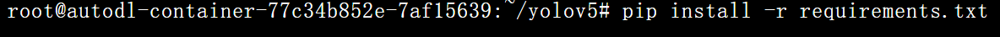
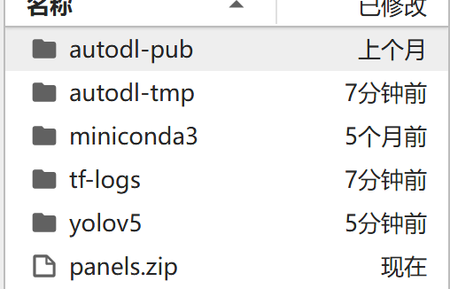
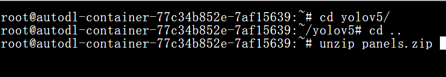
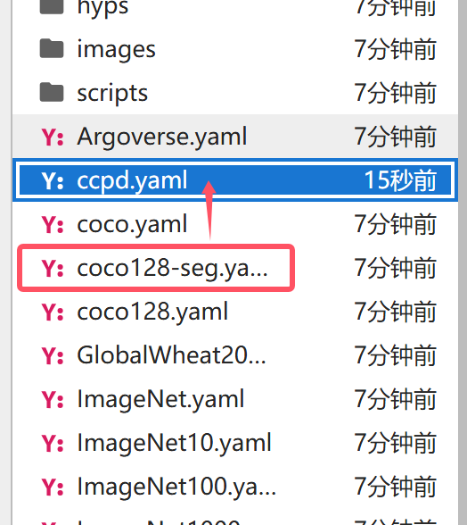
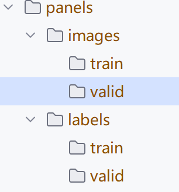
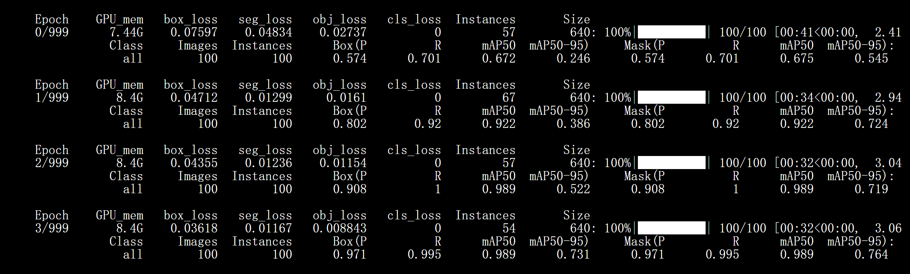
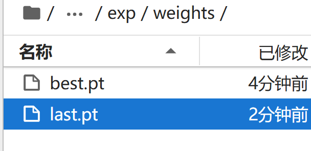

## 语义分割


+ 模型：yolov5

+ 数据集：CCPD


---

## 数据预处理

> 在企业开发中，大部分应用的数据集不符合实际模型运行标准，我们需要预处理


数据集是CCPD的3000张图像


按照数据集的要求，先生成模型需要的数据集的格式：


```python
import os
import cv2

ROOT_dir = "./VOCdevkit/ccpd"


def _label_content(f1):
    image = cv2.imread(os.path.join(ROOT_dir, f1))
    h, w = image.shape[:2]
    points = "0"  # 由于只有车牌这一个区域，因此此处写0
    for point in f1.split("-")[3].split("_"):
        x, y = point.split("&")
        x = int(x) / w
        y = int(y) / h
        # 归一化
        points += f" {x:.6f} {y:.6f}"
    return points


def _generate_images_labels(ROOT_dir):
    files = os.listdir(ROOT_dir)
    count = 1
    for file in files:
        # 保存图片到指定位置train 和 valid 可以相互生成
        image = cv2.imread(os.path.join(ROOT_dir, file))
        cv2.imwrite(f"./VOCdevkit/panels/images/train/{count}.jpg", image)
        # 保存位置信息  train 和 valid 可以相互生成
        content = _label_content(file)
        with open(f"./VOCdevkit/panels/labels/train/{count}.txt", "w") as f:
            f.write(content)
        f.close()
        count += 1


if __name__ == '__main__':
    _generate_images_labels(ROOT_dir)

```


将上述的数据集打包（云服务器训练）zip、tar、gz都可以 


## 模型部署

选择一个平台

[我的Notebook · 魔搭社区](https://modelscope.cn/my/mynotebook)

[AutoDL算力云 | 弹性、好用、省钱。租GPU就上AutoDL](https://www.autodl.com/)


#### autoDL 平台下的操作




YOLOv5 项目部署（git、上传代码）

此处我们直接克隆yolov5的代码



需要进入到yolov5目录（cd yolov5）







我们可以通过clear的指令，清空屏幕

上传数据集




解压项目的指令




编辑数据集yaml文件






数据集文件内容

```yaml
path: ../panels # dataset root dir
train: images/train 
val: images/valid 
test: # test images (optional)

# Classes
names:
  0: panel
```


```
cd yolov5
python segment/train.py --img 640 --batch 30 --epochs 1000 --data ccpd.yaml --weight yolov5s-seg.pt --cache
```


训练过程如下：



Ctrl + Z 停止训练


此处取出runs下的pt文件




将best.pt  文件保存到yolov5项目中，然后使用它进行检测：

```
python segment/predict.py --weights best.pt --img 640 --conf 0.5 --source test2
```

