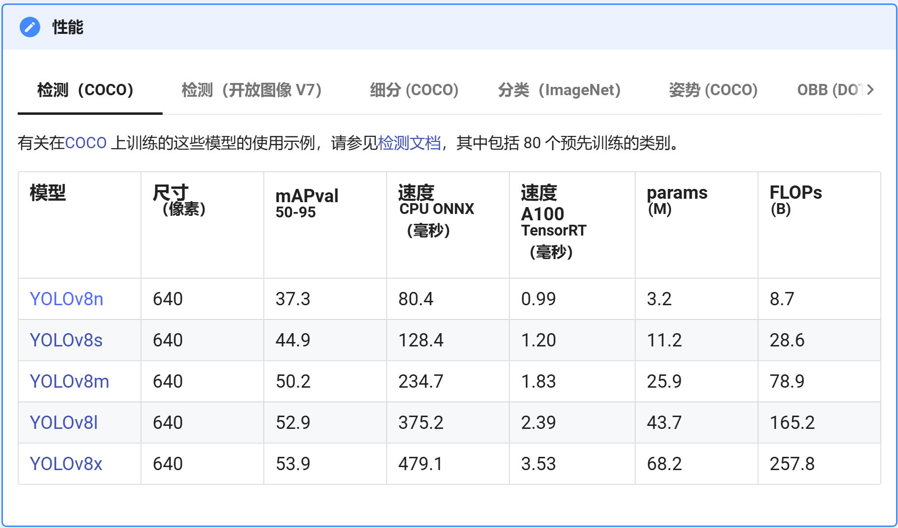
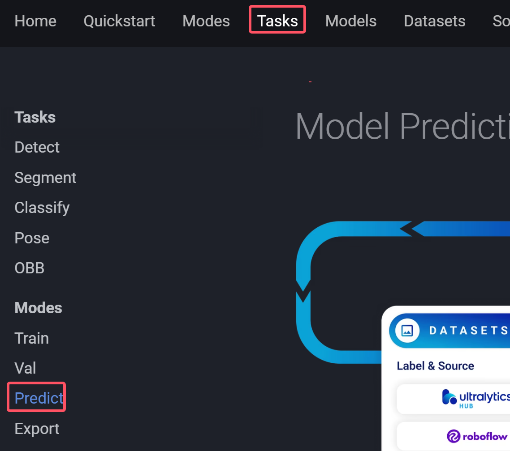

# YOLOv8


下载uralytics

```
pip install ultralytics
```

克隆原项目(如果网络不好，可以直接下载zip)

```
git clone https://github.com/ultralytics/ultralytics.git
```


下载预训练权重：

[YOLOv8 -Ultralytics YOLO 文档](https://docs.ultralytics.com/zh/models/yolov8/#supported-tasks-and-modes)




## 如何预测

访问：[Predict - Ultralytics YOLO Docs](https://docs.ultralytics.com/modes/predict/)





```python
from ultralytics import YOLO

# 加载官方的预训练权重
# 预训练权重是在COCO数据集下训练的，因此会有80个分类可以预测
model = YOLO("yolov8n.pt")

# 预测一张图中的信息
# results 返回每张图中的信息
results = model(["test1.jpg","test1.jpg"])  # return a list of Results objects

# 遍历每一张图中信息
for result in results:
    # boxes 边框参数（boxes 中可以生成想要的任何格式的坐标，目标检测）
    boxes = result.boxes
    # masks 图像分割中掩码的单通道图
    masks = result.masks
    # keypoints 返回图像中的关键信息
    keypoints = result.keypoints
    # probs 分类预测
    probs = result.probs
    # obb 旋转角度的目标检测结果
    obb = result.obb
    result.show() # 展示图片（以当前电脑中的默认方式打开图片）
    result.save(filename="result.jpg")  # 保存结果图片
```


## 自定义方式去设计

参考boxes api：[Predict - Ultralytics YOLO Docs](https://docs.ultralytics.com/modes/predict/#boxes)

```python
from ultralytics import YOLO
import matplotlib.pyplot as plt
from matplotlib import patches
import cv2

CLASSES = (
    'person', 'bicycle', 'car', 'motorcycle', 'airplane', 'bus', 'train', 'truck', 'boat', 'traffic light',
    'fire hydrant',
    'stop sign', 'parking meter', 'bench', 'bird', 'cat', 'dog', 'horse', 'sheep', 'cow', 'elephant', 'bear', 'zebra',
    'giraffe', 'backpack', 'umbrella', 'handbag', 'tie', 'suitcase', 'frisbee', 'skis', 'snowboard', 'sports ball',
    'kite',
    'baseball bat', 'baseball glove', 'skateboard', 'surfboard', 'tennis racket', 'bottle', 'wine glass', 'cup', 'fork',
    'knife', 'spoon', 'bowl', 'banana', 'apple', 'sandwich', 'orange', 'broccoli', 'carrot', 'hot dog', 'pizza',
    'donut',
    'cake', 'chair', 'couch', 'potted plant', 'bed', 'dining table', 'toilet', 'tv', 'laptop', 'mouse', 'remote',
    'keyboard', 'cell phone', 'microwave', 'oven', 'toaster', 'sink', 'refrigerator', 'book', 'clock', 'vase',
    'scissors',
    'teddy bear', 'hair drier', 'toothbrush')

model = YOLO("yolov8n.pt")

results = model(["test1.jpg"])

image = cv2.imread("test1.jpg")
image = cv2.cvtColor(image, cv2.COLOR_BGR2RGB)

ax = plt.subplot(111)
ax.imshow(image)

for result in results:
    boxes = result.boxes
    cls = result.boxes.cls
    print(cls)
    conf = result.boxes.conf
    for i, (x1, y1, x2, y2) in enumerate(boxes.xyxy):
        cls_name = CLASSES[int(cls[i].item())]
        obj_conf = conf[i].item()
        x1 = x1.item()
        y1 = y1.item()
        x2 = x2.item()
        y2 = y2.item()
        rect = patches.Rectangle((x1, y1), (x2 - x1), (y2 - y1), color="red", fill=False)
        ax.text(x1, y1,cls_name + f"{obj_conf:.4f}",color="red")
        ax.add_patch(rect)

plt.show()

```


## 如何去训练


```python
from ultralytics import YOLO

# YOLO("yolo8n.yaml") 训练的网络文件
# load("yolo8n.pt") 加载预训练权重（如果不使用load，就相当于从0开始训练）
# 下载 v8网络结构，需要访问：https://github.com/ultralytics/ultralytics/tree/main/ultralytics/cfg/models/v8
model = YOLO("yolov8n.pt")

# workers=0 指定训练时候的并发线程的数量，workers > 0 的时候可以在多GPU下使用
results = model.train(data="banana.yaml", epochs=100, imgsz=640, workers=0)
```


>  workers=0 是单GPU运行的必要内容

