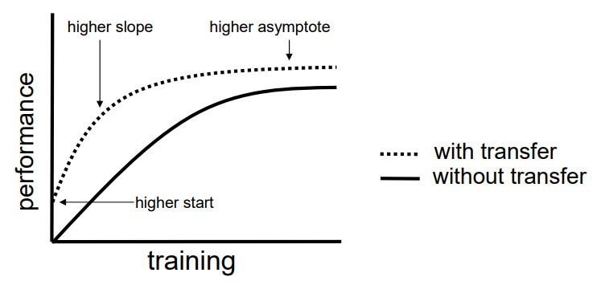

# 迁移学习

> 迁移学习（Transfer Learning）是机器学习中的一个名词，也可以应用到深度学习领域，是指一种学习对另一种学习的影响，或习得的经验对完成其他活动的影响。迁移广泛存在于各种知识、技能与社会规范的学习中。

[toc]

通常情况下，迁移学习发生在两个任务之间，这两个任务可以是相似的，也可以是略有不同。在迁移学习中，源任务（Source Task）是已经训练好的模型的来源，目标任务（Target Task）是我们希望在其中应用迁移学习的新任务。

迁移学习专注于存储已有问题的解决模型，并将其利用在其他不同但相关问题上。比如说，用来辨识汽车的知识（或者是模型）也可以被用来提升识别卡车的能力。计算机领域的迁移学习和心理学常常提到的学习迁移在概念上有一定关系，但是两个领域在学术上的关系非常有限。

## 1、迁移学习的具象理解

从技术上来说，迁移学习只是一种学习的方式，一种基于以前学习的基础上继续学习的方式。但现在大家讲的最多的还是基于神经网络基础之上的迁移学习。这里我们以卷积神经网络（CNN）为例，做一个简单的介绍。

《Visualizing and Understanding Convolutional Net》这篇论文中做出了如下贡献：

1. 提出了一种可视化的技巧，能够看到CNN中间层的特征功能和分类操作。
2. 通过对这些可视化信息进行分析，我们可以
   - 直观了解和分析CNN学到的特征（中间层特征对应什么样的图像）
   - 可以找到提升模型的办法（观察中间层特征，分析模型可以改进的地方）
   - 分析CNN的遮掩敏感性（遮住某一块区域后对分类结果的影响）
3. 这种可视化技巧主要用到反卷积的技术，把中间层的激活特征映射回输入空间。

layer1 中我们可以看到卷积对物体进行的边缘检测

layer2 中我们可以看到卷积对物体的抽象是一些相似的集合形状

layer5 中基本上每个图片中的内容都是些相似的东西

...

因此如果我们把卷积神经网络的前n层保留下来，对于剩余的神经网络舍弃，虽然不再可以做对应的分类，但其轮廓提取的方式对实际还是非常有帮助的。

## 2、迁移学习的思想

迁移学习的主要思想是通过利用源任务上学到的特征表示、模型参数或知识，来辅助目标任务的训练过程。这种迁移可以帮助解决以下问题：

1. 数据稀缺问题：当目标任务的数据量较少时，通过迁移学习可以利用源任务上丰富的数据信息来提高对目标任务的建模能力和泛化能力。
2. 高维输入问题：当目标任务的输入数据具有高维特征时，迁移学习可以借助已经学到的特征表示，减少目标任务中的维度灾难问题，提高处理效率和性能。
3. 任务相似性问题：当源任务和目标任务在特征空间或输出空间上存在一定的相似性时，迁移学习可以通过共享模型参数或知识的方式，加速目标任务的学习过程，提升性能。
4. 领域适应问题：当源任务和目标任务的数据分布存在一定的差异时，迁移学习可以通过对抗训练、领域自适应等方法，实现在不同领域之间的知识传递和迁移。

总结来说，迁移学习是一种将已经学到的知识和模型从源任务迁移到目标任务的方法。它在机器学习和深度学习中都具有重要意义，可以提高模型的泛化能力、减少训练成本，并更好地应对数据稀缺、高维输入和任务相似性等问题。

## 3、如何使用迁移学习

你可以在自己的预测模型问题上使用迁移学习。以下是两个常用的方法：

- 开发模型的方法
- 预训练模型的方法

### 开发模型的方法

1. 选择源任务。你必须选择一个具有丰富数据的相关的预测建模问题，原任务和目标任务的输入数据、输出数据以及从输入数据和输出数据之间的映射中学到的概念之间有某种关系，
2. 开发源模型。然后，你必须为第一个任务开发一个精巧的模型。这个模型一定要比普通的模型更好，以保证一些特征学习可以被执行。
3. 重用模型。然后，适用于源任务的模型可以被作为目标任务的学习起点。这可能将会涉及到全部或者部分使用第一个模型，这依赖于所用的建模技术。
4. 调整模型。模型可以在目标数据集中的输入-输出对上选择性地进行微调，以让它适应目标任务。

### 预训练模型方法

1. 选择源模型。一个预训练的源模型是从可用模型中挑选出来的。很多研究机构都发布了基于超大数据集的模型，这些都可以作为源模型的备选者。
2. 重用模型。选择的预训练模型可以作为用于第二个任务的模型的学习起点。这可能涉及到全部或者部分使用与训练模型，取决于所用的模型训练技术。
3. 调整模型。模型可以在目标数据集中的输入-输出对上选择性地进行微调，以让它适应目标任务。

第二种类型的迁移学习在深度学习领域比较常用。

## 4、什么使用使用迁移学习

迁移学习是一种优化，是一种节省时间或者得到更好性能的捷径。

通常而言，在模型经过开发和测试之前，并不能明显地发现使用迁移学习带来的性能提升。

Lisa Torrey 和 Jude Shavlik 在他们关于迁移学习的章节中描述了使用迁移学习的时候可能带来的三种益处：

- **更高的起点。在微调之前，源模型的初始性能要比不使用迁移学习来的高。**
- **更高的斜率。在训练的过程中源模型提升的速率要比不使用迁移学习来得快。**
- **更高的渐进。训练得到的模型的收敛性能要比不使用迁移学习更好。**

理想情况下，在一个成功的迁移学习应用中，会得到上述的三种益处

如果你能够发现一个与你的任务有相关性的任务，它具备丰富的数据，并且你也有资源来为它开发模型，那么，在你的任务中重用这个模型确实是一个好方法，或者（更好的情况），有一个可用的预训练模型，你可以将它作为你自己模型的训练初始点。

在一些问题上，你或许没有那么多的数据，这时候迁移学习可以让你开发出相对不使用迁移学习而言具有更高性能的模型。

