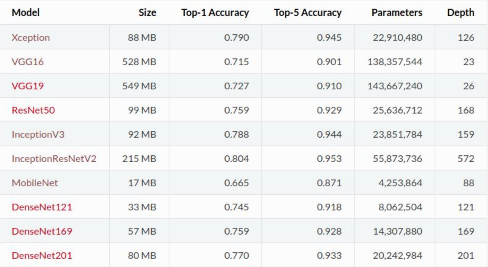

# 预训练与微调

[TOC]

## 1.什么是预训练与微调

+ 设计一个图像分类任务时，我们需要随机初始化参数，然后开始训练网络，不断调整参数，直到网络的损失越来越小。当整个模型结果符合预期时，我们可以将训练模型的参数保存下来，以便训练好的模型可以在一次执行类似任务时获得较好的结果。这就是`pre-training`
+ 如果我们接到一个类似的图像分类的任务，这时候，我们可以直接使用之前保存下来的模型的参数来作为一个任务的初始化参数，然后在训练的过程中，依据结果不断进行一些修改。这时候，你使用的就是一个，`pre-trained` 模型，而过程就是`fine-tuning`

> 总结：
>
> 预训练就是指预先训练的一个模型或者指预先训练模型的过程；
>
> 微调就是指将训练过的模型作用于自己的数据集，并使参数适应自己数据集的过程。

### 1.1 预训练模型

1、预训练模型就是已经用数据集训练好了的模型。

2、现在我们常用的预训练模型就是一些常用模型，比如`VGG16/19、Resnet`等模型，并用大型数据集来做训练集，比如`Imagenet、COCO`等训练好的模型参数；

3、正常情况下，我们常用的`VGG16/19`等网络已经是他人调试好的优秀网络，我们无需再修改其网络结构。

> 在卷积神经网络（CNN）以及更广泛的深度学习领域中，Top-1 Accuracy和Top-5 Accuracy是衡量模型性能的重要指标，特别是在图像分类任务中。这两个指标提供了模型预测准确性的不同维度的评估。
>
> Top-1 Accuracy: 如果模型对于一张图片的预测最可能的类别就是该图片的实际类别，那么这个预测就被认为是正确的，会计入Top-1 Accuracy的计算中
>
> Top-5 Accuracy: 只要模型预测的前五个类别中有一个与实际标签相匹配，这个预测就被认为是正确的，会计入Top-5 Accuracy的计算中。
>
> 为什么要引入Top-5 Accuracy:
>
> - Top-5 Accuracy的引入是为了更好地评估模型在面对具有大量类别（如ImageNet有上千个类别）时的性能。在实际应用中，即使模型不能准确预测出最可能的类别，只要它能在前几个最可能的预测中包括正确的类别，这样的预测对于用户来说仍然可能是有用的。
> - Top-5 Accuracy也为模型提供了更宽松的评价标准，因为它允许模型有一定的误差范围，这在实际应用中可能更加实用。

## 2.预训练和微调的作用

在CNN领域中，很少会有人从头训练一个CNN网络。主要原因是个人操作会有很小的概率会拥有足够大的数据集，基本是几百或者几千张，不像ImageNet有120万张图片这样的规模。**拥有的数据集不够大，而又想使用很好的模型的话，很容易造成过拟合。**

所以我们一般的操作都是在一个大型的数据集上（ImageNet）训练一个模型，然后使用该模型作为类似任务的初始化或者特征提取器，比如`VGG、ResNet`等模型都提供了自己的训练参数，以便人们可以拿来微调。可以进一步节省时间和计算资源。

## 3.模型微调

step 1: 假设我们的神经网络符合下面形式：
$$
Y = W \times X
$$
step 2: 现在我们需要找到一个W，使得当输入X=2时，输出Y=1，也就是希望W=0.5：
$$
1 = W \times 2
$$
step 3:首先对W要进行初始化，初始化的值服从均值为0，方差为1的分布，假设W初始化为0.1：
$$
Y = 0.1 \times X
$$
step 4:当输入X = 2时，W = 0.1,输出Y =  0.2，这个时候实际值和目标值1的误差是0.8
$$
1 \leftarrow 0.2 = 0.1 \times 2
$$

step 5: 0.8 的误差经过反向传播去更新权值W，假如这次更新为W = 0.2，输出为0.4，与目标值的误差为0.6
$$
1 \leftarrow 0.4 = 0.2 * 2
$$

step 6: 这可能要经历10到20次的反向传播，W才能最终到0.5：
$$
Y = 0.5 \times X
$$

step 7: 如果在更新模型最开始有人告诉你，W的值应在0.47附近：
$$
Y = 0.47 \times X
$$

step 8:  那么最开始训练，你与目标的误差就只有0.06了，那么可能只要一步两步，就可以将W训练到0.5
$$
1 \leftarrow 0.94 = 0.47 \times 2
$$

综上，`step 7`就是相当于给你一个预训练模型（Pre-trained model），`step 8 `就是基于这个模型微调（Fine Tune）。相对于从头开始训练，微调为你省去了大量计算资源和计算时间，提高了计算效率，甚至提高准确率。

### 3.1 微调的四个步骤

微调包括以下四个步骤：

1. 在源数据集（例如 ImageNet 数据集）上预训练一个神经网络模型，即源模型。
2. 创建一个新的神经网络模型，即目标模型。它复制了源模型上除了输出层外的所有模型设计及其参数。我们假设这些模型参数包含了源数据集上学习到的知识，且这些知识同样适用于目标数据集。我们还假设源模型的输出层跟源数据集的标签紧密相关，因此在目标模型中不予采用。
3. 为目标模型添加一个输出大小为目标数据集类别个数的输出层，并随机初始化该层的模型参数。
4. 在目标数据集（例如椅子数据集）上训练目标模型。我们将从头训练输出层，而其余层的参数都是基于源模型的参数微调得到的。

### 3.2 为什么要微调

卷积神经网络核心是：

1. 浅层卷积层提取基础特征，比如边缘、轮廓等基础特征
2. 深层卷积层提取抽象特征，比如整个脸型
3. 全连接层根据特征组合进行评分分类

普通预训练模型的特点是：用了大型数据集做训练，已经具备了提取浅层基础特征和深层抽象特征的能力。

如果不做微调的话：

1. 从头开始训练，需要大量的数据，计算时间和计算资源
2. 存在模型不收敛，参数不够优化，准确率低，模型泛化能力低，容易过拟合等风险。

### 3.3 什么情况下使用微调

1. **要使用的数据集和预训练模型的数据集相似。如果不太相似，比如你用的预训练的参数是自然景物的图片，你却要做人脸的识别，效果可能就没有那么好了，因为人脸的特征和自然景物的特征提取是不同的，所以相应的参数训练后也是不同的。**
2. **自己搭建或者使用的CNN模型正确率太低。**
3. **数据集相似，但数据集数量太少。**
4. **计算资源太少。**

### 不同数据集下使用微调

- **数据集1 - 数据量少**，但数据相似度非常高 - 在这种情况下，我们所做的只是修改最后几层或最终的`softmax`图层的输出类别。
- **数据集2 - 数据量少**，数据相似度低 - 在这种情况下，我们可以冻结预训练模型的初始层（比如k层），并再次训练剩余的（n-k）层。由于新数据集的相似度较低，因此根据新数据集对较高层进行重新训练具有重要意义。
- **数据集3 - 数据量大**，数据相似度低 - 在这种情况下，由于我们有一个大的数据集，我们的神经网络训练将会很有效。但是，由于我们的数据与用于训练我们的预训练模型的数据相比有很大不同。使用预训练模型进行的预测不会有效。因此，最好根据你的数据从头开始训练神经网络（Training from scatch）。
- **数据集4 - 数据量大**，数据相似度高 - 这是理想情况。在这种情况下，预训练模型应该是最有效的。使用模型的最好方法是保留模型的体系结构和模型的初始权重。然后，我们可以使用在预先训练的模型中的权重来重新训练该模型。

### 3.4 微调注意事项

1. 通常的做法是截断预先训练好的网络的最后一层（softmax层），并用与我们自己的问题相关的新的softmax层替换它。例如，ImageNet上预先训练好的网络带有1000个类别的softmax图层。如果我们的任务是对10个类别的分类，则网络的新softmax层将由10个类别组成，而不是1000个类别。然后，我们在网络上运行预先训练的权重。确保执行[交叉验证](https://zhida.zhihu.com/search?content_id=236745551&content_type=Article&match_order=1&q=交叉验证&zhida_source=entity)，以便网络能够很好地推广。
2. 使用较小的学习率来训练网络。由于我们预计预先训练的权重相对于随机初始化的权重已经相当不错，我们不想过快地扭曲它们太多。通常的做法是使初始学习率比用于从头开始训练（Training from scratch）的初始学习率小10倍。
3. 如果数据集数量过少，我们进来只训练最后一层，如果数据集数量中等，冻结预训练网络的前几层的权重也是一种常见做法。这是因为前几个图层捕捉了与我们的新问题相关的通用特征，如曲线和边。我们希望保持这些权重不变。相反，我们会让网络专注于学习后续深层中特定于数据集的特征。

