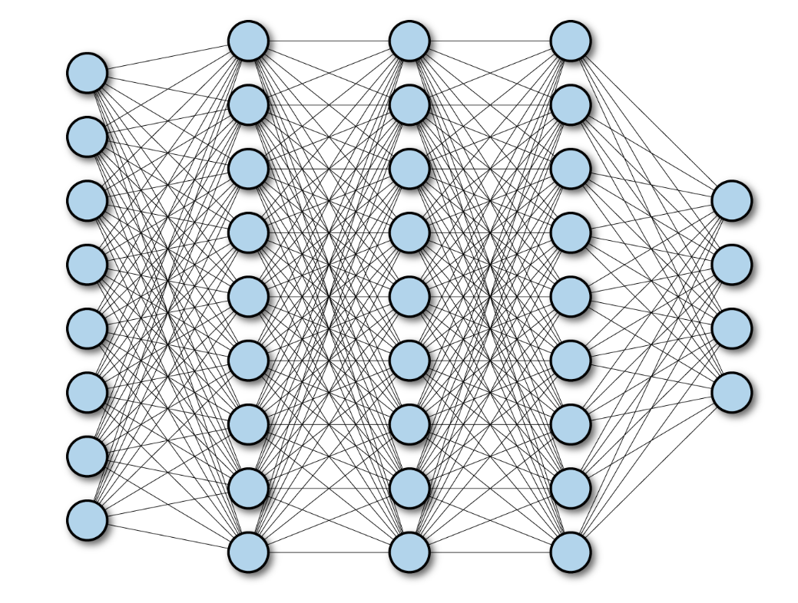

# 链式求导法则与全连接

[TOC]

## 链式求导

链式法则是[微积分](https://baike.baidu.com/item/微积分/6065?fromModule=lemma_inlink)中的[求导](https://baike.baidu.com/item/求导/1063861?fromModule=lemma_inlink)法则，用于求一个[复合函数](https://baike.baidu.com/item/复合函数/6176286?fromModule=lemma_inlink)的[导数](https://baike.baidu.com/item/导数/579188?fromModule=lemma_inlink)，是在微积分的求导运算中一种常用的方法。复合函数的导数将是构成复合这有限个函数在相应点的导数的乘积，就像锁链一样一环套一环，故称链式法则。 --百度百科

### 基本函数导数

导数的基本公式（在机器学习章节）

### 复杂函数式的导数

复杂函数式往往由多个基本函数组合而成的函数，而只有链式求导才能解决该问题。

下面是一个链式求导的经典案例：
$$
y = \sin (x^2 + 1) \\
我们可以先令:\\
a = x^2 + 1 \\
y = \sin a \\
分别对上述两个公式求导:\\
\frac {da}{dx} = 2x \\
\frac {dy}{da} = \cos (a) \\
最终x对y求导得结果：
\frac {dy}{dx} = \frac {da}{dx} \cdot \frac {dy}{da} = 2 x \cos (x^2 + 1)
$$

> 思考：以下函数可以使用链式求导法则吗？

$$
y = \cos (2x + 1) \cdot x
$$

参考：链式求导法则的定义

## 链式求导法则在感知机的应用

### 什么是感知机

感知机（或称感知器，Perceptron）是Frank Rosenblatt在1957年就职于Cornell航空实验室（Cornell Aeronautical Laboratory）时所发明的一种人工神经网络

 

感知机是集语音、文字、手语、人脸、表情、唇读、头势、体势等多通道为一体的,并对这些通道的信息进行编码、压缩、集成、融合的计算机智能接口系统。

形象理解：

现有工厂一批加工的零件，已知零件的长度a，零件的重量b，去判断零件的质量是否合格。

质量是否合格的因素受到零件的长度，以及零件的重量影响，因此我们可以认为检测`质量是否合格`的方式，

就是一种感知机。为了方便我们日后学习，我可以叫它`神经网络`

### 构建简答的神经网络

在逻辑回归任务中，我们所定义的最简单任务：
$$
y = w * x + b
$$
我们可以使用原理方式构建神经网络、也可以使用pytroch的方式，从本章开始，我们会一直使用pytorch。

### 多特征神经网络

当输入特征有多个时，我们该如何处理
$$
y = w_1 \times x + w_2 \times x + b
$$

### 含有链式求导法则的神经网络

$$
y_1 = w_1 \times x_1^2 + b_1 \\
x_2 = y_2 \\
y_2 = \sin (w_2 \times x_2) + b_2
$$

当上述的链式求导公式嵌套越来多时，我们就可以认为它就是`深度神经网络`。深度决定了问题复杂的程度，也决定了解决该问题，我们不可以再使用传统单一的逻辑回归。

### 链式求导中的重要规律

+ 无论有多奇怪的线性函数线或者平面，公式函数最终都可以拟合（万能逼近定理）
+ 当线性公式有n次方式，该线便会有n-1个拐弯处。
+ 分类与回归问题的本质是一样的

### 链式求导中的前向传播与反向传播

什么是前向传播

什么是反向传播

前向传播的意义是什么（或者做了什么）

反向传播的意义是什么（或者做了什么）

激活函数的作用是什么

机器学习三要素：模型、策略、算法

对于整个链式求导法则中的内容，如何对应机器学习三要素。

> 思考：1、当输入特征有n个，输出特征1个，无链式求导，w、b会有几个，执行运算会有多少次呢
>
> ​            2、当输入特征有n个，输出特征1个，有一次链式求导，w、b会有几个，执行运算会有多少次呢 
>
> ​            3、如果需要对 
> $$
> y = \cos (x) \cdot x
> $$
> ​            拟合，你需要怎样做？

## 全连接

### 什么是全连接

如果对于输入特征与参与链式求导的w、b也会增多，考虑到可能是复杂的情形，因此我们的神经网络会有如下样貌：

以下是输入层、隐藏层、输出层。

对于隐藏中的一点，它即连接了上一层所有的输出结果，也作为下一层输入的一个特征。则它被称为`全连接`

### 输入层

虽然说深度学习神经网络的输入，既有数值、也有文字、也有图像、甚至音频、甚至前者的组合关系等等。

但对于神经网络而言，输入的只有n维数据，左侧神经元的数量，证明输入特征或者卷积通道的数量

输入层的神经元的数量只是单纯得增多或者减少，其实意义不大，必须是对我们实现逻辑回归或者分类，有意义的数据，整个训练才会更加有效。

> 比如：抽奖之前，对手哈一口气，虽然在`心理上`抽奖概率更高，但对`实际`抽奖概率并没有实质意义。
>
> 而在情感神经网络问题分析中，虽然有些话虽然语无伦次，毫无语法可言，但对于分析场景下的人非常作用

数据有意义是每个人工智能开发者都追求的事情，但同样数据有效率，也同样意义重大。对样本数据进行一些算法加工对整个神经网络的训练，或许也有很大的帮助。

> 比如：将某些场景下的图片，进行灰度化处理。

### 隐藏层

当存在一个隐藏层时，此时函数g与函数f的关系

$$
y = f(g(x)) \\
如果需要加上w,b (此处我们的讨论，可以省略)\\
y = f(w_f(g(w_gx) + b_g)) + b_f
$$
而这层关系，仅仅代表隐藏层与上一层或者一下层之间的关系。而往往描述隐藏层与输出或者输入的关系式更加复杂

$$
我们将x_{21}的式子带入带x_{31}中就会有一个很复杂的结果:\\
x_{31} = x_{11} \cdot w_{11} \cdot w_{21} + x_{12} \cdot w_{12} \cdot w_{21} + b_1 \cdot w_{21} + b_2
$$

> 练习，如果增加了隐藏层的神经元数量，公式会有怎样的变化

> 思考，一个隐藏层中的神经元个数决定了什么

在一个隐藏层中增加神经元的数量，平面就越加复杂，只要复杂度足够高，任何一种复杂曲线都能表达出来。

某种意义上讲，隐藏层中的神经元被认为是对原本空间的升维，只为了更好地理解数据，但模型也会变得越来越复杂（opencv中的旋转矩阵，在SVM中出现的超平面等等，）

> 思考：为什么需要有多个隐藏层

隐藏层的出现，意味着可以拟合更多更复杂的情况。参考“链式求导中的重要规律”

隐藏层的层数往往也决定了对数据的抽象程度。

例如数字识别网络（注意：实际过程是不可解释的）

### 输出层

由于神经网络往往分析的问题，有线性问题，概率问题，分类问题等等，因此输出层的神经元个数要灵活地根据实际情况而定。

例如，在处理多分类问题的时候，我们可以将输出层调整为分类个数的神经元，理论上是一个又一个的二分类问题的叠加。（此处实际上涉及到后期的softmax与交叉熵问题，我们先不讨论）

> 案例1
>
> 复杂的曲线求解，已知一个三次方公式：
> $$
> y = 3 x ^ 3 - 2 x^2 - x + 5
> $$
> 请设计一个全连接神经网络对它拟合训练，（注意，在解决出问题的同时，我们需要思考结构精简以及效率问题）

> 案例2
>
> 簇点二分类，在坐标轴区域中随机生成两个簇点，请设计一个全连接神经网络，对它进行拟合训练

## 本章补充知识点：

+ 复合函数
+ pytorch 自动求导以及训练网络构建基础
+ plt 3D绘图技巧