# 优化器

对于深度学习问题，我们通常会先定义损失函数，一旦有了损失函数，就可以用优化算法来长师最小化损失，尽管SGD是一种最大限度减少深度学习损失函数的方法，但优化和深度学习的目标是不同的。优化的目标是减少训练误差，而深度学习的目标是减少泛化误差。

[TOC]

## 风险与经验风险

经验风险是训练数据集的平均损失

风险是整个数据群的预期损失

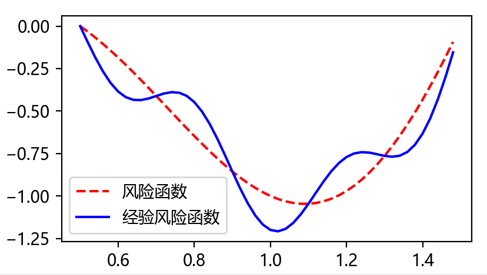

## 优化面临的挑战

### 局部最小风险

$$
对于给定的目标函数f(x),如果x所在区间内没有比它更小的f(x)值，那么它可能是局域最小值。\\
但如果x所在的区间是整个阈中，那么f(x)就一定是全局最小值
$$

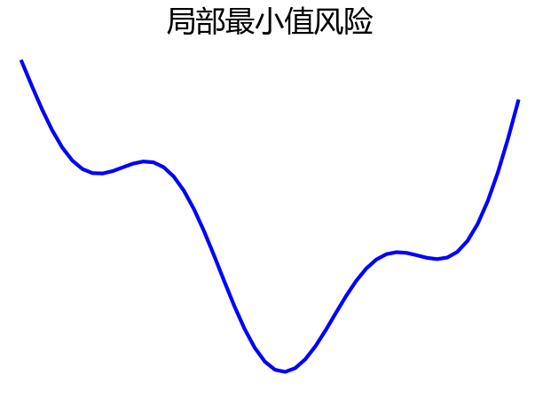

深度学习模型的目标函数通常由许多局部最优解。当优化问题的数值解接近局部最优值时，随着目标函数解的梯度接近或变为零，通过最终迭代获得的数值解可能仅使目标函数*局部*最优，而不是*全局*最优。只有一定程度的噪声可能会使参数跳出局部最小值。事实上，这是小批量随机梯度下降的有利特性之一。在这种情况下，小批量上梯度的自然变化能够将参数从局部极小值中跳出。

### 鞍点

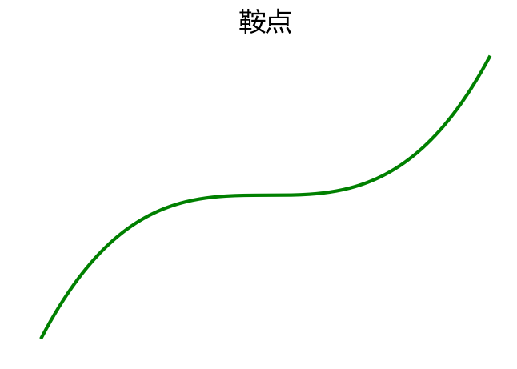
$$
除了局部最小值之外，鞍点是梯度消失的另一个原因。\\
鞍点（saddle point）是指函数的所有梯度都消失但既不是全局最小值也不是局部最小值的任何位置。\\
考虑这个函数f(x)=x^3。它的一阶和二阶导数在x=0时消失。\\
这时优化可能会停止，尽管它不是最小值。
$$

### 梯度消失

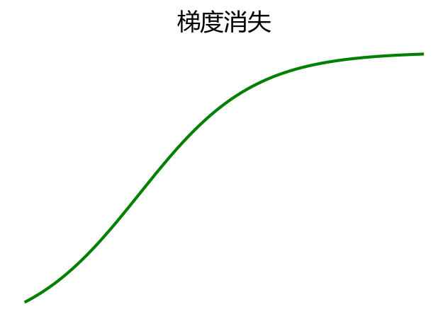

梯度消失，在e与w的图像像处于斜率为0的状态

那么体现在训练过程中，则表示梯度将不会进一步下降了,这与选取的激活函数有很大关系，这是ReLu出现之前深度学习面临的最棘手的问题之一。

## 凸性

*凸性*（convexity）在优化算法的设计中起到至关重要的作用， 这主要是由于在这种情况下对算法进行分析和测试要容易。如果算法在凸性条件下很差，我们很难使用其他方式得到很好的结果。在深度学习即使优化问题是非凸的，但在局部的极小值上也会存在凸性。

### 凸集（convex sets）

凸集（convex set）是凸性的基础。

在数学中的定义如下：
$$
如果对于任何a,b \in \chi,连接a和b的线段也位于\chi中，\\
则向量空间中的一个集合是凸（convex）的。\\
这意味着对于所有的\lambda \in[0,1],可得 \\
\lambda a + (1 - \lambda)b \in \chi 当 a,b \in \chi (该句的描述是线上任意一点)
$$

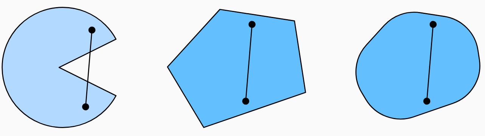

上图中只有图一是非凸的，其余均为凸集
$$
假设X和Y是凸集，那么X \cap Y 也是凸集\\
证明：如果任意的a,b \in X \cap Y \\
因X，Y为凸集，a，b 包含于X,Y中
$$
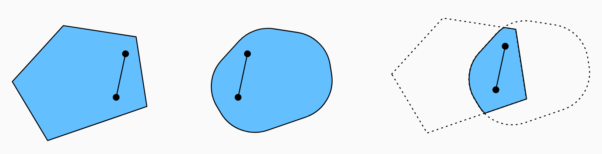

同理我们可以证明
$$
给定凸集X_i,它们的交集\cap_i X_i 也是凸的
$$
而反过来讲
$$
两个不相交的集合X \cap Y = \empty \\
令a \in X 和b \in Y \\
a,b 连线的线段包含一部分不在X,Y上，因此也一定不在X \cup Y 中 \\
证明凸集的并集不一定是凸的，即非凸（noconvex）
$$

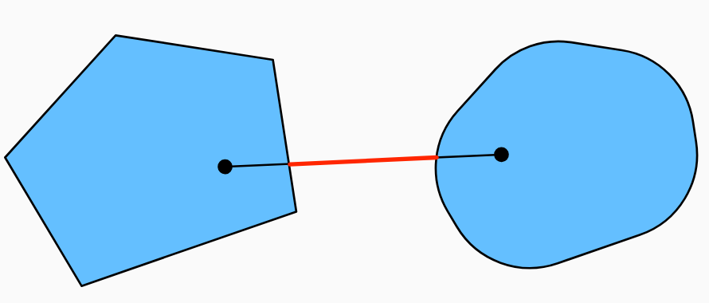

### 凸函数

凸函数有如下的数学定义
$$
给定一个凸集X，如果对于所有x,x^{`} \in X 和所有 \lambda \in [0,1], \\
函数f:X \rightarrow \mathbb{R}是凸的，我们可以得到 \\
\lambda f(x) + (1 - \lambda)f(x^{`}) \ge f(\lambda x + (1 - \lambda) x^{`})
$$

### 詹森不等式

给定一个凸函数f，最有用的数学工具之一就是詹森不等式（Jensen’s inequality）
$$
\sum_{i} \alpha_i f(x_i) \ge f(\sum_{i} \alpha_i x_i) \\
E_X[f(X)] \ge f(E_X[X]) \\
其中 \alpha_i 是满足 \sum_i \alpha_i = 1的非负实数，X是随机变量。\\
总之，便是凸函数的期望不小于期望的凸函数。
$$
根据詹森不等式，“一个多变量凸函数的总期望值”大于或等于“用每个变量的期望值计算这个函数的总值“。

### 性质

凸函数的局部极小值是全局极小值

凸函数的下水平集也是凸的

凸性和二阶导数

### 凸优化问题

所谓凸优化问题，是指在可行域范围内，都能得到最大值或者最小值。

如果一个模型的目标函数(梯度求解的函数)是凸函数，满足该条件的集合是凸集，则该问题变为凸优化问题

如果一个模型的目标函数是非凸的，满足该条件的集合是凸集，则若目标函数的拉格朗日对偶函数为凸函数，

则该问题也为凸优化问题。（此处省略slater条件与KKT条件的证明。）

### 凸优化问题可以解决的事情

约束问题

惩罚

投影

##  梯度下降

### 为什么梯度下降算法可以优化目标函数

$$
已知连续可微实值函数f:\mathbb{R} \rightarrow \mathbb{R} \\
使用泰勒展开公式可得：f(x+\epsilon) = f(x) + \epsilon f^{`}(x) + o(\epsilon^2) \\
假设负方向的 \epsilon 的会减小f \\
当固定步长\eta > 0,然后取\epsilon = - \eta f^{`}(x)，带入泰勒展开公式可得： \\
 f(x - \eta f^{`}(x)) = f(x) - \eta f^{`2}(x) + o(\eta^2f^{`2}(x)) \\
理论上只要 f^{`}(x) \ne 0 继续推演可得\eta f^{`2}(x) \ge 0 从而可知： \\
f(x - \eta f^{`}(x)) \le f(x) \\
最终，x \leftarrow x - \eta f^{`}(x) 会使整个f(x)减小\\
$$

总结：只要斜率逐渐变小，整个目标函数的值就会在整个函数曲线最平缓的位置收敛。

### 学习率

学习率(learning rate)决定目标函数能够收敛到局部最小值，以及合适收敛到最小值。

值得关注的是，学习率如果太小，则x更新缓慢，收敛时间边长，迭代次数更多。

learning_rate 为0.2时

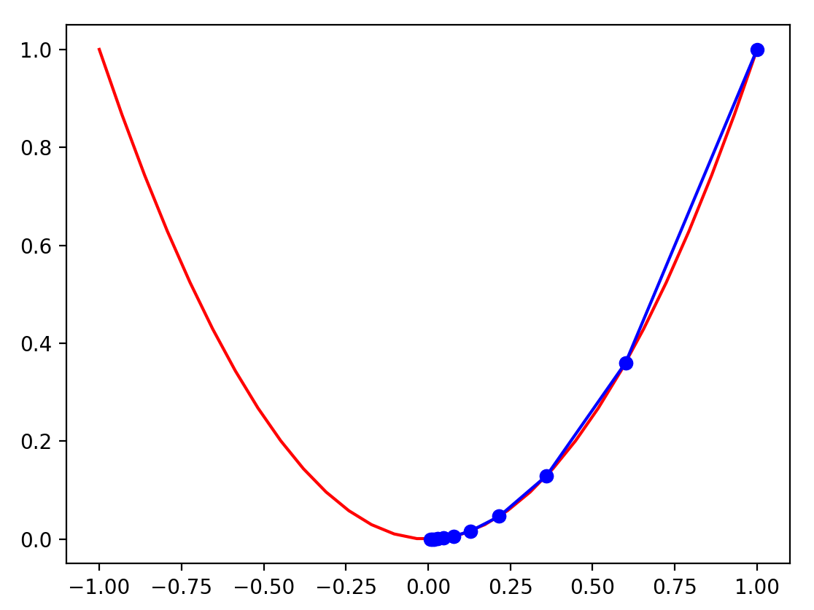

learning_rate 为0.02时

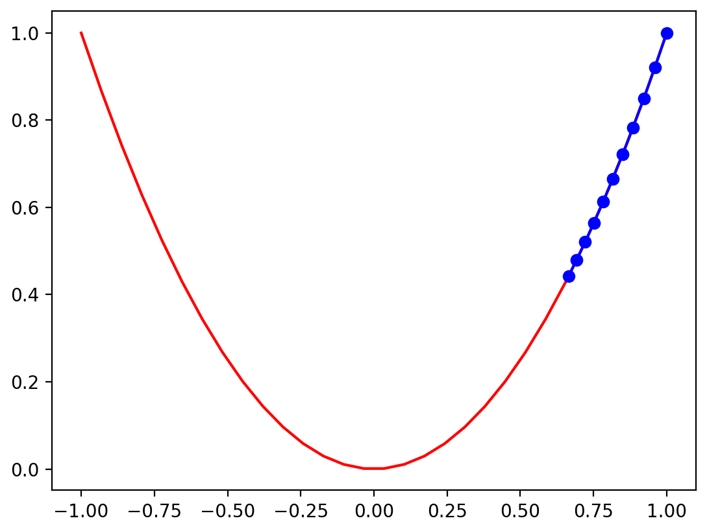

learning_rate 为0.9时

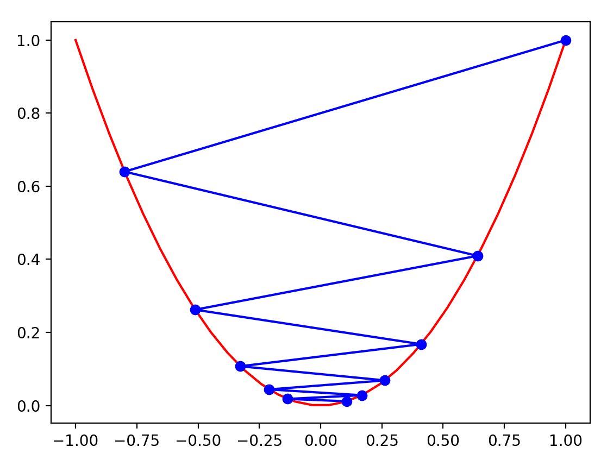

也有一种异常情况，我们需要在后面进行学习，那就是局部最小值

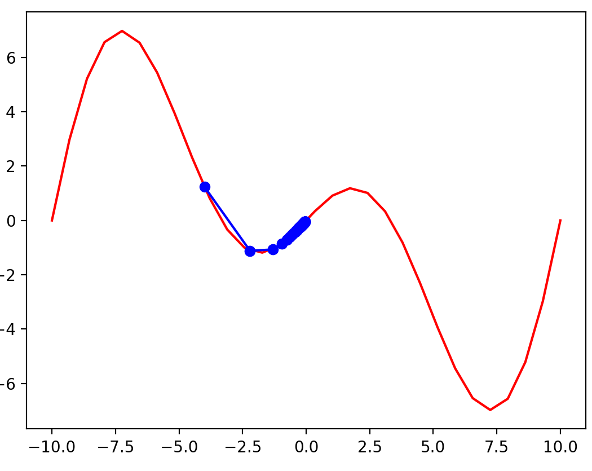

#### 多元梯度下降

对于多元梯度下降是指的输入特征在多维的情况下需要考虑的特殊矩阵
$$
如果输入特征为x = [x_1,x_2,...,x_d]^T ,即特征向量，那么它的梯度也会是多元的 \\
\nabla f(x) = [\frac{dx_1}{df(x)},\frac{dx_2}{df(x)},...,\frac{dx_d}{df(x)}]^T \\
泰勒展开公式依旧为：\\
f(x+\epsilon) = f(x) + \epsilon^T \nabla f(x) + o(\epsilon^2) \\
梯度下降的算法依旧为：\\
x \leftarrow x - \eta \nabla f(x)
$$

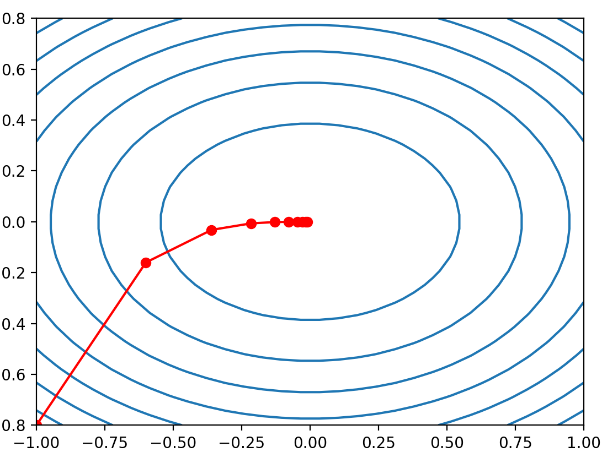

> 我怎么直到学习率是更好的？难道需要一直调整吗？

#### 随机梯度下降

我们可以尝试用一个随机数作为`学习率`，让模型在不同的学习率中学习。

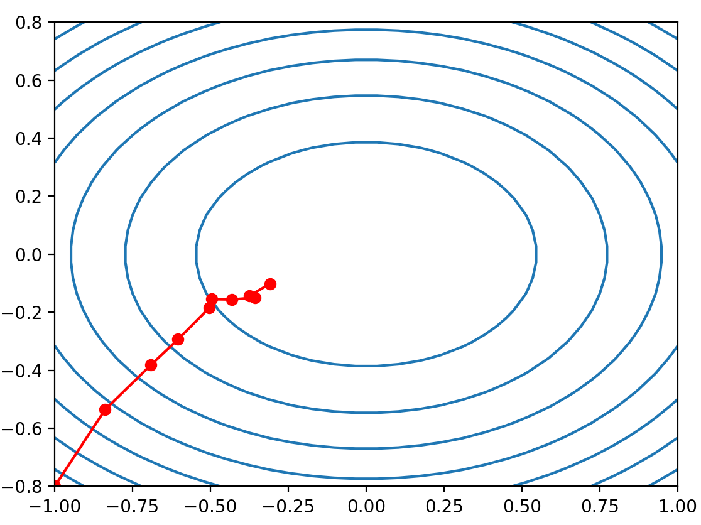

随机梯度实验下，就算我们训练很多次，由于梯度噪点的干扰，使整体不会很好收敛
而目前的唯一选择：修改学习率，实际上没有太大的意义

#### 自适应方法

在梯度下降中，我们需要找到一个合适的学习率learning_rate很困难
因此"牛顿法"可以在没有learning_rate的情况下使用
它将 `SGD`的梯度下降模式改变为  一阶导数 / 二阶导数模式

优点：
牛顿法在凸问题中一旦开始工作，速度就会快很多

缺点：
对于非凸问题，需要对牛顿法做出一定调整，否则没有任何意义

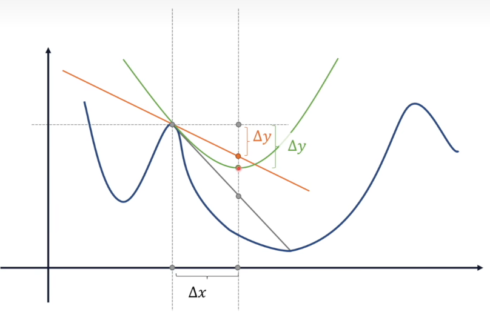

牛顿法的公式为：
$$
W = W - \frac {J^`(W)}{J^{``}(W)}
$$
求证过程如下：
$$
J(x)的泰勒展开保留到二阶导：\\
J(x) \approx J(a_0) + J^`(a_0)(x-a_0) + \frac{1}{2}J^{``}(a_0)(x - a_0)^2 \\
f(x) = J(a_0) + J^`(a_0)(x-a_0) + \frac{1}{2}J^{``}(a_0)(x - a_0)^2 \\
f(x)求极值，令f^`(x) = 0 \\
f^`(x) = J^`(a_0) + J^{``}(a_0)(x-a_0) = 0 \\
x = a_0 - \frac {J^`(W)}{J^{``}(W)}\\
W = W - \frac {J^`(W)}{J^{``}(W)} (此处不需要学习率)
$$

#### 动态学习率

用时间相关的学习率取代，增加了控制优化算法收敛的复杂性
动态学习率最大的两个问题：
1、衰减速度太快，过早停止优化
2、衰减速度太慢，会在优化上浪费时间

基本策略有：
1、分段常数（在不同时间段，给定不同的常数）: 需要降低学习率
$$
\eta(t) = \eta_i \space if \space t_i \le t \le t_{i+1}
$$

2、指数衰减 （使用e的负指数（t 时间）幂  e^-t）：算法收敛过早停止
$$
\eta(t) = \eta_0 \cdot e^{-\lambda t}
$$

3、多项式衰减 ：最优解，适合凸优化
$$
\eta(t) = \eta_0 \cdot (\beta t + 1)^{-a}
$$

#### 小批量随机梯度下降

无论是自适应方法还是动态学习率，每当数据相似度非常高时，梯度下降并不“高效”
我们需要找到一种高效计算方式让梯度下降，这就是小批量随机梯度下降(minibatch gradient descent)

批量处理最简单的测试就是矩阵乘法
1、点积运算
2、可以一次计算一列或者一行
3、直接运算
4、分成区块矩阵

#### 动量法

对于两个特征存在的w的图像如下，红色线为实际梯度下降路径：

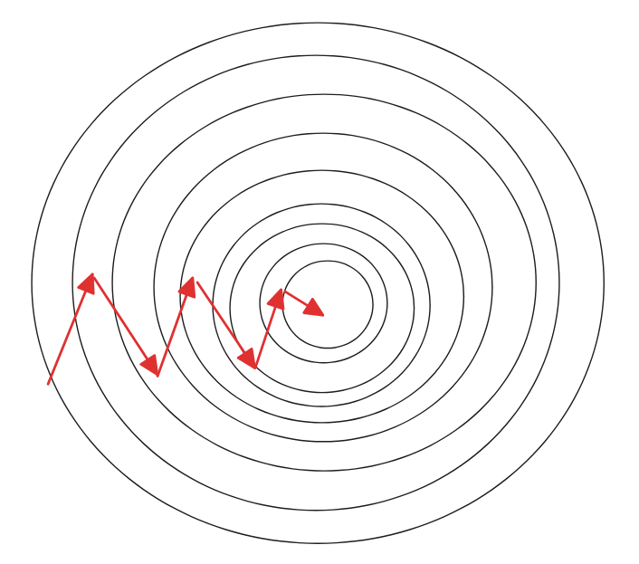

虽然在实际训练过程中，我们都能最终梯度下降到合适位置，但我们也有理由相信梯度下降的方式可以得到进一步的优化

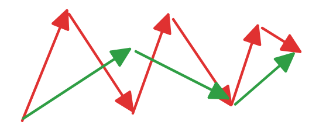

对于梯度下降的优化方式，往往只有两个方向可以选择：

1、减少训练量（小批量梯度随机下降法）

2、优化梯度的下降路径（优化器）

$$
如果我们令 \nabla W_(t)i = \frac{\partial J( W_{(t-1)i} )}{\partial W_i} \\
如果令V_{(t)} = V_{(t-1)} + \nabla W_{(t)i} \\
W_{(t)i} = W_{(t-1)i} - \eta \cdot V_{(t)}
$$

如果按照上述的方式，不断叠加历史w对后面梯度的影响力，那么在足够长的迭代次数下，会导致这种参考没有任何意义

所以我们针对上述情况做出以下调整：
$$
V_{(t)} = \beta V_{(t-1)} + (1 - \beta)\nabla W_{(t)i} \\
$$
这种方式也成为`加权平均移动法`

证明如下：
$$
V_{(t)} = 0.9 \cdot V_{(t-1)} + (1 - 0.9) \cdot \nabla W_{(t)i} \\
对公式进行展开可得：\\
V_{(t)} = 0.1 \cdot 0.9^{0} \cdot \nabla W_{(t)i} +
0.1 \cdot 0.9^{1} \cdot \nabla W_{(t-1)i} +
0.1 \cdot 0.9^{2} \cdot \nabla W_{(t-2)i} +……
0.1 \cdot 0.9^{t-1} \cdot \nabla W_{(1)i}
$$
距离当前梯度越远，影响力也会变得越小。

#### Nesterov 算法

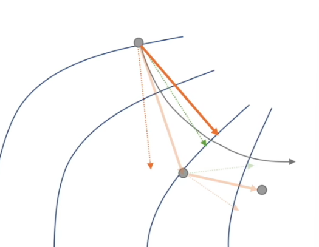

$$
V_{(t)} = \beta V_{(t-1)} + (1 - \beta)\nabla W_{(t)i}\\
其中 \nabla W_(t)i = \frac{\partial J( W_{(t-1)i} )}{\partial W_i} \\
W_{(t)i} = W_{(t-1)i} - \eta \cdot V_{(t)}\\
我们令\\
 \nabla W_(t)i = \frac{\partial J( W_{(t-1)i} + \gamma V_{(t-1)} )}{\partial W_i}
$$

上述算法均采用对0次项的修正，实际上我们也可以对1次项进行修正。

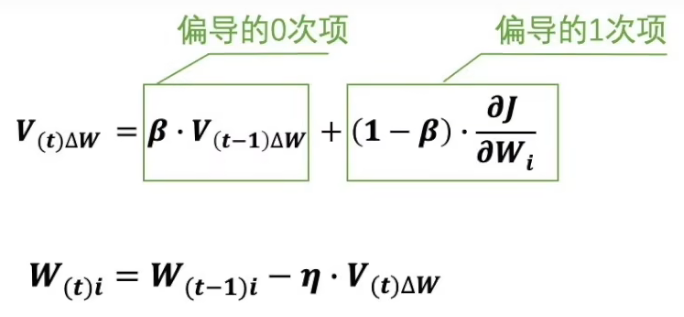

#### AdaGrad

自适应的梯度下降法

自适应学习率的做法：
$$
W_{(t)i} = W_{(t - 1)i} - \frac{\eta}{\sqrt{S_{t}} + \epsilon} \cdot \nabla W_{(t)i}\\
其中：S_{(t)} = S_{(t-1)} + \nabla W_{(t)i} \cdot \nabla W_{(t)i} \\
\nabla W_{(t)i} = \frac{\partial J( W_{(t-1)i} )}{\partial W_i}
$$

#### RMSprop

$$
W_{(t)i} = W_{(t - 1)i} - \frac{\eta}{\sqrt{S_{t}} + \epsilon} \cdot \nabla W_{(t)i}\\
其中：S_{(t)} = \beta S_{(t-1)} + (1 - \beta)\nabla W_{(t)i} \cdot \nabla W_{(t)i}
$$

#### Adam

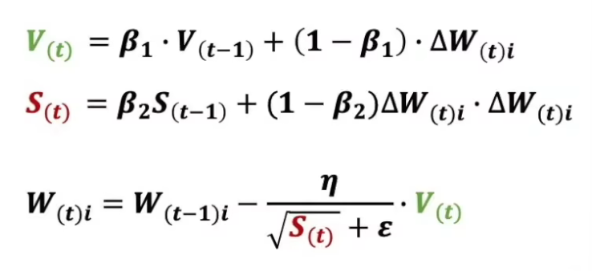
