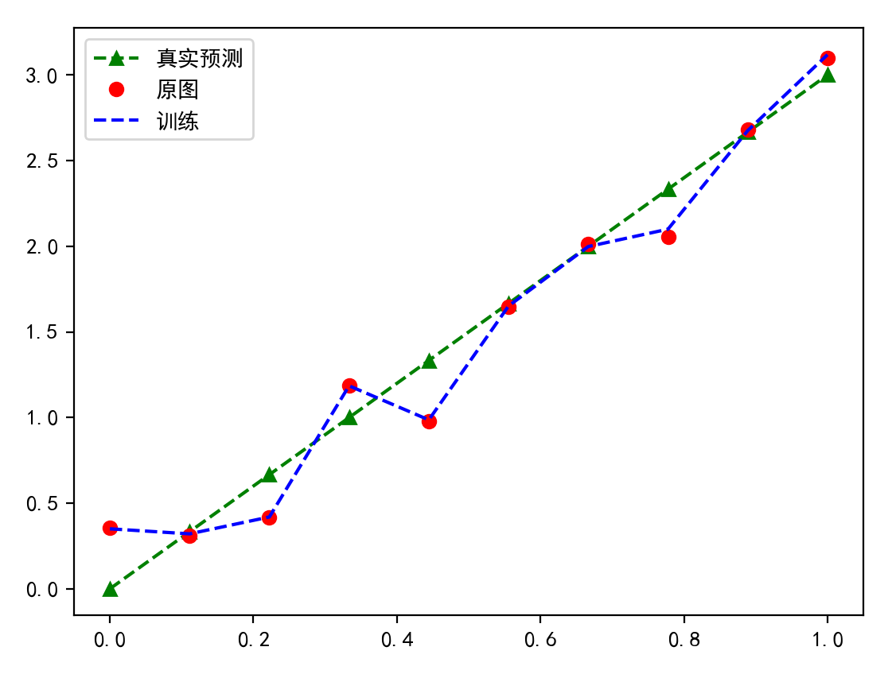
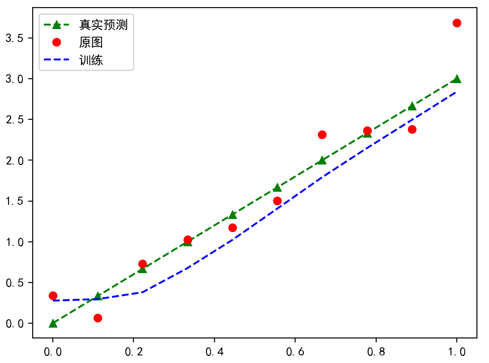
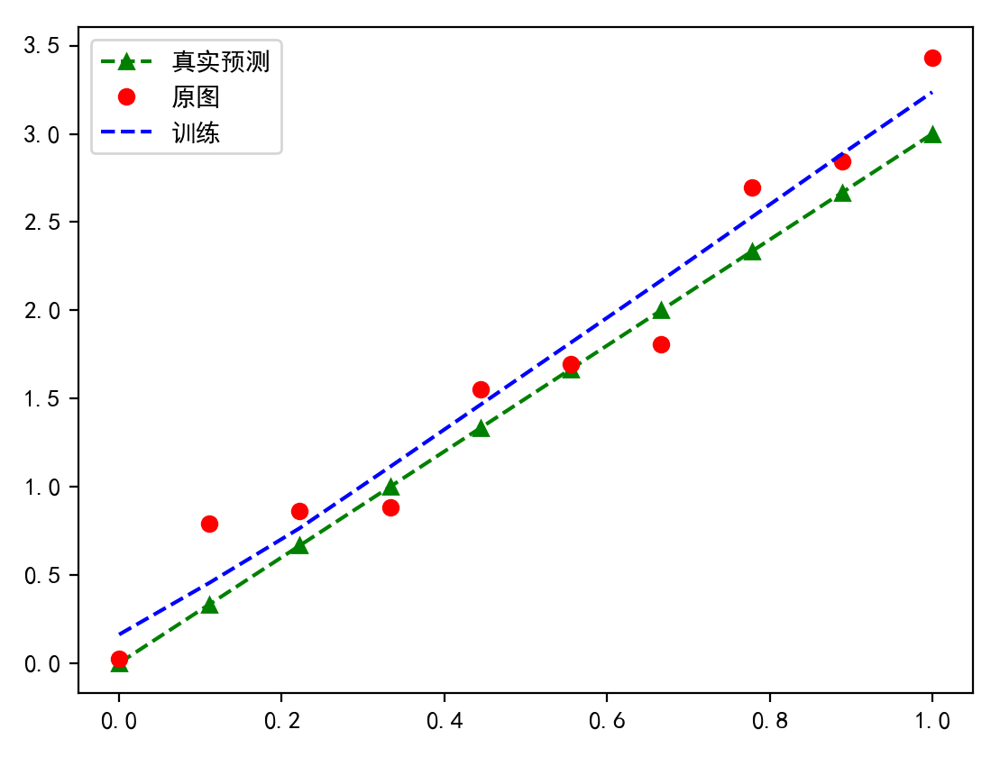
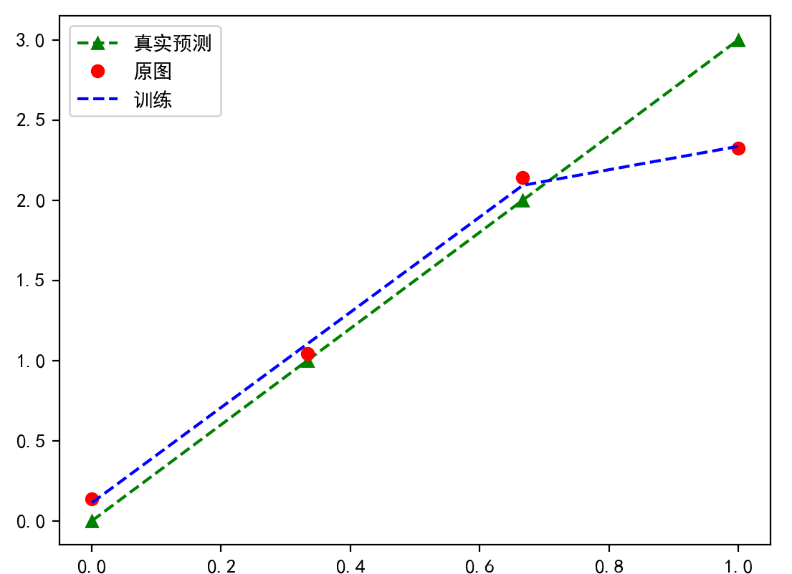
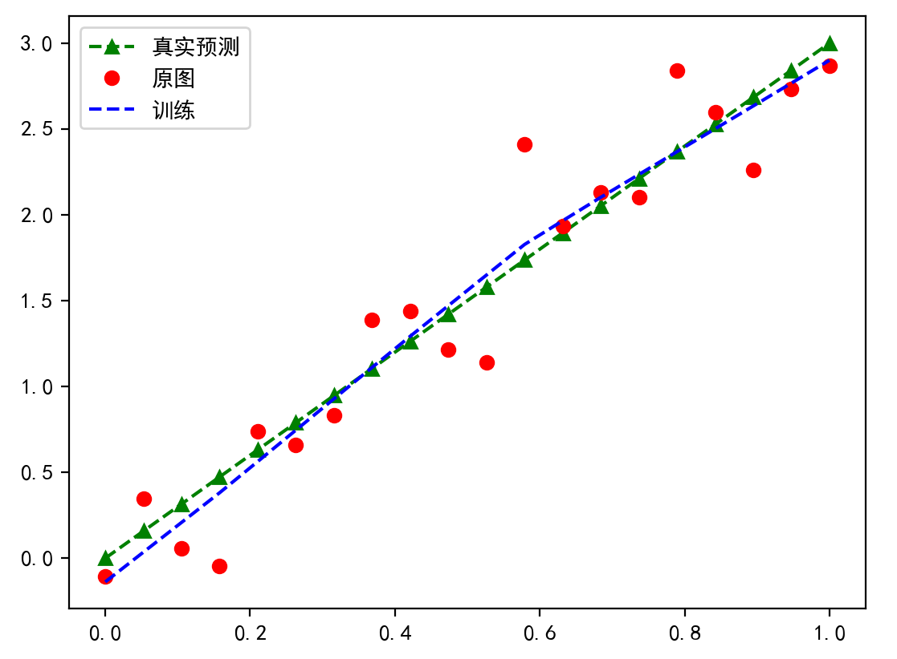
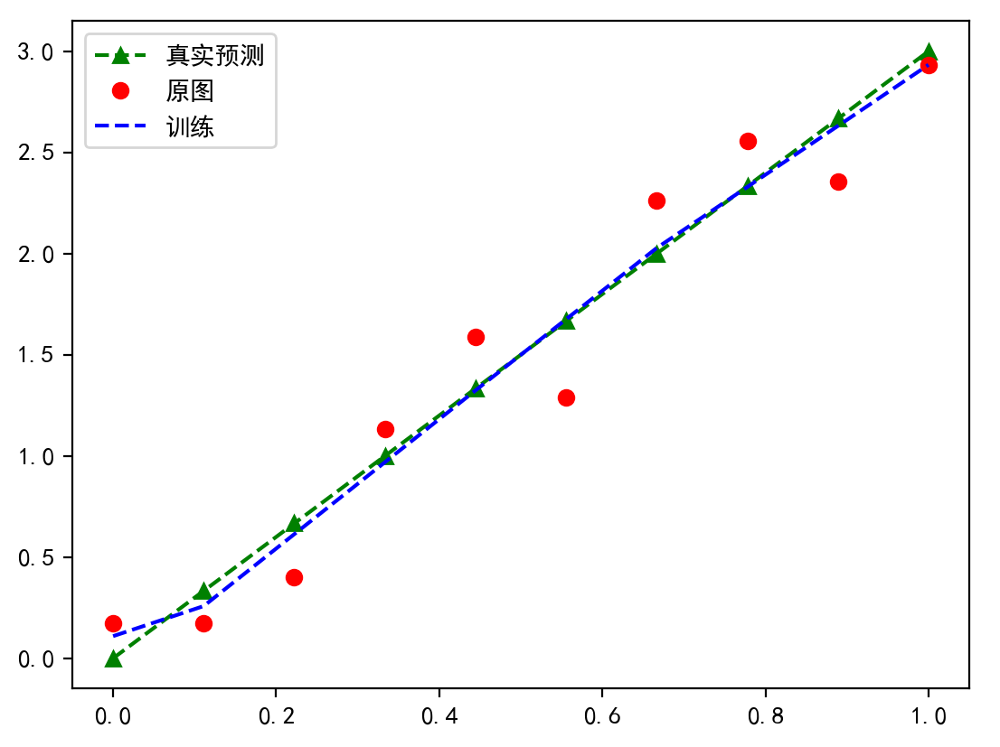
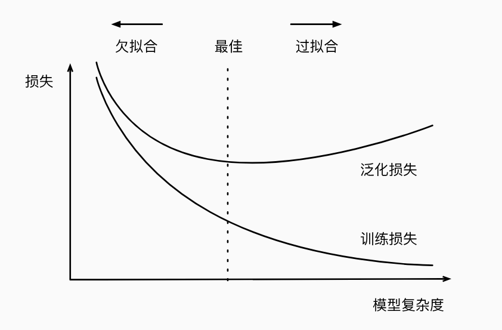

# 过拟合问题


[TOC]

## 什么是过拟合

过拟合（Overfitting）是机器学习和统计建模中的一种现象，指的是模型在训练数据上表现得过于优越，学习到了训练数据中的噪声和细节，以至于在新数据或未见过的数据上表现不佳。简单来说，就是模型对训练数据“记忆”得太好，以至于无法泛化到新的情况。

过拟合通常发生在模型复杂度过高、训练数据量不足、缺乏正则化或训练次数过多等情况下。为了防止过拟合，可以采取一些策略，如增加数据量、使用正则化技术（如L1、L2正则化）、简化模型、进行交叉验证等。这些方法可以帮助提高模型的泛化能力，使其在未见过的数据上也能有良好的表现。


## 产生过拟合的原因

### 模型复杂度过高

当神经网络的层数过多、神经元数量过多或者模型参数过多时，模型会变得非常复杂，从而有能力拟合训练数据中的每一个细节，包括噪声和异常值。这种情况下，模型在训练集上的表现可能会很好，但在未见过的测试集上表现却很差。


以下为模型复杂度高，且训练epoch=10000的现象



上述图像中关于蓝色线的部分即为`过拟合现象`，实际中（最后的几个epoch）的损失值如下：

```
0.0002804563846439123
0.00027663909713737667
0.00026483795954845846
0.0002766515826806426
0.0002705264778342098
0.00030501620494760573
0.0002733695728238672
0.0003135116130579263
```


我们修改epoch的数量为100后



原来模型的hidden-layers总共6层，我们锐减至2层




### 训练数据量不足

如果训练数据量不足以代表整个数据集的分布，模型可能会过度关注训练数据中的特定样本，从而导致过拟合。在数据量较少的情况下，模型更容易学习到数据中的噪声和细节，而不是数据背后的真正规律。


如果数据量只有4，那么也会发生过拟合



增大数据量到20后




### 缺乏正则化

正则化是一种防止过拟合的技术，通过在损失函数中添加惩罚项来控制模型的复杂度。如果模型训练过程中没有使用正则化或者正则化的强度不够，模型可能会过度拟合训练数据。


加入正则化系数




### 训练次数过多

在训练神经网络时，如果迭代次数过多，模型可能会在训练集上达到非常高的准确率，但同时也会学习到训练数据中的噪声和细节，导致过拟合。


如`模型复杂度过高`中所示的`10000`epoch与`100`epoch。


### 数据预处理不当

数据预处理是机器学习项目中非常关键的一步。如果数据预处理不当，比如数据清洗不彻底、特征选择不合理等，都可能导致模型学习到错误的信息，从而产生过拟合


案例:

1. 大语言模型中，由于收集的信息中，有大量错误回答或者无效回答，比如：“今天天气如何 --- 天气如何”，“今天天气如何 --- 今天天气这个人很不错”，会导致后期模型的实际测试中会有问题
2. 图像识别中，由于需要检测人脸，因大量混入了其他不相关的图片，导致图像训练损失无法收敛。


## 神经网络训练中的几个问题

1. 训练的损失率越低证明模型的预测结果越优秀吗
2. 过拟合，好还是不好。
3. 训练次数不变的情况下，该如何防止过拟合（该题会与欠拟合混淆出现）
4. 数据量不足的情况下，改如何防止过拟合


## 如何简单记忆过拟合

孩子的平时成绩在你的监督下，一直以来都考九十几分，但是就是一到期末考试就不及格

我们一般认为过拟合，发生在训练时期，而训练中只显示训练集的损失率，无法估计模型的真实效果，因此

需要加入`验证集`，或者`测试集`来评估该模型的好坏。


将模型在训练数据上拟合的比在潜在分布中更接近的现象称为`过拟合（overfitting）`， 用于对抗过拟合的技术称为`正则化（regularization）`。


## 专业术语的概念


### 训练误差和泛化误差

训练误差（training error）是指，模型在训练数据集上计算得到的误差。

泛化误差（generalization error）是指，模型应用在同样从原始样本的分布中抽取的无限多数据样本时，模型误差的期望。（实际上就是说期末考试）


举例：抛硬币实验


关于训练误差和泛化误差的几个相关说法：

+ 当我们训练模型时，我们试图找到一个能够尽可能拟合训练数据的函数。但是如果它执行地“太好了”，而不能对看不见地数据做到很好地泛化，就会导致过拟合。
+ 三个会让模型容易过拟合的原因，可调参数的数量、参数采用的值、训练样本的数量。


### 模型选择

我们通常在评估几个候选模型后选择最终的模型。这个过程叫做`模型选择`

模型选择时，会对每一个epoch数据做一次除开`训练数据集`之外的验证。这时便用到了`验证集`(validation set)。


### K折交叉验证

当训练数据稀缺时，我们甚至可能无法提供足够的数据来构成一个合适的验证集。 这个问题的一个流行的解决方案是采用K*折交叉验证*。 这里，原始训练数据被分成K个不重叠的子集。 然后执行K次模型训练和验证，每次在K−1个子集上进行训练， 并在剩余的一个子集（在该轮中没有用于训练的子集）上进行验证。 最后，通过对K次实验的结果取平均来估计训练和验证误差。


### 欠拟合与过拟合

当训练和验证误差都很眼中，仅有一点差距，这是因为模型过于简单（即表达能力不足）。这种现象被称为欠拟合(underfitting)。


当我们的训练误差明显低于验证误差时，这表明严重的过拟合（overfitting）


