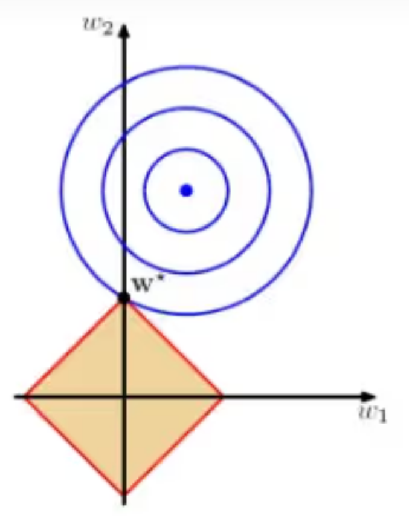
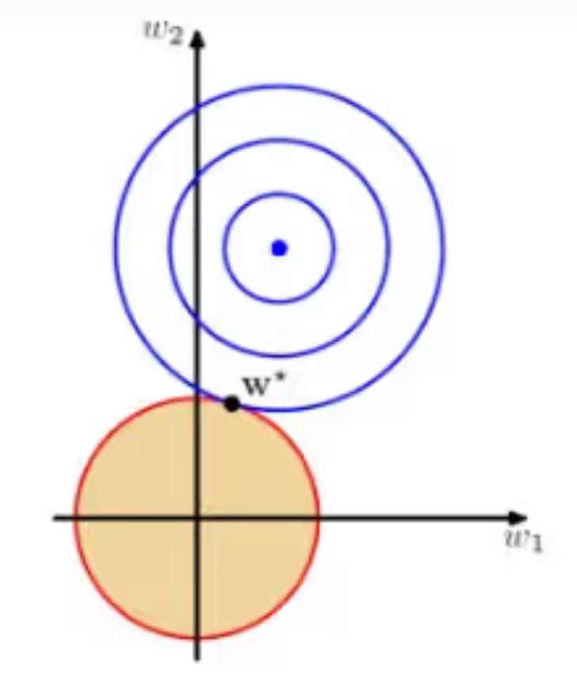

# 正则化

[TOC]

## 什么是正则化

模型正则化(Regularization)是机器学习中一种重要且常见的技术，其主要目的是为了防止模型过拟合（Overfitting），并提高模型的泛化能力。当使用复杂的模型（如神经网络）去拟合数据时，模型很容易在训练数据上表现得过好，但在未见过的新数据上表现不佳，这种现象就是过拟合。正则化通过引入额外的约束条件或惩罚项到模型中，使模型在训练过程中不仅关注训练误差，还考虑模型的复杂度，从而避免过拟合。

## 范数

线性代数中最有用的一些运算符是范数（norm）

L2范数实际上是欧几里得距离：假设n维向量x中的元素$x_1,...,x_n$,其中$L_2$范数是向量元素平方和的平方根。
$$
||w||_2 = \sqrt {\sum_{i=1}^{n}x_i^{2}}
$$
L1范数，实际上是曼哈顿距离公式,表示为向量元素的绝对值之和
$$
||w||_1 = \sum_{i=1}^{n}|x_i|
$$

## L1/L2正则化是什么

+ L1正则化是指权值向量w中各个元素的绝对值之和，通常表示为$ ||w||_1 $

+ L2正则化是指权值向量w中各个元素的平方和然后再求平方根（可以看到Ridge回归的L2正则化项有平方符号), 通常表示为$ ||w||_2 $

 

## L1/L2正则化的用处

+ L1正则化可以产生稀疏权值矩阵，即产生一个稀疏模型，可以用于特征选择。
+ L2正则化可以防止模型过拟合；虽然一定程度上，L1也可以防止过拟合。

## L1可用于特征选择的原因

为什么L1正则化有助于生成稀疏权值矩阵

假设有如下带有L1正则化的损失函数：
$$
J = J_0 + \lambda \sum_{w}|w|
$$
其中
$$
J_0 是原始的损失函数 \\
\lambda \sum_{w}|w| 是L_1 正则化项 \\
\lambda 是正则化系数 \\
对于整个L_1就是所有w绝对值的权值之和 \\
所以对于J而言是不完全可微的，若要求出损失函数的最小值。\\
若令L = \lambda \sum_{w}|w|，则J = J_0 + L,当前任务变为在L约束下求J_0最小值 \\
若当前只有w_1,w_2两个权重系数，此时L = |w_1| + |w_2|。\\
又因J_0 对于w_1,w_2而言实际上是层层等高线（梯度下降章节有讲）\\
对于L而言，由于也与w_1,w_2相关，如果L存在当前最小值，则L = |w_1| + |w_2|构成如下图线 \\
$$

$$
在L的约束下求出J_0取最小值的解：\\
1.根据梯度下降法，J_0越靠近圆心，其取值越小；越远离圆心，其取值越大 \\
2.同时w_1和w_2的取值要满足L约束（即最优点要落在L图形的框上）。
$$

### 稀疏矩阵

所谓稀疏权值矩阵指的是很多元素为0，只有少数元素是非零值得矩阵，即得到的线性回归模型的大部分系数是0
$$
当等值线向外扩散，J_0与L图形首次相交的地方就是最优解。\\
图中案例中J_0与L在L的一个顶点相交，该顶点的值为（w_1,w_2） = (0,w)。\\
由于J_0与L的四角接触概率更大，但对于每个角相交时都会有权值为0的情况 \\
这就是为什么L_1正则化会产生稀疏模型
$$

### 稀疏矩阵可用于特征选择

对于文本处理，如果讲一个词组或者字符作为特征，特征数量将会很大，在预测或者分类过程中，特征难以选择。

比如有以下特征，女性（1），国王（2），女王（3）.... 我们将会得到许多特征，

但假如我们令女性（0，1，0，....）,国王（0，0，1，.....）,则女王我们可以表示为 (0,1,1，......)

### L1正则化如何防止过拟合

$$
正则化前面的系数\lambda，可以控制L图形的大小。\\
\lambda越小，L的图形越大（上图中的黑色方框） \\
\lambda越大，L的图形就越小。\\
通过调节正则化前面的系数\lambda，可以控制模型参数取到很小的值，进而防止过拟合。
$$

## L2正则化

L2正则化不具备稀疏性，但可以防止模型过拟合

假设带有L2正则化的损失函数：
$$
J = J_0 + \lambda \sum w^2
$$

$$
L2正则化下的L图形，与L1下的L图形相比，没有了棱角。\\
因此J_0与L相交时使得w_1或w_2为零得概率小了很多，\\
这就是为什么L2正则化不具备稀疏性的原因。
$$

### L2正则化可以防止过拟合

对于一个线性回归方程，若参数很大，那么只要数据偏移一点点，就会对结果造成很大的影响；但如果参数足够小，数据偏移多一点也不会对结果造成什么太大的影响。专业说法就是`抗扰动能力强`

为什么L2正则化可以获得值很小的参数
$$
以线性回归的梯度下降法为例。假设要求参数为\theta,h_{\theta}(x)是我们的假设函数\\
那么线性回归的代价函数如下：
J(\theta) = \frac{1}{2}m\sum(h_{\theta}(x^i) - y^i)^2 \\
在梯度下降法中，最终用于迭代计算参数\theta 的迭代式为：\\
\theta_j:=\theta_j - \alpha \frac{1}{m}\sum_{i=1}^{m}(h_{\theta}(x^i) - y^i)x_j^i \\
其中\alpha 是learning \ rate 上式是没有添加L2正则化的迭代公式，如果在原始代价函数中添加L2正则化后\\
\theta_j:=\theta_j(1-\alpha \frac{\lambda}{m}) - \alpha \frac{1}{m}\sum_{i=1}^{m}(h_{\theta}(x^i) - y^i)x_j^i\\
其中\lambda就是正则化参数。从上式中可知，与未添加L2正则化的迭代公式相比，\\每一次迭代，\theta_j都需要先乘以一个小于1的因子，从而使得\theta_j不断减小
$$
